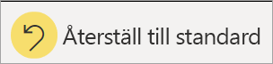

# Rapporter i Power BI

[!INCLUDE[consumer-appliesto-yyny](../includes/consumer-appliesto-yyny.md)]

[!INCLUDE [power-bi-service-new-look-include](../includes/power-bi-service-new-look-include.md)]

En Power BI-rapport visar en datauppsättning ur flera perspektiv med visuella objekt som representerar olika fynd och insikter från datauppsättningen.  En rapport kan ha ett enda visuellt objekt eller sidor som är fulla av dem. Beroende på din arbetsroll kan du vara en person som *designar* rapporter. Du kan också vara en som *konsumerar* eller använder rapporterna. Den här artikeln är för *konsumenter*.

A. Den här rapporten innehåller sex sidor (eller flikar) och du visar sidan **Sentiment**.    
B. Den här sidan har 5 olika visuella objekt och en titelsida.    
C. I fönstret *Filter* visas ett filter som tillämpas på alla rapportsidor. Om du vill minimera fönstret Filter väljer du pilen ( **>** ).    
D. Power BI-banderollen visar namnet på rapporten och datumet för den senaste uppdateringen. Välj pilen för att öppna en meny som också visar namnet på rapportägaren.    
E. Åtgärdsfältet innehåller åtgärder som du kan vidta för den här rapporten.  Du kan till exempel lägga till en kommentar, visa ett bokmärke eller exportera data från rapporten.  Välj **Fler alternativ** (...) om du vill visa en lista med fler rapportfunktioner.    

Om du är nybörjare på Power BI kan du få en bra grund genom att läsa [Grundläggande begrepp för användare av Power BI-tjänsten](end-user-basic-concepts.md). Rapporter är tillgängliga för att visa, dela och kommentera på mobila enheter. Mer information finns i [Utforska rapporter i Power BI-mobilappar](mobile/mobile-reports-in-the-mobile-apps.md).

## Fördelar med rapporter

Power BI baserar en rapport på en enda datamängd. *Rapportdesigner* skapar visuella objekt i en rapport, vilka representerar en liten mängd information. De visuella objekten är inte statiska.  De uppdateras allt eftersom underliggande data ändras. Du kan få insikter och hitta svar genom att interagera med visuella objekt och filter när du analyserar data. Rapporter är mycket interaktiva och anpassningsbara, som instrumentpaneler.

### Interagera på ett säkert sätt med innehåll

Du behöver inte oroa dig för att du ska förstöra rapporterna när du utforskar och interagerar med ditt innehåll genom att filtrera, dela, prenumerera och exportera. Ditt arbete påverkar inte den underliggande datauppsättningen eller det ursprungliga delade innehållet. Detta gäller för instrumentpaneler, rapporter och appar.

> [!NOTE]
> Kom ihåg att du inte kan förstöra dina data. Power BI är en bra plats där du kan utforska och experimentera, utan att du behöver oroa dig för att förstöra något.

### Spara dina ändringar eller återställ till standardinställningarna

Men det här betyder inte att du inte kan spara dina ändringar. Det kan du, men dina ändringar påverkar bara din visning av innehållet. Om du vill återgå till den ursprungliga standardvyn för rapporten väljer du **Återställ till standard**.

## Instrumentpaneler kontra rapporter

[Instrumentpaneler](end-user-dashboards.md) förväxlas ofta med rapporter, eftersom de också är arbetsytor med visuella objekt. Men det finns några viktiga skillnader.  

| **Kapacitet** | **Instrumentpaneler** | **Rapporter** |
| --- | --- | --- |
| Sidor |En sida |En eller flera sidor |
| Datakällor |En eller flera rapporter och en eller flera datauppsättningar per instrumentpanel |En enskild datauppsättning per rapport |
| Filtrering |Det går inte att filtrera eller dela upp |Det finns många olika sätt att filtrera, markera och dela upp |
| Ställa in avisering |Det går att skapa e-postaviseringar när instrumentpanelen uppfyller vissa villkor |Nej |
| Funktion |Det går att ange en instrumentpanel som din ”aktuella” instrumentpanel |Det går inte att skapa en aktuell rapport |
| Det går att visa tabeller och fält från den underliggande datauppsättningen |Nej. Det går att exportera data, men tabeller och fält för datauppsättningen visas inte i själva instrumentpanelen |Ja. Det går att visa de tabeller, fält och värden för datauppsättningen som du har behörighet att visa |
| Anpassning |Nej  |Det går att filtrera, exportera, visa relaterat innehåll, lägga till bokmärken, generera QR-koder, analysera i Excel och mycket mer |

<!--| Available in Power BI Desktop |No |Yes, can create and view reports in Desktop |
| Pinning |Can pin existing visuals (tiles) only from current dashboard to your other dashboards |Can pin visuals (as tiles) to any of your dashboards. Can pin entire report pages to any of your dashboards. | -->

## Rapportdesigner och rapportanvändare

Beroende på din roll kan du vara *designer*, som skapar rapporter för eget bruk eller för att dela med dina kollegor. Du kommer behöva lära dig att skapa och dela rapporter.

Eller också är du en som *använder* rapporter, som tar emot dem från andra. Du kommer behöva lära dig att förstå och interagera med rapporter. Om du är *rapportanvändare* är följande länkar för dig:

* Börja med att ta en närmare [titt på Power BI-tjänsten](end-user-basic-concepts.md) så att du vet var du hittar rapportverktyg och rapporter.
* Lär dig att [öppna en rapport](end-user-report-open.md) och alla [interaktioner som är tillgängliga för konsumenter](end-user-reading-view.md).
* Bekanta dig mer rapporter genom att ta en titt på ett av våra [exempel](../sample-tutorial-connect-to-the-samples.md).  
* Information om vilken datauppsättning som används av rapporten och vilka instrumentpaneler som visar grafiska objekt från rapporten (*fästa paneler*) finns i [Visa relaterat innehåll i Power BI-tjänsten](end-user-related.md).

> [!TIP]
> Om du inte hittar det du söker efter här kan du använda innehållsförteckningen till vänster för att bläddra igenom alla *artiklar om rapporter*.

## Nästa steg

[Öppna och visa en rapport](end-user-report-open.md)    
[Instrumentpaneler i Power BI-tjänsten](end-user-dashboards.md)
