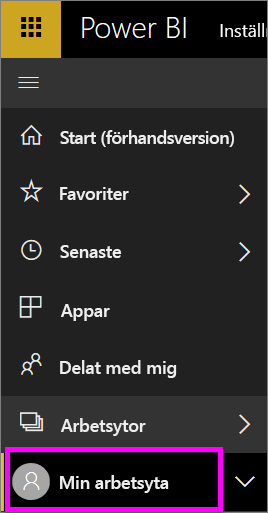
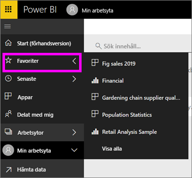

# Navigering: sökning, lokalisering och sortering av innehåll i Power BI-tjänsten
Det finns många sätt att navigera i innehållet i Power BI-tjänsten. Innehållet är organiserat efter typen av arbetsyta: instrumentpaneler, rapporter, arbetsböcker och datauppsättningar.  Och innehållet ordnas också efter användning: favoriter, senaste, appar, delas med mig och funktioner. För en sömlös navigering, organiserar startsidan innehållet på en enda sida. Med dessa olika vägar till ditt innehåll kan du snabbt hitta det du söker i Power BI-tjänsten.  

## Navigera i arbetsytorna

Power BI-*konsumenter* har vanligtvis endast en arbetsyta: **Min arbetsyta**. **Min arbetsyta** har endast innehåll om du har hämtat Microsoft-exempel eller skapat eller laddat ned ditt eget innehåll.  

Inom **Min arbetsyta** separerar Power BI-tjänsten ditt innehåll efter typ: instrumentpaneler, rapporter, arbetsböcker och datauppsättningar. Den här organisationen visas när du väljer en arbetsyta. I det här exemplet innehåller **Min arbetsyta** en instrumentpanel, två rapporter, ingen arbetsbok och två datauppsättningar.

________________________________________

## Navigering med hjälp av vänster navigeringsfält
Vänster navigeringsfält klassificerar ditt innehåll på ett sätt som gör det ännu enklare att snabbt hitta det du behöver.  

- Innehåll som delas med dig är tillgängligt i **delat med mig**.
- Senast visat innehåll är tillgängligt i **senaste**. 
- Dina appar kan hittas genom att välja **appar**.
- **Start** är en vy av en enda sida av dina viktigaste innehåll och innehållsförslag och inlärningskällor.

Dessutom kan du tagga innehåll Med [Favoriter](end-user-favorite.md) och [Aktuellt](end-user-featured.md). Välj den instrumentpanel som du tror att du oftast kommer att använda och ange den som din *aktuella* instrumentpanel. Varje gång du öppnar Power BI-tjänsten kommer din aktuella instrumentpanel visas först. Har du flera instrumentpaneler och appar som du besöker ofta? Genom att ange dem som favoriter är de alltid tillgängliga i det vänstra navigeringsfältet.

.

## Överväganden och felsökning
* För datauppsättningar är **Sortera efter** inte tillgängligt per ägare.

## Nästa steg
[Power BI – grundläggande begrepp](end-user-basic-concepts.md)

Har du fler frågor? [Prova Power BI Community](http://community.powerbi.com/)