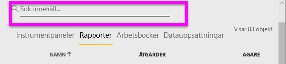
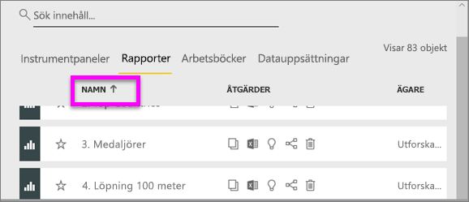
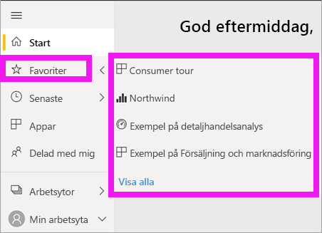

# Navigering: sökning, lokalisering och sortering av innehåll i Power BI-tjänsten

[!INCLUDE [power-bi-service-new-look-include](../includes/power-bi-service-new-look-include.md)]

Det finns många sätt att navigera i ditt innehåll i Power BI-tjänsten. Innehållet är organiserat på din arbetsyta efter typ: instrumentpaneler och rapporter.  Och innehållet ordnas också efter användning: favoriter, senaste, appar, delas med mig och funktioner. För enhetlig navigering organiserar *Power BI-start* innehållet på en enda sida. Med dessa olika vägar till ditt innehåll kan du snabbt hitta det du söker i Power BI-tjänsten.  

## Navigera i arbetsytorna

Power BI-*konsumenter* har vanligtvis endast en arbetsyta: **Min arbetsyta**. **Min arbetsyta** har innehåll om du har laddat ned Microsoft-exempel eller skapat eller laddat ned egna instrumentpaneler, rapporter eller appar.  

I **Min arbetsyta** separerar Power BI-tjänsten ditt innehåll efter typ: instrumentpaneler, rapporter, arbetsböcker och datamängder. Den här organisationen visas när du väljer en arbetsyta. I det här exemplet innehåller **Min arbetsyta** en instrumentpanel, en rapport, inga arbetsböcker och en datamängd.

________________________________________
## Navigering via sökfältet
Använd innehållsvyn i **Min arbetsyta** till att söka efter, filtrera och sortera ditt innehåll. I sökfältet skriver du hela eller en del av namnet på en instrumentpanel, rapport, arbetsbok eller ägare.  

Om du har ganska lite innehåll behöver du inte söka eller sortera.  Om du däremot har en lång lista över instrumentpaneler och rapporter är sökning och sortering dock mycket användbara funktioner. Till exempel innehåller rapportlistan nedan 83 objekt. 

Du kan också sortera innehåll efter namn eller ägare. Observera uppåtpilen till höger om **Namn**. För närvarande sorterar vi 83 objekt stigande alfabetiskt efter namn. Om du vill ändra sorteringsordningen till fallande väljer du **Namn**. Uppåtpilen ändras till en nedåtpil.

Det finns vissa kolumner som inte kan sorteras. Hovra över kolumnrubrikerna för att identifiera vilka som kan sorteras.

___________________________________________________________________
## Navigera med hjälp av navigeringsfönstret
I navigeringsfönstret klassificeras ditt innehåll på ett sätt som gör att du snabbt hittar det du behöver.  

- Innehåll som delas med dig är tillgängligt i **delat med mig**.
- Senast visat innehåll är tillgängligt i **senaste**. 
- Dina appar kan hittas genom att välja **appar**.
- **Start** är en vy av en enda sida av dina viktigaste innehåll och innehållsförslag och inlärningskällor.

Dessutom kan du tagga innehåll Med [Favoriter](end-user-favorite.md) och [Aktuellt](end-user-featured.md). Välj den instrumentpanel eller den rapport som du tror att du oftast kommer att använda och ange den som ditt *aktuella* innehåll. Varje gång du öppnar Power BI-tjänsten visas din aktuella instrumentpanel först. Har du flera instrumentpaneler och appar som du besöker ofta? Genom att ange dem som favoriter är de alltid tillgängliga i navigeringsfönstret.

.

## Överväganden och felsökning
* För datauppsättningar är **Sortera efter** inte tillgängligt per ägare.

## Nästa steg
[Sortera visuella objekt i rapporter](end-user-change-sort.md)

Har du fler frågor? [Prova Power BI Community](https://community.powerbi.com/)
