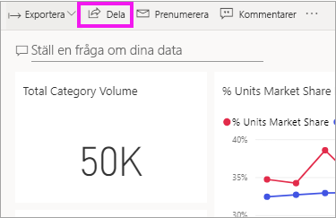
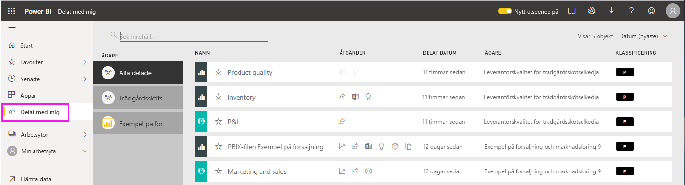
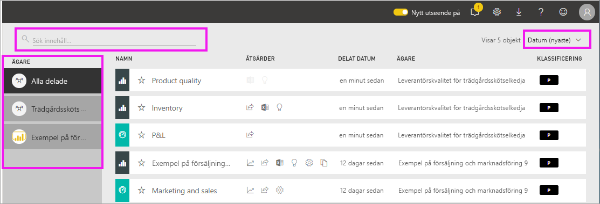

# Visa instrumentpaneler och rapporter som har delats med mig

[!INCLUDE[consumer-appliesto-yyny](../includes/consumer-appliesto-yyny.md)]

[!INCLUDE [power-bi-service-new-look-include](../includes/power-bi-service-new-look-include.md)]

När en kollega delar innehåll med dig visas det, via knappen **dela**, i behållaren**delat med mig**. Instrumentpanelen är endast tillgänglig från **delat med mig** och inte från en arbetsyta eller från **appar**.

Titta när Amanda förklarar innehållslistan **delat med mig** och visar hur du navigera och filtrerar listan. Prova sedan själv genom att följa de stegvisa anvisningarna under videon. Om du vill visa instrumentpaneler som delas med dig, måste du ha en Power BI Pro-licens. Läs [Vad är Power BI Premium?](../admin/service-premium-what-is.md) för mer information.
    

> [!NOTE]
> Den här videon använder en äldre version av Power BI-tjänsten.
    

<iframe width="560" height="315" src="https://www.youtube.com/embed/G26dr2PsEpk" frameborder="0" allowfullscreen></iframe>

## Interagera med delat innehåll

Du kommer att ha alternativ för att interagera med de delade instrumentpanelerna och dess rapporter, beroende på vilka behörigheter som *designern* ger dig. Det inkluderar att kunna göra kopior av instrumentpanelen, öppna rapporten [i läsvy](end-user-reading-view.md) och att dela vidare till andra kollegor.

### Åtgärder som är tillgängliga från **delat med mig**-behållaren
Åtgärderna som är tillgängliga för dig beror på vilka inställningar som tilldelats av innehålls*designern*. Några av dina alternativ kan vara:
* Välj stjärnikonen för att [favoritmarkera en instrumentpanel eller rapport](end-user-favorite.md) .
* Ta bort en instrumentpanel eller en rapport  .
* Vissa instrumentpaneler och rapporter kan delas vidare  .
* [Öppna rapporten i Excel](end-user-export.md)  
* [Visa insikter](end-user-insights.md) som Power BI hittar i data .
  
  > [!NOTE]
  > Välj **klassificeringsknappen** för information om EGRC-klassificeringar, eller [besök klassificering av instrumentpanelsdata](../create-reports/service-data-classification.md).
  > 

## Söka i och sortera delade instrumentpaneler
Om innehållslistan blir lång har du flera alternativ för att hitta det du behöver. Du kan använda sökfältet, sortera efter datum eller välja från kolumnen **Ägare**.    

