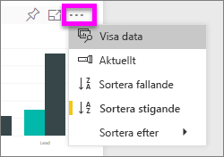
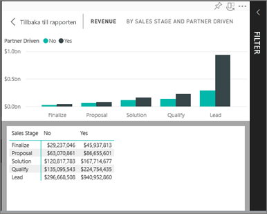
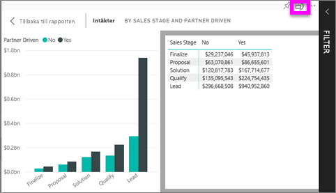

# Visa data som används för att skapa visualiseringen
## Visa data
En Power BI-visualisering konstrueras med hjälp av data från underliggande datamängder. Om du är intresserad av att se vad som pågår i bakgrunden, Power BI kan *visa* de data som används för att skapa visualiseringen. När du väljer **Visa data** visar Power BI dessa data under (eller bredvid) visualiseringen.

## Använda *Visa data* i Power BI-tjänsten
1. Öppna en rapport i Power BI-tjänsten och välj ett visuellt objekt.  
2. Om du vill visa bakomliggande data för det visuella objektet väljer du ellipsen (...) och **Visa data**.
   
   
3. Som standard visas data under visualiseringen.
   
   

4. För att välja orientering väljer du lodrät layout  uppe i det högra hörnet på visualiseringen.
   
   

### Nästa steg
[Visuella objekt i Power BI-rapporter](../visuals/power-bi-report-visualizations.md)    
[Power BI-rapporter](end-user-reports.md)    
