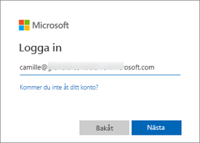
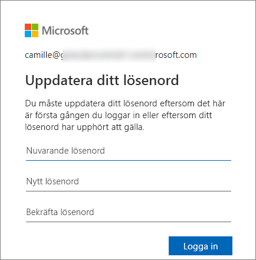
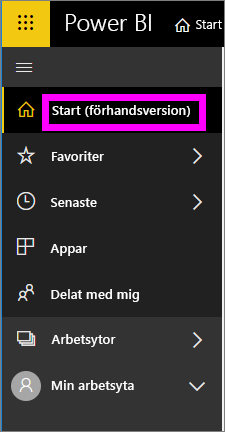
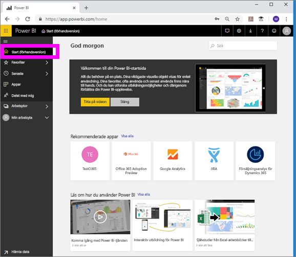

# Logga in på Power BI-tjänsten

## Power BI-konton
Innan du kan logga in på Power BI måste du ha ett konto. Det finns två sätt att skaffa ett Power BI-konto. Den första är när ditt företag köper Power BI-licenser till sina anställda. Och den andra är när användare registrerar sig för kostnadsfria utvärderingsversioner eller personliga licenser. Den här artikeln beskriver det första scenariot.

## Logga in första gången

### Steg ett: öppna en webbläsare
Power BI-tjänsten körs i en webbläsare.  Så steg ett är att öppna din favoritwebbläsare och skriva **app.powerbi.com**.

### Steg två: skriv din e-postadress
Första gången du loggar in måste du ange din e-postadress.  Det här är e-postadressen till arbetet eller skolan som du använde när du registrera dig för Power BI.  

Titta i din inkorg efter ett e-postmeddelande från Power BI-administratören. De flesta administratörer skickar dig ett välkomstmeddelande via e-post med ett tillfälligt lösenord. Använda det här e-postkontot för inloggningen. 

 
### Steg tre: skapa ett nytt lösenord
Om Power BI-administratören har skickat dig ett tillfälligt lösenord anger du det i fältet **Aktuellt lösenord**. Om du inte har fått det här lösenordet i e-posten kontaktar du Power BI-administratören.

Power BI-kommer ihåg dina autentiseringsuppgifter och du behöver inte ange användarnamnet (e-postadressen) nästa gång du loggar in. 

### Steg fyra: granska din startsida
Vid ditt allra första besök öppnas Power BI på din **startsida**. Om **startsidan** inte öppnas väljer du den i det vänstra navigeringsfönstret. 

På startsidan visas allt innehåll som du har behörighet att använda. Först kanske det inte finns så mycket innehåll på din startsida men oroa dig inte. Det ändras när du börjar använda Power BI med dina kollegor. 

Om du inte vill att Power BI ska öppnas på startsidan kan du [ange en **Aktuell** instrumentpanel eller rapport](end-user-featured.md) att öppnas i stället. 

## Interagera på ett säkert sätt med innehåll
Som ***konsument*** delar andra innehåll med dig och du interagerar med det innehållet för att utforska data och fatta affärsbeslut.  När du filtrerar, gör utsnitt, exporterar och ändra storlek behöver du inte oroa dig – ditt arbete påverkar inte den underliggande datauppsättningen eller det ursprungliga delade innehållet (instrumentpaneler och rapporter). Power BI är ett säkert utrymme där du kan utforska och experimentera. Det betyder inte att du inte kan spara dina ändringar – det kan du. Men de ändringarna påverkar bara **din** vy över innehållet. Och att återgå till den ursprungliga standardvyn är lika enkelt som att klicka på en knapp.

## Logga ut från Power BI-tjänsten
När du stänger eller logga ut från Power BI sparas dina ändringar så att du kan fortsätta direkt där du slutade.

Om du vill stänga Power BI kan du helt enkelt stänga den webbläsarflik där du arbetar. 

 

Om du delar en dator rekommenderar vi att du loggar ut varje gång du stänger Power BI.  Logga ut genom att gå till det övre högra hörnet markera profilbilden och välja **Logga ut**. Annars stänger du bara webbläsarfliken när du är klar.

 

## Felsökning och överväganden
- Om du har registrerat dig för Power BI som användare loggar du inte med den e-postadress du använde vid registreringen.

- Om du använder Power BI med fler än ett konto uppmanas du att välja ett konto i en lista och ange ett lösenord när du loggar in. 

## Nästa steg
[Visa en Power BI-app](end-user-app-view.md)
