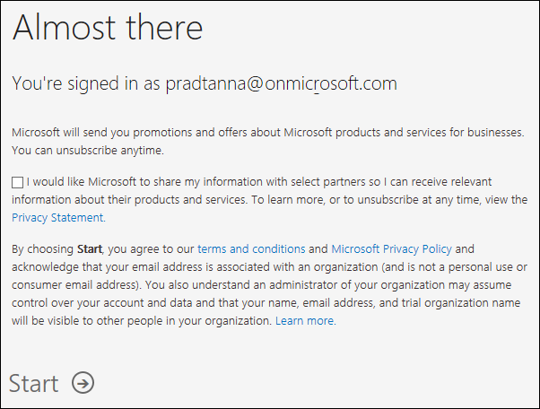

# Logga in på Power BI-tjänsten

[!INCLUDE[consumer-appliesto-yynn](../includes/consumer-appliesto-yynn.md)]

## Power BI-konton
Innan du kan logga in på Power BI måste du ha ett konto. Det finns två sätt att skaffa ett Power BI-konto. Det första är när din organisation köper Power BI-licenser till sina anställda. Och det andra är när [användare registrerar sig för kostnadsfria utvärderingsversioner eller personliga licenser](../fundamentals/service-self-service-signup-for-power-bi.md). Den här artikeln beskriver det första scenariot.

## Logga in första gången

### Steg 1: Öppna Power BI-tjänsten.
Power BI-tjänsten körs i en webbläsare. 

- Om du har fått ett e-postmeddelande från en kollega med en länk till en instrumentpanel eller rapport, väljer du länken för att **öppna den här rapporten** eller **öppna den här instrumentpanelen**.

        

- Öppna sedan din favoritwebbläsare och skriv in **app.powerbi.com**.

        

### Steg 2: Skriv din e-postadress
Första gången du loggar in kontrollerar Microsoft om du redan har ett Microsoft 365-konto. I exemplet nedan har Pradtanna redan en licens för andra Microsoft-tjänster. 

Ange ditt lösenord. Detta är ditt lösenord till ditt Microsoft 365-konto. Det är samma e-postadress och lösenord som du använder för andra Microsoft-produkter, till exempel Outlook och Office.  Beroende på hur ditt konto har konfigurerats, kan du också uppmanas att ange en kod som skickas till din e-post eller mobila enhet.   

Ibland tilldelar din globala administratör dig en licens och skickar ett e-postmeddelande till dig med den här informationen. Titta i inkorgen efter ett välkomstmeddelande och följ anvisningarna för att logga in för första gången. Använd samma e-postkonto vid inloggningen. 
 
### Steg 3: Granska villkoren
Granska villkoren. Om du godkänner dem markerar du kryssrutan och väljer **Starta**.

### Steg 4: Granska din landningssida
Vid ditt första besök öppnas Power BI på din **startsida**. Om **startsidan** inte öppnas kan du välja den i navigeringsfönstret. 

På startsidan visas allt innehåll som du har behörighet att använda. Först kanske det inte finns så mycket innehåll, men oroa dig inte. Det ändras när du börjar använda Power BI tillsammans med dina kollegor. Kommer du ihåg den där rapporten som din kollega delade med dig via e-post? Den finns på din landningssida under rubriken **Delat med mig**.

Om du inte vill att Power BI ska öppnas på startsidan kan du [ange att en **Aktuell** instrumentpanel eller rapport](end-user-featured.md) ska öppnas i stället. 

## Interagera på ett säkert sätt med innehåll
Som ***konsument*** delar andra innehåll med dig och du interagerar med det innehållet för att utforska data och fatta affärsbeslut.  När du filtrerar, gör utsnitt, exporterar och ändra storlek behöver du inte oroa dig – ditt arbete påverkar inte den underliggande datauppsättningen eller det ursprungliga delade innehållet (instrumentpaneler och rapporter). Power BI är ett säkert utrymme där du kan utforska och experimentera. Det betyder inte att du inte kan spara dina ändringar – det kan du. Men de ändringarna påverkar bara **din** vy över innehållet. Och att återgå till den ursprungliga standardvyn är lika enkelt som att klicka på en knapp.

## Logga ut från Power BI-tjänsten
När du stänger eller logga ut från Power BI sparas dina ändringar så att du kan fortsätta direkt där du slutade.

Om du vill stänga Power BI stänger du den webbläsarflik där du arbetar. 

 

Om du delar en dator rekommenderar vi att du loggar ut varje gång du stänger Power BI.  Logga ut genom att gå till det övre högra hörnet markera profilbilden och välja **Logga ut**.  

 

## Felsökning och överväganden
- Om du har registrerat dig för Power BI som användare loggar du inte med den e-postadress du använde vid registreringen.

- Vissa personer använder Power BI med mer än ett konto. I så fall uppmanas du att välja ett konto från en lista när du loggar in. 

## Nästa steg
[Visa en Power BI-app](end-user-app-view.md)
