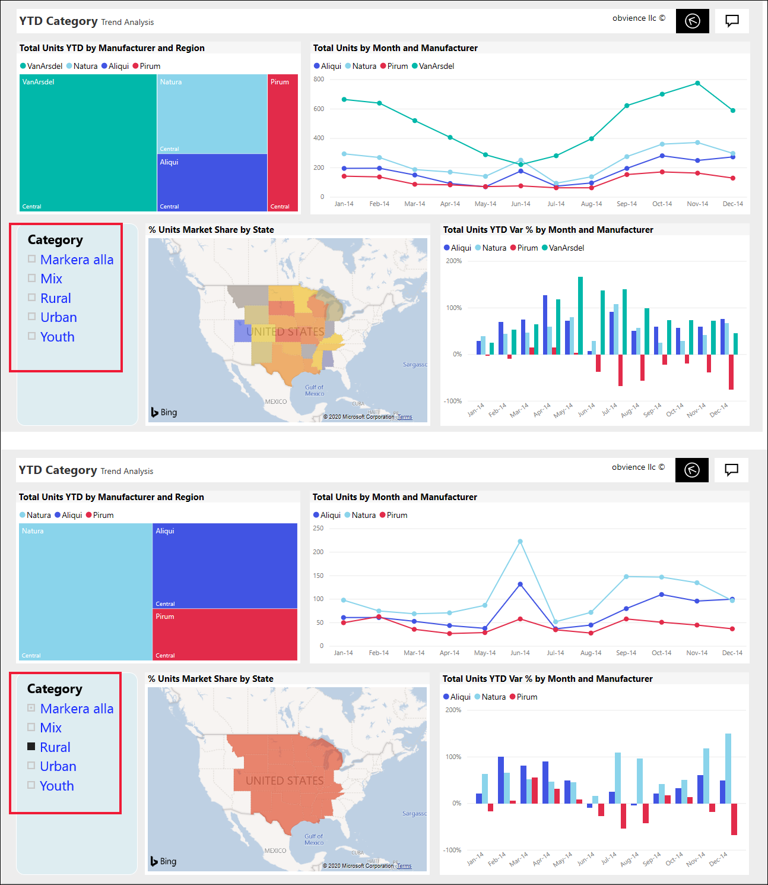
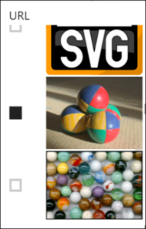
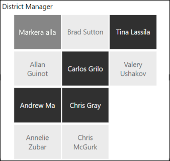
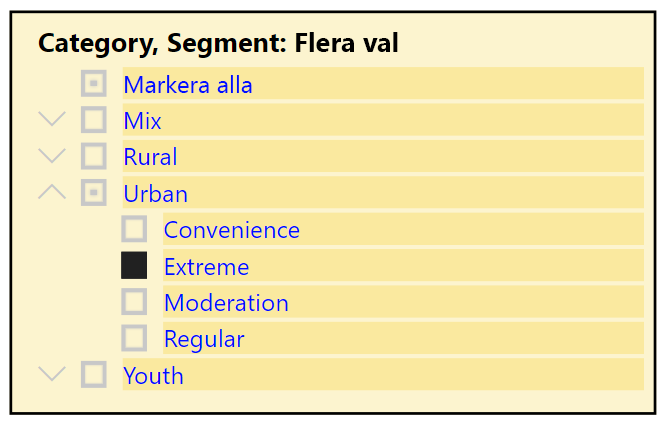
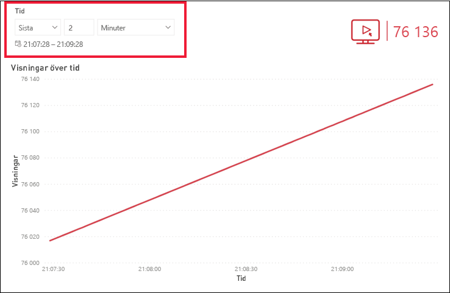
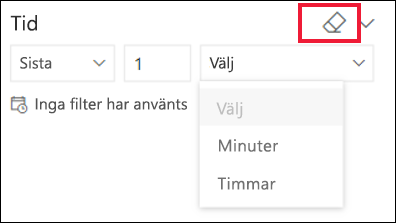

# Utsnitt i Power BI-tjänsten

[!INCLUDE[consumer-appliesto-ynnn](../includes/consumer-appliesto-yynn.md)]

Ett utsnitt är en typ av visualisering som filtrerar de andra visuella objekten på en rapportsida. När du använder Power BI-rapporter kommer du att stöta på många typer av utsnitt. I bilden ovan ser du samma utsnitt men med olika val. Observera hur varje val filtrerar de andra visuella objekten på sidan.  

## Så här använder du utsnitt
När *designers* skapar rapporter lägger de till utsnitt för att kunna berätta en historia och ge dig verktyg för att utforska dina data.

### Numeriskt intervallutsnitt
 Det numeriska intervallutsnittet ovan hjälper dig att utforska den totala försäljningen per geografi, enheter i lager och beställningsdatum. Använd handtagen till att välja ett intervall. 

### Utsnitt för grundläggande vertikala kryssrutor

I ett utsnitt för grundläggande kryssrutor markerar du en eller flera kryssrutor för att se hur de andra visuella objekten på sidan påverkas. Om du vill välja fler än en kryssruta använder du CTRL-välj. Ibland kan *rapportdesignern* ställa in utsnittet så att du bara får välja ett värde åt gången. 

### Bild- och formutsnitt
När utsnittsalternativen är bilder eller former gör du dina val ungefär som med kryssrutor. Du kan välja en eller flera bilder eller former för att tillämpa utsnittet på de andra visuella objekten på sidan. 

    

    

### Hierarkiutsnitt

I ett utsnitt med en hierarki använder du »-tecken till att expandera och komprimera hierarkin. Rubriken uppdateras med dina val.

### Relativt tidsutsnitt
I nya scenarier med snabba uppdateringar kan det vara väldigt användbart att filtrera på en mindre tidsperiod.
Med hjälp av det relativa tidsutsnittet kan du tillämpa tidsbaserade filter på alla datum- och tidsdata i rapporten. Du kan till exempel använda det relativa tidsutsnittet till att bara visa videovisningar de senaste 2 dagarna, timmarna eller till och med minuterna. 

## Inaktivera ett utsnitt
Om du vill inaktivera ett utsnitt väljer du ikonen Radera.

## Nästa steg
Mer information finns i följande artiklar:

[Visualiseringstyper i Power BI](end-user-visualizations.md)

