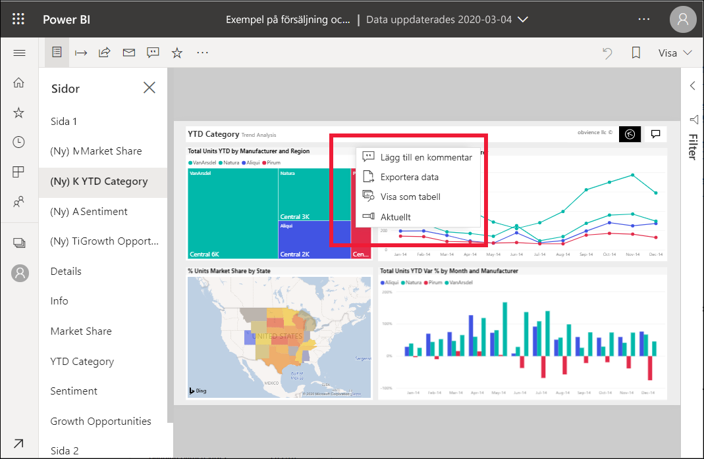
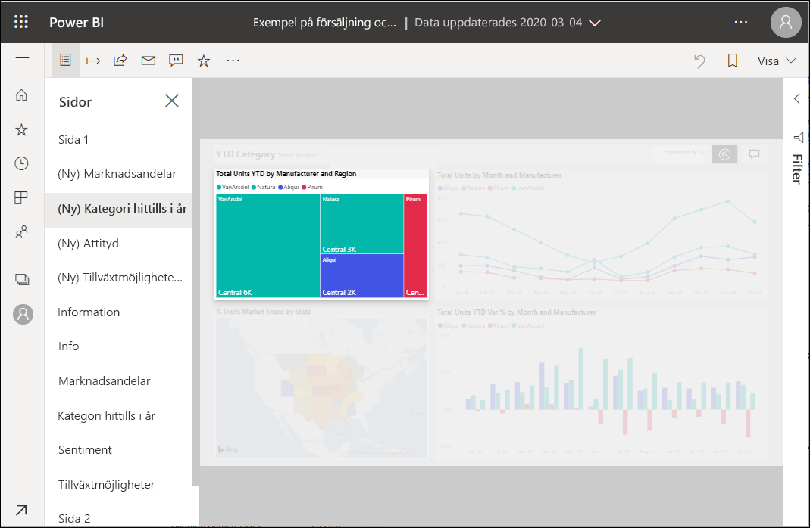

# Lägga till spotlight i Power BI-rapporter

[!INCLUDE[consumer-appliesto-yyny](../includes/consumer-appliesto-yyny.md)]

Med Spotlight kan du dra uppmärksamheten till ett särskilt visuellt objekt på en rapportsida.  Om du väljer spotlightläge när du lägger till ett bokmärke, behålls det läget i bokmärket.

## Lägg till Spotlight

1. [Öppna rapporten](end-user-report-open.md) i Power BI-tjänsten.

2. Bestäm vilket visuellt objekt du vill markera på rapportsidan. Välj listrutan **Fler åtgärder**.  

    

3. Välj alternativet för **Spotlight**. Det valda visuella objektet är markerat vilket gör att alla andra visuella objekt på sidan tonas till nära genomskinlighet. 

    

## Nästa steg

* [Visa en instrumentpanel eller rapportvisualisering i fokusläge](end-user-focus.md)

