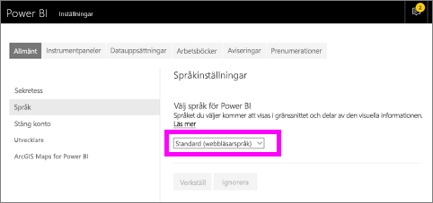
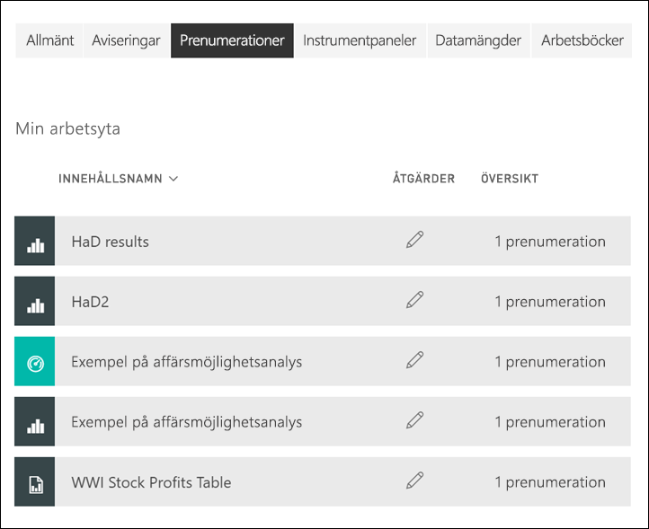

# Prenumerera på en rapport eller en instrumentpanel i Power BI-tjänsten 

[!INCLUDE[consumer-appliesto-ynny](../includes/consumer-appliesto-ynny.md)]

[!INCLUDE [power-bi-service-new-look-include](../includes/power-bi-service-new-look-include.md)]

Det har aldrig varit enklare att hålla sig uppdaterad när det gäller viktiga instrumentpaneler och rapporter. Prenumerera på de rapportsidor och instrumentpaneler som är viktigast för dig och Power BI skickar dig ett e-postmeddelande med en ögonblicksbild till din inkorg. Ange hur ofta du vill att Power BI ska skicka dig sådana e-postmeddelanden: varje dag, varje vecka eller när data uppdateras. Du kan även ange en specifik tid då Power BI skickar e-postmeddelanden eller låta den köras nu.  Du kan ställa in upp till 24 olika prenumerationer per rapport eller instrumentpanel.

E-post och ögonblicksbild använder det språk som angetts i Power BI-inställningarna (se [språk och länder/regioner som stöds för Power BI](../supported-languages-countries-regions.md)). Om inget språk har definierats använder Power BI det språk som är inställt i de nationella inställningarna i din nuvarande webbläsare. Om du vill se eller ange din språkinställning klickar du på kugghjulsikonen  > **Inställningar > Allmänt > Språk**. 

När du får e-postmeddelandet innehåller det en länk med rubriken ”Gå till rapporten eller instrumentpanelen”. Om du väljer den här länken på mobila enheter med installerade Power BI-appar, så startas appen (istället för standardåtgärden att rapporten eller instrumentpanelen på webbplatsen Power BI öppnas).

## Krav
Att **Skapa** en prenumeration för dig själv kräver en viss typ av [licens](end-user-license.md). Kontakta Power BI-administratören om du inte kan skapa någon prenumeration. Att **prenumerera åt andra** är endast tillgängligt för instrumentpanelens eller rapportens ägare. Prenumeration på sidnumrerade rapporter fungerar lite annorlunda. Mer information finns i [Skapa en prenumeration åt dig själv och andra på en sidnumrerad rapport i Power BI-tjänsten](paginated-reports-subscriptions.md). 

## Prenumerera på instrumentpanel eller en rapportsida
Oavsett om du prenumererar på en instrumentpanel eller en rapport är processerna lika. Du kan använda samma knapp för att prenumerera på Power BI-tjänstens instrumentpaneler och rapporter.
 
.

1. Öppna instrumentpanelen eller rapporten.
2. Välj **Prenumerera** på den översta menyraden, eller välj kuvertikonen .
   

   
    
    Fönstret till vänster när du är på en instrumentpanel och väljer **Prenumerera**. Fönstret till höger när du är på en rapportsida och väljer **Prenumerera**. 
    
    a. Om du vill prenumerera på flera sidor i en rapport väljer du **Lägg till en till prenumeration** och väljer en annan sida i listrutan högst upp.

    b. Aktivera eller inaktivera prenumerationen med det gula skjutreglaget.  Om du ställer in skjutreglaget på Av så tas inte prenumerationen bort. Om du vill ta bort prenumerationen så väljer du istället papperskorgen.

    c. Lägg alternativt till ett ämne och e-postmeddelandeinformation. 

    d. Välj en **frekvens** för prenumerationen.  Du kan välja Varje dag, Varje vecka och Efter datauppdatering (Varje dag).  Om du bara vill få e-post för prenumerationen på vissa dagar väljer du **Varje vecka** och vilka dagar du vill få den.  Om du till exempel bara vill ha prenumerationens e-postmeddelanden på arbetsdagar, väljer du **Varje vecka** som frekvens och avmarkerar rutorna Lör och Sön. Om du väljer **Varje månad** anger du den eller de dagar i månaden som du vill ta emot prenumerationsmeddelandet via e-post.   

    e. Om du väljer Varje dag, Varje timme, Varje månad eller Varje vecka kan du även välja en Schemalagd tid för prenumerationen. Du kan köra den på heltimme eller 15, 30 eller 45 minuter över. Välj morgon (AM) eller eftermiddag/kväll (PM). Du kan även ange tidszon. Om du väljer Varje timme ska du välja Schemalagd tid då du vill att prenumerationen ska starta, så körs den varje timme efter det.  

    f. Schemalägg start- och slutdatum genom att ange datum i datumfälten. Som standard blir starttiden för prenumerationen det datum du skapade den och slutdatumet blir ett år senare. Du kan ändra det till vilket datum som helst i framtiden (upp till år 9999) när som helst innan prenumerationen avslutas. När en prenumeration når ett slutdatum stoppas den tills du aktiverar den igen.  Du får ett eller flera meddelanden innan det schemalagda slutdatumet där du tillfrågas om du vill förlänga den.     

    ex. Välj **Kör nu** om du vill granska prenumerationen och testa den.  Då skickas e-postmeddelandet till dig direkt. 

3. Om allt ser bra ut väljer du **Spara och stäng**. Du får ett e-postmeddelande och en ögonblicksbild av instrumentpanelen eller rapporten enligt det schema som du anger. Alla prenumerationer med frekvensen **Efter datauppdatering** inställd skickar bara ett e-postmeddelande efter den första schemalagda uppdateringen på den dagen.
   
   
   
    Att uppdatera rapportsidan uppdaterar inte datauppsättningen. Endast datauppsättningens ägare kan uppdatera en datauppsättning manuellt. Om du vill söka efter ägarnamnet på den eller de underliggande datamängderna väljer du listrutan på menyraden eller letar rätt på prenumerationens ursprungliga e-postmeddelande.
   
    

## Hantera dina prenumerationer
Endast du kan hantera de prenumerationer som du skapar. Välj **prenumerera** igen och välj **Hantera alla prenumerationer** längst ned i det nedre vänstra hörnet (se skärmbilder ovan). Vilka enskilda prenumerationer som visas beror på vilken arbetsyta som för närvarande är aktiv. Om du vill se alla dina prenumerationer på en gång för alla arbetsytor, så kontrollera att **Min arbetsyta** är aktiv. Om du vill ha hjälp med att förstå hur arbetsytor fungerar, så gå till [Arbetsytor i Power BI](end-user-workspaces.md). 

En prenumeration går ut om Pro-licensen upphör att gälla, om instrumentpanelen eller rapporten tas bort av ägaren eller om det användarkonto som använts för att skapa prenumerationen raderas.

## Överväganden och felsökning
* Om du vill undvika att e-postprenumerationer skickas till din skräppostmapp lägger du till e-postaliaset för Power BI (no-reply-powerbi@microsoft.com) i dina kontakter. Om du använder Microsoft Outlook högerklickar du på aliaset och väljer **Lägg till i Outlook-kontakter**. 
* Instrumentpaneler med fler än 25 fästa paneler eller fyra fästa liverapportsidor kanske inte återges till fullo i prenumerationsmeddelanden som skickas till användare via e-post. Vi rekommenderar att du kontaktar och ber instrumentpanelsdesignern att minska antalet fästa paneler till färre än 25 och fästa live-rapporter till färre än fyra så att e-postmeddelandet återges korrekt.  
* För e-postprenumerationer på instrumentpaneler visas inte paneler som har säkerhet på radnivå (RLS) tillämpat.  
* Om länkarna i ditt e-postmeddelande (till innehållet) slutar fungera kan det bero på att innehållet har tagits bort. Under skärmbilden i e-postmeddelandet kan du se om du har prenumererat dig själv eller om någon annan prenumererade åt dig. Om någon annan gjorde det kan du be den kollegan att antingen avbryta e-postmeddelandena eller prenumerera på nytt åt dig.
* För prenumerationer på instrumentpaneler så saknar vissa typer av paneler fortfarande stöd. Detta gäller: strömningspaneler, videopaneler och paneler för anpassat webbinnehåll. 
* Rapportsideprenumerationer är knutna till namnet på rapportsidan. Om du prenumererar på en rapportsida och den byter namn måste du återskapa din prenumeration.
* Kontakta systemadministratören om du inte använder prenumerationsfunktionen. Din organisation kan ha inaktiverat den här funktionen.  
* E-postprenumerationer har inte stöd för så många [anpassade visuella objekt](../developer/visuals/power-bi-custom-visuals.md).  Undantaget är de anpassade visuella Power BI-objekt som har [certifierats](../developer/visuals/power-bi-custom-visuals-certified.md).    
* E-postprenumerationer skickas med rapportens standardfilter och utsnittstillstånd. Inga ändringar av standardinställningarna som du gör efter att du börjar prenumerera visas i e-postmeddelandet. Sidnumrerade rapporter har stöd för den här funktionen och gör att du kan ställa in specifika parametervärden per prenumeration.  
* E-postprenumerationer saknar för närvarande stöd för R-baserade visuella Power BI-objekt.  
* För prenumerationer på instrumentpaneler så saknar vissa typer av paneler fortfarande stöd.  Detta gäller: strömningspaneler, videopaneler och paneler för anpassat webbinnehåll.     
* På grund av storleksbegränsningar i e-posten kan prenumerationer på instrumentpaneler och rapporter som innehåller extremt stora bilder misslyckas.    
* Power BI pausar automatiskt uppdateringar för datauppsättningar som är associerade med instrumentpaneler och rapporter som inte har besökts på över två månader.  Men om du lägger till en prenumeration på en instrumentpanel eller en rapport pausas den inte även om den förblir obesökt.
* I sällsynta fall kan e-postprenumerationer ta längre tid än 15 minuter at levereras till mottagarna.  Om detta inträffar rekommenderar vi att du kör datauppdateringen och e-postprenumerationen vid olika tider för att säkerställa leverans i tid.  Om problemet kvarstår kontaktar du supporten för Power BI.

## Nästa steg

[Söka efter och sortera innehåll](end-user-search-sort.md)
