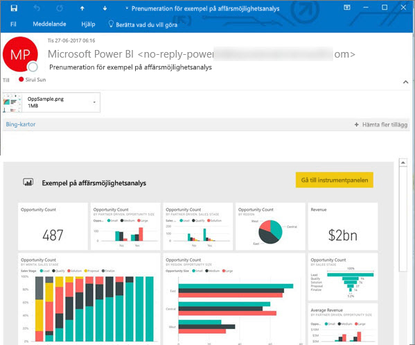
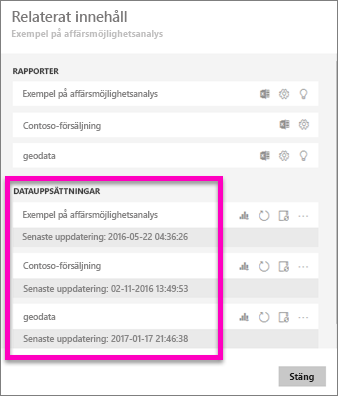
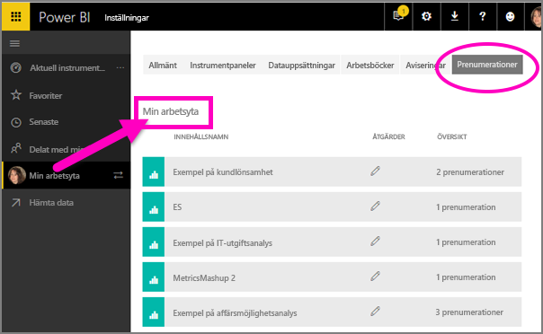

# Prenumerera på en rapport eller en instrumentpanel i Power BI-tjänsten 
Det har aldrig varit enklare att hålla sig uppdaterad när det gäller viktiga instrumentpaneler och rapporter. Prenumerera på de rapportsidor och instrumentpaneler som är viktigast för dig och Power BI skickar dig ett e-postmeddelande med en ögonblicksbild till din inkorg. Ange hur ofta du vill att Power BI ska skicka dig sådana e-postmeddelanden: från en gång om dagen till en gång i veckan. 

E-post och ögonblicksbild använder det språk som angetts i Power BI-inställningarna (se [språk och länder/regioner som stöds för Power BI](../supported-languages-countries-regions.md)). Om inget språk har definierats använder Power BI det språk som är inställt i de nationella inställningarna i din nuvarande webbläsare. Om du vill se eller ange din språkinställning klickar du på kugghjulsikonen  > **Inställningar > Allmänt > Språk**. 

När du får e-postmeddelandet innehåller det en länk med rubriken ”Gå till rapporten eller instrumentpanelen”. Om du väljer den här länken på mobila enheter med installerade Power BI-appar, så startas appen (istället för standardåtgärden att rapporten eller instrumentpanelen på webbplatsen Power BI öppnas).

## Krav
- **Skapa** en prenumeration är en funktion i Power BI Pro. 
- Eftersom e-post angående prenumerationer endast skickas när en underliggande datauppsättning uppdateras fungerar inte prenumerationer på datamängder som inte uppdateras.

## Prenumerera på instrumentpanel eller en rapportsida
Oavsett om du prenumererar på en instrumentpanel eller en rapport är processerna mycket lika. Du kan använda samma knapp för att prenumerera på Power BI-tjänstens instrumentpaneler och rapporter.
 
.

1. Öppna instrumentpanelen eller rapporten.
2. Välj **Prenumerera** på den översta menyraden, eller välj kuvertikonen .
   
   

3. Aktivera eller inaktivera prenumerationen med det gula skjutreglaget.  Om du ställer in skjutreglaget på Av så tas inte prenumerationen bort. Om du vill ta bort prenumerationen så väljer du istället papperskorgen.

4. Lägg alternativt till e-postmeddelandeinformation. 

    I skärmbilderna nedan ser du att när du prenumererar på en rapport prenumererar du i själv verket på en rapport*sida*.  Om du vill prenumerera på flera sidor i en rapport väljer du **Lägg till en till prenumeration** och väljer en annan sida. 
      
   

5. Spara prenumerationen genom att välja **Spara och stäng**. Du kommer att få ett e-postmeddelande och en ögonblicksbild av instrumentpanelen eller rapportsidan varje gång några av de underliggande datamängderna ändras. Om instrumentpanelen eller rapporten uppdateras mer än en gång om dagen skickas e-postmeddelandet endast efter den första uppdateringen.  
   
   
   
Att uppdatera rapportsidan uppdaterar inte datauppsättningen. Endast datauppsättningens ägare kan uppdatera en datauppsättning manuellt. Om du vill söka efter namnet på den underliggande datauppsättningen, välj **Visa relaterade** på den översta menyraden.
   

## Hur e-postschemat bestäms
I följande tabell beskrivs hur ofta du får ett e-postmeddelande. Det beror helt på anslutningsmetoden för den datauppsättning som instrumentpanelen eller rapporten baseras på (DirectQuery, Live-anslutning, import till Power BI, Excel-fil i OneDrive eller SharePoint Online) samt på vilka prenumerationsalternativ som är tillgängliga och valda (varje dag, varje vecka eller inget).

|  | **DirectQuery** | **Live Connect** | **Schemalagd uppdatering (import)** | **Excel-fil i OneDrive/SharePoint Online** |
| --- | --- | --- | --- | --- |
| **Hur ofta uppdateras rapporten/instrumentpanelen?** |Var 15:e minut |Power BI kontrollerar var 15: e minut, och om datauppsättningen har ändrats, så uppdateras rapporten. |Användaren väljer inget, varje dag eller varje vecka. Varje dag kan vara upp till 8 gånger per dag. Varje vecka är ett veckoschema som användaren skapar och ställer in uppdateringar från så lite som en gång i veckan upp till varje dag. |En gång i timman |
| **Hur stor kontroll har användaren över schemat för e-postprenumeration?** |Alternativen är: varje dag eller varje vecka |Inga alternativ: användarna får ett e-postmeddelande om rapporten uppdateras, men inte mer än en gång per dag. |Om uppdateringsschemat är varje dag, så är alternativen dagliga och veckovisa.  Om uppdateringsschemat är varje vecka så är endast veckoalternativet tillgängligt. |Inga alternativ: användaren skickas ett e-postmeddelande när datauppsättnngen har uppdaterats, men inte mer än en gång per dag. |

## Hantera dina prenumerationer
Endast du kan hantera dina prenumerationer. Välj **prenumerera** igen och välj **hantera alla prenumerationer** (se skärmbilderna under steg 4 ovan). 

En prenumeration går ut om Pro-licensen upphör att gälla, om instrumentpanelen eller rapporten tas bort av ägaren eller om det användarkonto som använts för att skapa prenumerationen raderas.

## Överväganden och felsökning
* För e-postprenumerationer på instrumentpaneler visas inte paneler som har säkerhet på radnivå (RLS) tillämpat.  För e-postprenumerationer på rapporter går det inte att skapa en prenumeration om datauppsättningen använder RLS.
* Rapportsideprenumerationer är knutna till namnet på rapportsidan. Om du prenumererar på en rapportsida och den byter namn, måste du återskapa din prenumeration
* Vissa inställningar för din organisation kan konfigureras i Azure Active Directory, vilket kan begränsa möjligheten att använda e-postprenumerationer i Power BI.  Detta inkluderar, men inte begränsat till, att ha multifaktorautentisering eller begränsningar för IP-intervallet vid åtkomst till resurser.
* För e-postprenumerationer på live-anslutningsdatauppsättningar får du endast e-postmeddelanden när data ändras. Så om en uppdatering görs, men inga data ändras, så skickar Power BI dig inget e-postmeddelande.
* E-postprenumerationer har inte stöd för så många [anpassade visuella objekt](../power-bi-custom-visuals.md).  Det enda undantaget är de anpassade visuella objekt som har [certifierats](../power-bi-custom-visuals-certified.md).  
* E-postprenumerationer har för närvarande inte stöd för R-baserade anpassade visuella objekt.  
* Om det finns paneler på instrumentpanelen som har säkerhet på radnivå (RLS) tillämpat visas inte de panelerna.
* E-postprenumerationer skickas med rapportens standardfilter och utsnittstillstånd. Inga ändringar av standardinställningarna som du gör efter att du börjar prenumerera visas i e-postmeddelandet.    
* För prenumerationer på instrumentpaneler så saknar vissa typer av paneler fortfarande stöd.  Detta gäller: strömningspaneler, videopaneler och paneler för anpassat webbinnehåll.     
* På grund av storleksbegränsningar i e-posten kan prenumerationer på instrumentpaneler och rapporter som innehåller extremt stora bilder misslyckas.    
* Power BI pausar automatiskt uppdateringat för datauppsättningar som är associerade med instrumentpaneler och rapporter som inte har besökts på över två månader.  Men om du lägger till en prenumeration på en instrumentpanel eller en rapport, så pausas den inte, även om den förblir obesökt.    

## Nästa steg
* Har du fler frågor? [Fråga Power BI Community](http://community.powerbi.com/)    
* [Läs blogginlägget](https://powerbi.microsoft.com/blog/introducing-dashboard-email-subscriptions-a-360-degree-view-of-your-business-in-your-inbox-every-day/)

