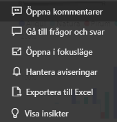
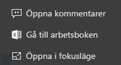
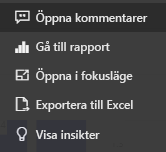

# Paneler på instrumentpanelen i Power BI

[!INCLUDE[consumer-appliesto-yyny](../includes/consumer-appliesto-ynny.md)]

[!INCLUDE [power-bi-service-new-look-include](../includes/power-bi-service-new-look-include.md)]

En panel är en ögonblicksbild av dina data, fäst på instrumentpanelen av en *designer*. *Designers* kan skapa paneler från en rapport, datamängd, instrumentpanel, Frågor och svar-frågerutan, Excel samt SQL Server Reporting Services (SSRS) med mera.  Den här skärmbilden visar många olika paneler fästa på en instrumentpanel.

Utöver paneler som är fästs från rapporter kan *designers* lägga till fristående paneler direkt på instrumentpanelen med hjälp av **Lägg till panel**. Fristående paneler innehåller: textrutor, bilder, videor, strömmande data och webbinnehåll.

Behöver du hjälp att förstå de olika byggstenarna i Power BI?  Mer information finns i [Power BI – grundläggande begrepp](end-user-basic-concepts.md).

## Interaktion med paneler på en instrumentpanel

1. Hovra över panelen för att visa ellipserna.
   
    
2. Välj ellipserna för att öppna åtgärdsmenyn i panelen. De tillgängliga alternativen varierar med visuell typ och den metod som används för att skapa panelen. Här följer några exempel på vad som kan visas.

    - panel som skapats med hjälp av frågor och svar
   
        

    - panel som skapats från en arbetsbok
   
        

    - panel som skapats från en rapport
   
        
   
    Här kan göra du följande:
   
   * [Öppna den rapport som användes för att skapa den här panelen ](end-user-reports.md)   
   
   * [Öppna den Frågor och svar-fråga som användes för att skapa panelen ](end-user-reports.md)   
   

   * [Öppna den arbetsbok som användes för att skapa den här panelen ](end-user-reports.md)   
   * [Visa panelen i fokusläge ](end-user-focus.md)   
   * [Visa insikter ](end-user-insights.md) 
   * [Lägga till en kommentar och starta en diskussion](end-user-comment.md)  
   * [Hantera aviseringar som angetts på en instrumentpanel](end-user-alerts.md)  
   * [Öppna data i Excel](end-user-export.md)  

3. Om du vill stänga åtgärdsmenyn, välj ett tomt område på arbetsytan.

### Välj (klicka på) en panel
När du väljer en panel beror händelseförloppet på hur panelen skapades och om den har en [anpassad länk](../create-reports/service-dashboard-edit-tile.md). Om den har en anpassad länk kommer du till denna länk om du väljer panelen. I annat fall kommer du, om du väljer panelen, till rapporten, arbetsboken i Excel Online, den lokala SSRS-rapporten eller frågor och svar som användes för att skapa panelen.

> [!NOTE]
> Undantag för detta är videopaneler som skapats direkt på en instrumentpanel med hjälp av **Lägg till panel**. Att välja en videopanel (som har skapats på detta sätt) gör så att videon spelas upp direkt på instrumentpanelen.   
> 
> 

## Överväganden och felsökning
* Om den rapport som användes för att skapa visualiseringen inte sparades kommer inget att hända om du väljer panelen.
* Om panelen har skapats från en arbetsbok i Excel Online och du inte har minst läsbehörighet för arbetsboken, kommer arbetsboken i Excel Online inte att öppnas om du väljer panelen.
* För paneler som skapats direkt på en instrumentpanel med hjälp av **Lägg till panel**, kan du, om en anpassad hyperlänk har ställts in, markera rubriken, underrubriken och eller en panel för att öppna URL:en.  I annat fall händer som standard ingenting om du väljer en av dessa paneler som skapats direkt på instrumentpanelen för en bild, webbkod eller textruta.
* Om du inte har behörighet för rapporten i SSRS, kommer val av en panel som skapats från SSRS att generera en sida som anger att du inte har åtkomst (rsAccessDenied).
* Om du inte har åtkomst till nätverket där SSRS-servern finns, kommer val av en panel som skapats från SSRS generera en sida som anger att det inte går att hitta servern (HTTP 404). Enheten måste ha nätverksåtkomst till rapportservern för att visa rapporten.
* Om den ursprungliga visualiseringen som användes för att skapa panelen ändras, ändras inte panelen.  Om *designern* till exempel har fäst ett linjediagram från en rapport och sedan ändrar linjediagrammet till ett stapeldiagram fortsätter panelen på instrumentpanelen att visa ett linjediagram. Data uppdateras, men visualiseringstypen gör det inte.

## Nästa steg
[Datauppdatering](../connect-data/refresh-data.md)

[Power BI – Grundläggande begrepp](end-user-basic-concepts.md)

