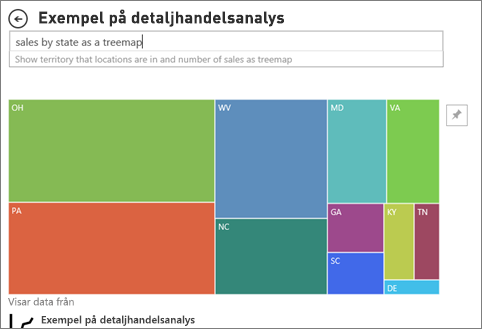

# Typer av visuella objekt i Power BI

[!INCLUDE[consumer-appliesto-yynn](../includes/consumer-appliesto-yynn.md)]

Det finns visuella objekt i rapporter, på instrumentpaneler samt i frågor och svar. Vissa av dessa typer av visuella objekt paketeras med Power BI, och vissa är *visuella Power BI-objekt*. Anpassade visuella objekt skapas utanför Power BI och på ett sätt som gör att *rapportdesigners* kan lägga till dem i Power BI-rapporter och -instrumentpaneler. 

Den här artikeln är en översikt över de visuella objekt som paketeras med Power BI-tjänsten.  Det här är de visuella objekt som du stöter på oftast. Detaljerad information om dessa visuella objekt finns i [dokumentationen om typer av visuella objekt för Power BI-*rapportdesigners*](../visuals/power-bi-visualization-types-for-reports-and-q-and-a.md)

> [!NOTE]
> Du kan få mer information om visuella Power BI-objekt genom att söka efter dem i avsnittet om **visuella objekt i Power BI** i [Microsoft AppSource](https://appsource.microsoft.com/marketplace/apps?product=power-bi-visuals). För varje visuella objekt finns en beskrivning, information om skapare och antingen skärmbilder eller en video. 

## Lista över visuella objekt som är tillgängliga i Power BI
Alla dessa visuella objekt finns i Power BI-instrumentpaneler och -rapporter och [anges i frågor och svar](end-user-q-and-a.md). Information om hur du interagerar med visuella objekt finns i [Interagera med visuella objekt i rapporter, instrumentpaneler och appar](end-user-visualizations.md)

### Ytdiagram: Enkelt (i lager) och stapel

Grundläggande ytdiagram baseras på linjediagram där området mellan axeln och linjen har fyllts i. Ytdiagrammet framhäver omfattningen av förändring över tid och kan användas för att uppmärksamma totalvärdet över en trend. Data som representerar vinst över tid kan till exempel ritas i ett ytdiagram för att betona den totala vinsten.

### Fält och kolumndiagram

 

Stapeldiagram är standard för att visa ett specifikt värde över olika kategorier.

### Kort: Enskilt antal

Enskilt tal-kort visar ett enda faktum, en enda datapunkt. Ett enda tal kan ibland vara det viktigaste du vill spåra i Power BI-instrumentpanelen eller -rapporten, till exempel total försäljning, marknadsandel år för år eller totala affärsmöjligheter.  

### Kort: Flerrad

Flerradskort visar en eller flera datapunkter, en per rad.

### Kombinationsdiagram

En kombinationsdiagram kombinerar ett stapeldiagram och ett linjediagram. Om du kombinerar de två diagrammen till ett kan du göra en snabbare jämförelse av dina data. Kombinationsdiagram kan ha en eller två Y-axlar, så titta noga. 

Kombinationsdiagram är ett bra alternativ:
- när du har ett linjediagram och ett stapeldiagram med samma X-axel,
- för att jämföra flera mått med olika värdeintervall
- för att illustrera korrelationen mellan två mått i ett visuellt objekt
- för att kontrollera om ett mått uppfyller det mål som har definierats av ett annat mått
- för att spara utrymme på arbetsytan

### Ringdiagram

Ringdiagram liknar cirkeldiagram.  De visar relationen mellan delar och en helhet. Den enda skillnaden är att mitten är tom och har utrymme för en etikett eller ikon.

### Trattdiagram

Trattdiagram hjälper dig att visualisera en process som har steg och objekt som flödar i ordning från ett stadium till nästa.  Ett exempel är en säljprocess som börjar med leads och avslutas med att köpet genomförs.

Till exempel en försäljningstratt som spårar kunderna genom stadier: Lead > kvalificerat lead > potentiell kund > avtal > avslut. Trattens form ger en översikt över processens tillstånd.
Varje steg i trattens motsvarar en procentandel av det totala antalet. I de flesta fallen är ett trattdiagram format som en tratt, där det första stadiet är störst och varje följande steg är mindre än det föregående. En päronformad tratt kan också vara användbar – den kan identifiera ett problem i processen. Men vanligtvis är det första stadiet, ”intaget”, det största.

### Måttdiagram

Ett diagram med radiell mätare har en cirkelformad båge och visar ett värde som mäter framsteg på ett mål/KPI. Målet, eller målvärdet, representeras av strecket (nålen). Framsteg mot målet representeras av skuggningen. Och det värde som representerar förloppet visas i fetstil i bågen. Alla möjliga värden är jämnt fördelade längs bågen, från det lägsta (värdet längst till vänster) värdet till det högsta (värdet längst till höger).

I exemplet ovan är vi en bilåterförsäljare som spårar våra säljares genomsnittliga försäljning per månad. Vårt mål är 140, vilket representeras av den svarta nålen. Minsta möjliga genomsnittlig försäljning är 0 och högsta har konfigurerats som 200. Den blå skuggningen visar att det aktuella medelvärdet är cirka 120 försäljningar denna månad. Som tur är ha vi fortfarande ytterligare en vecka till vårt mål.

Radiella mätare är ett bra val för att:
- visa förlopp mot ett mål
- representera ett procentmått, t.ex. ett KPI
- visa hälsotillståndet för ett enda mått
- visa information som går snabbt att genomsöka och förstå

 ### Diagram över viktiga påverkare

Ett diagram över viktiga påverkare visar de största bidragande orsakerna till ett valt resultat eller värde.

Viktiga påverkare hjälper dig att förstå de faktorer som påverkar ett nyckelmått. Till exempel *vad som påverkar att kunderna gör en andra beställning *eller* varför försäljningen gick så bra i juni förra året*. 

### KPI:er

En KPI (Key Performance Indicator) är en visuell ledtråd som kommunicerar de framsteg som gjorts mot ett mätbart mål. 

KPI:er är ett bra alternativ
- för att mäta framsteg (Vad ligger jag före eller efter med?)
- för att mäta avståndet till ett mål (Hur långt före eller efter ligger jag?)

### Linjediagram

Linjediagram fokuserar på övergripande formen av en hel serie av värden, vanligtvis över tid.

### Kartor: Grundläggande kartor

Använd en grundläggande karta för att associera både kategorisk och kvantitativ information med platser.

### Kartor: ArcGIS-mappar

Kombinationen av ArcGIS-kartor och Power BI tar mappning längre än till bara presentation av punkter på en karta – helt enkelt till en helt ny nivå. De tillgängliga alternativen för grundläggande kartor, platstyper, teman, symbolformat och referensskikt skapar fantastiska informativa visuella kartobjekt. Kombinationen av auktoritativa dataskikt (till exempel folkräkningsdata) på en karta med spatial analys ger en bättre förståelse av data i det visuellt objektet.

### Kartor: Fyllda kartor (Choropleth)

En fylld karta använder skuggning, toning eller mönster för att visa hur ett värde skiljer sig åt proportionellt på en geografisk plats eller i en region. Du kan snabbt visa dessa relativa skillnader med skuggning som sträcker sig från ljus (mindre ofta/lägre) till mörk (mer frekvent/fler).

### Kartor: Formkartor

Formkartor jämför regioner på en karta med hjälp av färg. Formkartor kan inte visa exakta geografiska platser för datapunkter på en karta. Istället är dess huvudsakliga syfte att visa relativa jämförelser mellan regioner med hjälp av olika färger.

### Matris

Matrisen är en typ av visuellt tabellobjekt (se ”Tabell” nedan) som stöder en stegvis layout. Ofta inkluderar rapportdesigner matriser i rapporter och instrumentpaneler så att användare kan välja ett eller flera element (rader, kolumner, celler) i matrisen för att korsmarkera andra visuella objekt på en rapportsida.  

### Cirkeldiagram

Cirkeldiagram visar relationen mellan delar och en helhet. 

### Visuellt Power Apps-objekt

Rapportdesigners kan skapa en Power App och bädda in den i en Power BI-rapport. Användarna kan interagera med det visuella objektet i Power BI-rapporten. 

### Visuella frågor och svar

>[!TIP]
>Precis som med [Frågor och svar på instrumentpaneler](../create-reports/power-bi-tutorial-q-and-a.md) så kan du använda Visuella frågor och svar till att ställa frågor om dina data på naturligt språk. 

Mer information finns i [Visuella frågor och svar i Power BI](../visuals/power-bi-visualization-types-for-reports-and-q-and-a.md).

### Banddiagram

Banddiagram visar vilken datakategori som har den högsta rangordningen (största värdet). Banddiagram är effektiva för att visa en rangordningsförändring med den högsta rangordningen (värdet) längst upp för varje tidsperiod.

### Punktdiagram, bubbeldiagram och punktritningsdiagram

Ett punktdiagram har alltid två värdeaxlar som visar en uppsättning numeriska data längs en vågrät axel och en annan uppsättning numeriska värden längs en lodrät axel. Diagrammet visar punkter i skärningspunkten för ett numeriskt X- och Y-värde och kombinerar dessa värden till separata datapunkter. Dessa datapunkter kan vara jämnt eller ojämnt fördelade på den horisontala axeln, beroende på datan.

Ett bubbeldiagram ersätter datapunkterna med bubblor, med en bubbelstorlek som motsvarar ytterligare en dimension av informationen.

Punktritningsdiagram liknar bubbeldiagram och punktdiagram, med den skillnaden att det kan rita numeriska data eller kategoridata utmed X-axeln. Det här exemplet använder nämligen kvadrater i stället för cirklar och ritar försäljning längs X-axeln.

### Punktdiagram med hög densitet

Per definition samplas högdensitetsdata för att skapa visuella objekt förhållandevis snabbt som reagerar på interaktivitet. Högdensitetssampling använder en algoritm som eliminerar överlappande punkter och ser till att alla punkter i datauppsättningen representeras i det visuella objektet. Det ritar inte bara ett representativt urval av data.  

Den säkerställer den bästa kombinationen av svarstider, återgivning och att bevara viktiga punkter i varje datauppsättningen.

### Utsnitt

Ett utsnitt är ett fristående diagram som kan användas för att filtrera de andra visuella objekten på sidan. Utsnitt finns i många olika format (kategori, intervall, datum osv.) och kan formateras att tillåta val av bara en, många eller alla tillgängliga värden. 

Utsnitt är ett bra alternativ för att:
- visa vanliga eller viktiga filter på rapportarbetsytan för enklare åtkomst
- göra det lättare att se det aktuella filtrerade tillståndet utan att öppna listrutan
- filtrera efter kolumner som är onödiga och dolda i datatabellerna
- skapa mer fokuserade rapporter genom att placera utsnitt bredvid viktiga visuella objekt

### Fristående bilder

En fristående bild är grafik som har lagts till i en rapport eller instrumentpanel. 

### Tabeller

En tabell är ett rutnät som innehåller relaterade data i en logisk serie med rader och kolumner. Det kan också innehålla rubriker och en rad för summor. Tabeller fungerar bra med kvantitativa jämförelser där du tittar på många värden för en enskild kategori. I den här tabellen visas till exempel fem olika mått för Kategori.

Tabeller är ett bra alternativ:
- för att visa och jämföra detaljerade data och exakta värden (istället för visuella representationer)
- för att visa data i tabellformat
- att visa numeriska data efter kategorier

### Trädkartor

Trädkartor är diagram som består av färgade rektanglar, vars storlek representerar värdet.  De kan vara hierarkiska, med rektanglar inbäddade i huvudrektanglarna. Utrymmet i varje rektangel fördelas utifrån vilka värden som mäts. Rektanglarna ordnas i storleksordning med de största överst till vänster och de minsta längst ned till höger.

Trädkartor är ett bra alternativ:
- för att visa stora mängder hierarkiska data
- när ett stapeldiagram inte på ett effektivt sätt kan hantera ett stort antal värden
- för att visa proportionerna mellan delarna och helheten
- för att visa distributionsmönstret för mätvärdena för varje nivå av kategorier i hierarkin
- för att visa attribut med hjälp av storlek och färgkodning
- för att upptäcka mönster, avvikande värden, de viktigaste bidragande faktorerna och undantag

### Vattenfallsdiagram

Ett vattenfallsdiagram visar en löpande summa efter hand som värden adderas eller subtraheras. Det är användbart för att förstå hur ett startvärde (till exempel nettointäkter) påverkas av en serie positiva och negativa förändringar.

Kolumnerna är färgkodade så att du snabbt kan se ökningar och minskningar. Kolumnerna med start- och slutvärde startar ofta på den horisontella axeln, medan de mellanliggande värdena är flytande kolumner. På grund av det här utseendet kallas också vattenfallsdiagram ibland för brodiagram.

Vattenfallsdiagram är ett bra alternativ
- när ändringar inträffar för måttet över tid eller olika kategorier
- för att granska de viktigaste ändringarna som bidrar till det totala värdet
- för att rita företagets årliga vinst genom att visa olika intäktskällor och komma fram till den totala vinsten (eller förlusten)
- för att illustrera inledande och avslutande personalstyrka för ditt företag under ett år
- för att visualisera hur mycket pengar ni tjänar och spenderar varje månad och den löpande balansen för räkenskaperna.

## Berätta för Frågor och svar vilket visuellt objekt som ska användas
När du skriver frågor med naturligt språk i Frågor och svar för Power BI kan du ange typen av visuellt objekt i frågan.  Till exempel:

”***försäljning per tillstånd som en trädkarta***”

## Nästa steg
[Interagera med visuella objekt i rapporter, instrumentpaneler och appar](end-user-visualizations.md)    
[Rätt visuell referens från sqlbi.com](https://www.sqlbi.com/wp-content/uploads/videotrainings/dashboarddesign/visuals-reference-may2017-A3.pdf)

