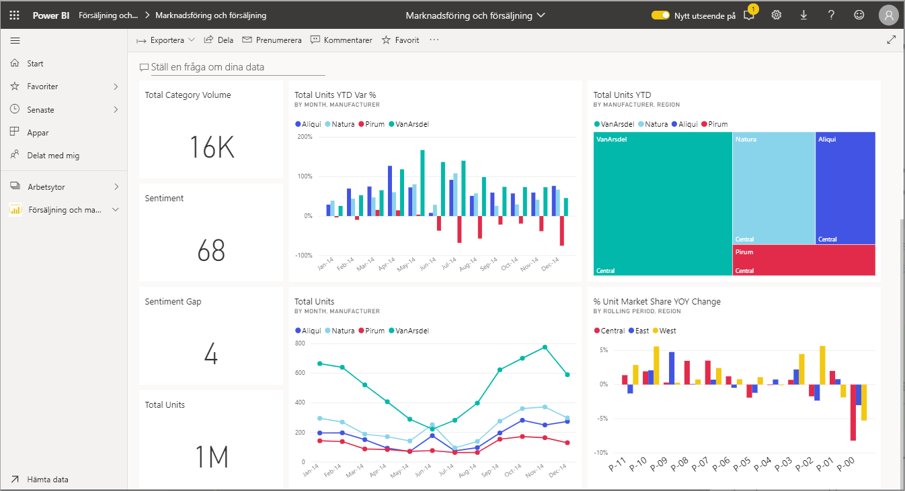
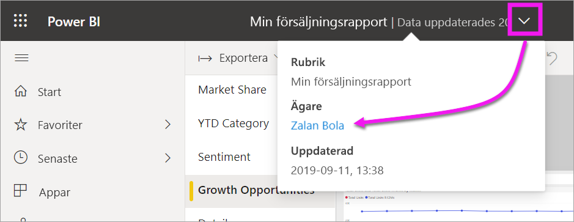

# Interagera med visuella objekt i rapporter, instrumentpaneler och appar

[!INCLUDE[consumer-appliesto-ynny](../includes/consumer-appliesto-ynny.md)]

I grunden är en ***visualisering*** (eller ett *visuellt objekt*), en typ av diagram som har skapats av *Power BI-designers* med hjälp av data i rapporter och datamängder. 

Visuella objekt finns på instrumentpaneler, i rapporter och kan skapas direkt med hjälp av frågor och svar i Power BI. När designers skapar ett visuellt objekt i en rapport kan de *fästa* det virtuella objektet på en instrumentpanel. Ett [visuellt objekt på en instrumentpanel kallas för en *panel*](end-user-tiles.md). Den här instrumentpanelen har åtta paneler. 

> [!TIP]
> Vi rekommenderar att du först läser översiktsavsnittet [Grundläggande begrepp för Power BI för *konsumenter*](end-user-basic-concepts.md) innan du läser det här mer detaljerade innehållet.

## Vad kan jag göra med visuella objekt?

Visuella objekt skapas av *rapport- och instrumentpanelsdesigners* och delas med *användare*. Som användare har du många alternativ för att interagera med visuella objekt för att få nya insikter och fatta datadrivna affärsbeslut. De flesta av dessa alternativ visas i tabellen nedan med länkar till stegvisa anvisningar.

För många av dessa alternativ kan administratören eller *designern* inaktivera din möjlighet att se eller använda dessa funktioner. Och vissa av dessa funktioner fungerar bara för vissa visuella objekt.  Om du har några frågor kan du kontakta administratören eller ägaren av rapporten eller instrumentpanelen. Om du vill hitta ägaren väljer du listrutan för instrumentpanelen eller rapporten. 

> [!IMPORTANT]
> Men först, lite om frågor och svar. Frågor och svar är sökverktyget för Power BI:s naturliga språk. Du skriver en fråga med ett naturligt språk och Frågor och svar ger svar på frågan i form av ett visuellt objekt. Frågor och svar är ett sätt för användare att skapa egna visuella objekt snabbt och enkelt. Visuella objekt som du skapar med Frågor och svar kan dock inte sparas. Men om det inte finns något speciellt du vill lära dig från dessa data och designern inte inkluderar dem i en rapport eller på en instrumentpanel, är frågor och svar ett bra alternativ. Mer information om frågor och svar finns [frågor och svar för konsumenter](end-user-q-and-a.md).

|Uppgift  |På en instrumentpanel  |I en rapport  | I frågor och svar
|---------|---------|---------|--------|
|[Lägga till kommentarer i ett visuellt objekt för dig själv eller starta en konversation med kollegor om det visuella objektet](end-user-comment.md).     |  ja       |   ja      |  nej  |
|[Öppna och utforska rapporten där det visuella objektet skapades](end-user-tiles.md).     |    ja     |   na      |  nej |
|[Visa en lista med filter och utsnitt som påverkar det visuella objektet](end-user-report-filter.md).     |    om du öppnar i fokusläge     |   ja      |  nej |
|[Öppna och utforska ett visuellt objekt i Frågor och svar (om *designern* använde Frågor och svar för att skapa det visuella objektet)](end-user-q-and-a.md).     |   ja      |   na      |  na  |
|[Skapa ett visuellt objekt i Frågor och svar för utforskning (du kan inte spara det) ](end-user-q-and-a.md).     |   ja      |   om designern har lagt till Frågor och svar i rapporten      |  ja  |
|[Be Power BI att leta efter intressanta fakta eller trender](end-user-insights.md) i det visuella objektets data åt dig.  Dessa automatiskt genererade visuella objekt kallas *insikter*.     |    ja, för paneler    |  nej       | nej   |
|[Visa bara ett visuellt objekt i taget med hjälp av läget *Fokus*](end-user-focus.md).     | ja, för paneler        |   ja, för visuella objekt      | na  |
|[Leta upp den senaste gången som det visuella objektet uppdaterades](end-user-fresh.md).     |  ja       |    ja     | na  |
|[Visa bara ett visuellt objekt i taget, utan kantlinjer eller navigeringsfönster, med hjälp av *helskärmsläget*](end-user-focus.md).     |   ja      |  ja       | som standard  |
|[Skriv ut](end-user-print.md).     |  ja       |   ja      | nej  |
|[Gräva djupare i det visuella objektet genom att lägga till och ändra visuella filter.](end-user-report-filter.md)     |    nej     |   ja      | nej  |
|Hovra över ett visuellt objekt för att visa ytterligare information och knappbeskrivningar.     |    ja     |   ja      | ja  |
|[Korsfiltrera och korsmarkera andra visuella objekt på sidan.](end-user-interactions.md)    |   nej      |   ja      | na  |
|[Visa de data som användes för att skapa det visuella objektet](end-user-show-data.md).     |  nej       |   ja      | nej  |
| [Ändra hur det visuella objektet sorteras](end-user-change-sort.md). | nej  | ja  | kan ändra sorteringen genom att omformulera frågan  |
| Lägga till en spotlight till ett visuellt objekt. | nej  | ja  |  nej |
| [Exportera till Excel.](end-user-export.md) | ja | ja | nej|
| [Skapa en avisering](end-user-alerts.md) så att du meddelas när ett värde överstiger ett visst tröskelvärde som du har angett.  | ja  | nej  | nej |
| [Korsfiltrera och korsmarkera de andra visuella objekten på sidan](end-user-report-filter.md).  | nej      | ja  | na |
| [Granska ett visuellt objekt som har en hierarki](end-user-drill.md).  | nej  | ja   | nej |

## Nästa steg
Tillbaka till [grundläggande koncept för konsumenter](end-user-basic-concepts.md)    
[Välj ett visuellt objekt för att öppna en rapport](end-user-report-open.md)    
[Visuella objektstyper som är tillgängliga i Power BI](end-user-visual-type.md)