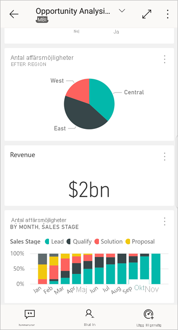
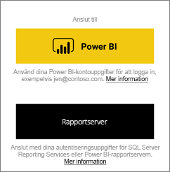
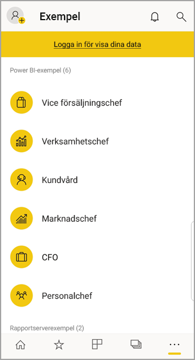
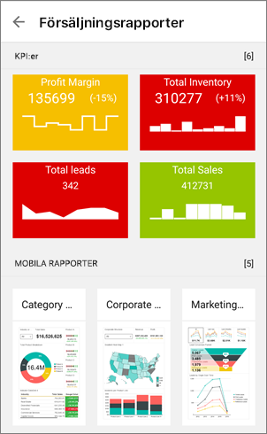
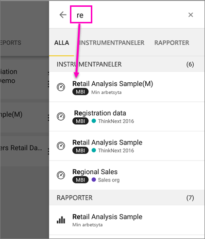
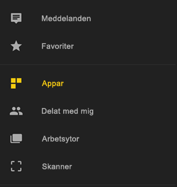
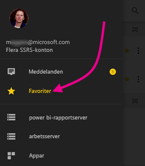
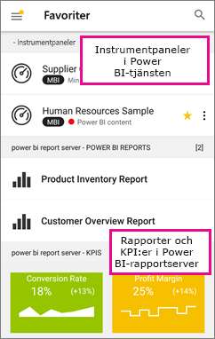

# Kom igång med Power BI-mobilapp på Android-enheter
Android-appen för Microsoft Power BI ger mobil BI-upplevelse för Power BI, Power BI-rapportserver och Reporting Services. Visa och interagera med ditt företags instrumentpaneler lokalt och i molnet överallt, med pekaktiverad mobil åtkomst i realtid. Utforska data i instrumentpaneler och dela med dina kollegor via e-post eller sms. 

Du skapar Power BI-rapporter i Power BI Desktop och publicerar dem:

* [Publicera dem i Power BI-tjänsten](../../power-bi-overview.md) och skapa instrumentpaneler.
* [Publicera dem lokalt på Power BI-rapportservern](../../report-server/quickstart-create-powerbi-report.md).

Sedan interagerar du i Power BI-appen för Android med dina instrumentpaneler och rapporter, antingen lokalt eller i molnet.

Ta reda på [nyheterna i Power BI-mobilapparna](../../mobile-whats-new-in-the-mobile-apps.md).

## Förutsättningar

### Hämta appen

[Ladda ner Power BI för Android-appen](http://go.microsoft.com/fwlink/?LinkID=544867) från Google Play Butik.
  
Power BI kan köras på ett antal olika Android-enheter som kör operativsystemet Android 5.0 eller senare. Om du vill kontrollera detta på din tenhet, gå till **Inställningar** > **Om enheten** > **Android-version**. 

**Starta när du öppnar appen**    
Även utan att registrera dig eller logga in kan du, när du öppnar appen, bläddra igenom inloggningssidorna för en snabb överblick över vad du kan göra med Power BI-appen på din Android-telefon. Tryck på **Hoppa över** för att visa och utforska exemplen och praktisk information med appen. Du kan [gå tillbaka till exemplen](mobile-android-app-get-started.md#try-the-power-bi-and-reporting-services-samples) från instrumentpanelernas hemsida när du vill.

Ta reda på [nyheterna i Power BI-mobilapparna](../../mobile-whats-new-in-the-mobile-apps.md).

## Registrera dig för Power BI-tjänsten på internet
Om du inte har registrerat dig ännu, går du till [Power BI-tjänsten (http://powerbi.com/)](http://powerbi.com/) för att registrera dig för ditt eget konto för att skapa och lagra instrumentpaneler och rapporter och föra samman dina data. Logga sedan in på Power BI från din Android-enhet att se dina egna instrumentpaneler varifrån du vill.

1. I Power BI-tjänsten, peka på [registrering](http://go.microsoft.com/fwlink/?LinkID=513879) för att skapa ett Power BI-konto.
2. Starta [skapa dina egna instrumentpaneler och rapporter](../../service-get-started.md).

## Kom igång med Power BI-appen på enheten
1. Öppna Power BI för Android-enheten från startskärmen på din Android-telefon.
   
   
2. Om du vill visa dina Power BI-instrumentpaneler och -rapporter trycker du på **Power BI**.  
   
   Om du får ett meddelande om att Power BI inte kan logga in, hittar du mer information i [”kunde inte autentisera eftersom företagets SSL-certifikat inte är betrott”](mobile-android-app-error-corporate-ssl-account-is-untrusted.md) om hur du löser problemet.

   Om du vill visa dina rapporter för Power BI-rapportserver och Reporting Services och KPI:er, trycker du på **Rapportserver**.
   
   

## Testa Power BI- och Reporting Services-exemplen
Även om du inte registrerar dig, kan du prova dig fram med Power BI- och Reporting Services-exemplen. När du har hämtat appen kan du se exemplen eller sätta igång. Gå tillbaka till exemplen från instrumentpanelernas startsida när du vill.

### Power BI-exempel
Du kan visa och interagera med instrumentpanelsexemplen i Power BI, men det finns några saker som du inte kan göra med dem. Du kan inte öppna rapporterna bakom instrumentpanelerna, dela exemplen med andra eller göra dem till dina favoriter.

1. Tryck på den globala navigeringsknappen  i det övre vänstra hörnet.
2. Tryck på **Inställningar** > **Identifiera våra exempel**, välj en roll och utforska exempelinstrumentpanel för rollen.  
   
   

### Mobila rapportexempel för Reporting Services
1. Tryck på den globala navigeringsknappen  i det övre vänstra hörnet.
2. Tryck på **Reporting Services-exemplen** och öppna antingen mappen för detaljhandelsrapporter eller försäljningsrapporter om du vill utforska deras KPI:er och mobila rapporter.
   
   

## Sök efter en instrumentpanel eller rapport
* Tryck på förstoringsglaset i det övre högra hörnet , skriv sedan termen som du vill hitta.
  
    
  
    Som standard söks alla instrumentpaneler och rapporter igenom, men du kan också söka i bara någondera.

## Hitta ditt innehåll i Power BI-mobilapparna
Dina instrumentpaneler och rapporter lagras på olika platser i Power BI-mobilapparna beroende på var de kom från. Läs mer om [att hitta ditt innehåll i mobilapparna](../../mobile-apps-quickstart-view-dashboard-report.md). Dessutom kan du alltid söka efter det du har i Power BI-mobilapparna. 

## Visa dina favoritinstrumentpaneler, KPI:er och rapporter
På sidan Favoriter i mobilapparna visas alla dina Power BI-favoritinstrumentpaneler tillsammans med KPI:er och rapporter för Power BI-rapportservern och Reporting Services. När du gör en instrumentpanel till en *favorit* i Power BI-mobilappen, kan du komma åt den från alla dina enheter, inklusive Power BI-tjänsten i din webbläsare. 

* Tryck på **Favoriter**.
  
   
  
   Dina Power BI-favoriter och dina favoriter från webbportalen för Power BI-rapportserver och Reporting Services finns på den här sidan.
  
   

Läs mer om [favoriter i Power BI-mobilappar](mobile-apps-favorites.md).

## Företagsstöd för Power BI-mobilapparna
Organisationer kan använda Microsoft Intune för att hantera enheter och program, inklusive Power BI-mobilappar för Android och iOS.

Microsoft Intune låter organisationer kontrollera objekt och kräva en PIN-kod för åtkomst, styra hur data hanteras av programmet och till och med kryptera programdata när appen inte används.

> [!NOTE]
> Om du använder Power BI-mobilappen på din Android-enhet och din organisation har konfigurerat Microsoft Intune MAM, stängs datauppdatering i bakgrunden av. Nästa gång du använder appen uppdaterar Power BI data från Power BI-tjänsten på webben.
> 
> 

Läs mer om att [konfigurera Power BI-mobilappar för Android med Microsoft Intune](../../service-admin-mobile-intune.md). 

## Nästa steg
Här följer några saker som du kan göra i Android-enhetsappen för Power BI med instrumentpaneler och rapporter i Power BI och rapporter och KPI:er i webbportalen för Power BI-rapportserver eller Reporting Services.

### Power BI-instrumentpaneler och -rapporter
* Visa [dina appar](../end-user-apps.md).
* Visa dina [instrumentpaneler](../../mobile-apps-view-dashboard.md).
* Utforska [panelerna på dina instrumentpaneler](../../mobile-tiles-in-the-mobile-apps.md).
* Öppna [Power BI-rapporter](../../mobile-reports-in-the-mobile-apps.md).
* Visa [dina appar](../end-user-apps.md).
* [Kommentera och dela paneler](mobile-annotate-and-share-a-tile-from-the-mobile-apps.md).
* Dela [instrumentpaneler](../../mobile-share-dashboard-from-the-mobile-apps.md).
* [Skanna en Power BI QR-kod](../../mobile-apps-qr-code.md) med din Android-telefon för att öppna en relaterad instrumentpanel eller rapport. 
* Visa [meddelanden om uppdateringar av Power BI-kontot](../../mobile-apps-notification-center.md), till exempel instrumentpaneler som kollegor delar med dig.

### Rapporter och KPI:er på webbportalerna för Power BI-rapportserver och Reporting Services
* [Visa rapporter och KPI:er på webbportalen](mobile-app-ssrs-kpis-mobile-on-premises-reports.md) i Power BI-mobilappen för Android-enheter.
* Skapa [KPI:er i webbportalen](https://docs.microsoft.com/sql/reporting-services/working-with-kpis-in-reporting-services).
* Skapa [rapporter i Power BI Desktop och publicera dem på Power BI-rapportserverns](../../report-server/quickstart-create-powerbi-report.md) webbportal

### Se också
* [Hämta Android-appen](http://go.microsoft.com/fwlink/?LinkID=544867) från Android-appbutiken.
* [Vad är Power BI?](../../power-bi-overview.md)
* Har du några frågor? [Fråga Power BI Community](http://community.powerbi.com/)

