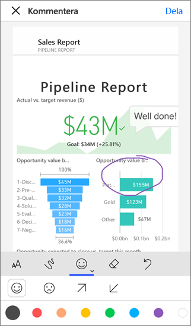
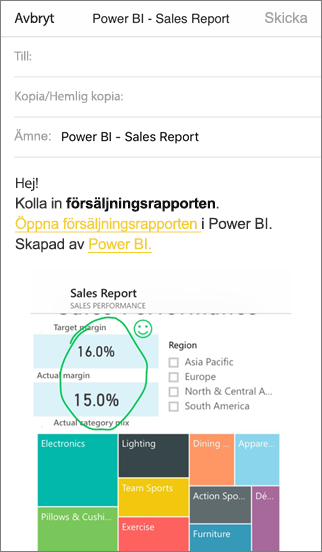

# Kommentera och dela en panel, rapport eller ett visuellt objekt i Power BI-mobilapparna
Gäller för:

|  |  |  |  |
|:--- |:--- |:--- |:--- |
| iPhone-telefoner |iPad-surfplattor |Android-telefoner |Android-surfplattor |

Du kan kommentera och dela en ögonblicksbild av en panel, rapport eller visualisering från Power BI-mobilappen för iOS- och Android-enheter. Dina mottagarna ser den exakt som den var när du skickade e-postmeddelandet, plus en länk. Du kan skicka ögonblicksbilder av paneler till vem som helst. Inte bara kollegor på samma e-postdomän. Du kan lägga till anteckningar: rader, text eller stämplar, innan du delar den.

*En rapport med kommentarer*

E-postmeddelandet med ögonblicksbilden av panelen, rapporten eller det visuella objektet inkluderar även en länk till det faktiska objektet i Power BI-tjänsten ([https://powerbi.com](https://powerbi.com)). Dina mottagare kan klicka på länken och gå direkt till den panelen, rapporten eller visualiseringen, om du och de har Power BI Pro-licenser eller om innehållet ligger på en [Premium-kapacitet](../../service-premium.md) och du redan har delat objektet med dem. 

Du kan [dela en panel från Power BI-mobilappen för Windows 10-enheter](mobile-windows-10-phone-app-get-started.md) också, men inte kommentera den.

## Öppna en panel för kommentering
1. Tryck på panelen för att öppna den i fokusläge.
2. Tryck på kommentera-ikonen  i det övre högra hörnet av panelen.
3. Du är redo att [kommentera och dela panelen](mobile-annotate-and-share-a-tile-from-the-mobile-apps.md#annotate-and-share-the-tile-report-or-visual).

## Öppna en rapport för kommentering
1. Öppna en rapport. 
2. Tryck på kommentera-ikonen  i det övre högra hörnet på rapporten.
3. Du är redo att [kommentera och dela rapporten](mobile-annotate-and-share-a-tile-from-the-mobile-apps.md#annotate-and-share-the-tile-report-or-visual).

## Öppna en visualisering för att kommentera
1. I rapporten, trycker du på någon visuell information och trycker sedan på expandera-ikonen för att öppna den i fokusläge. 
   
    
2. Tryck på kommentera-ikonen  i det övre högra hörnet på visualiseringen.
3. Du är redo att [kommentera och dela visualiseringen](mobile-annotate-and-share-a-tile-from-the-mobile-apps.md#annotate-and-share-the-tile-report-or-visual).

## Kommentera och dela panelen, rapporten eller visualiseringen
1. Så här kommenterar du:  
   
   
   
   *Kommentarsfältet på iPhone- och iPad-enheter*
   
   
   
   *Kommentarsfältet i Android-enheter*
   
   * Om du vill rita rader med olika färger och tjocklek, trycker du på ikonen med kurvad linje, väljer en bredd och färg och ritar.  
   * Om du vill skriva kommentarer, trycker du på **AA** och väljer textstorlek, färg och typsnitt.  
   * Om du vill klistra in stämplar (till exempel uttryckssymboler) på panelen, trycker du på smileyn, väljer en färg och trycker där du vill ha den.   
2. Efter att ha kommenterat, trycker du på **Dela** i det övre högra hörnet.
3. Öppna din e-postapp, ange mottagarnas namn och modifiera meddelandet om du vill.  
   
   
   
   E-postmeddelandet har en bild och en länk till den specifika panelen, rapporten eller visualiseringen. 
4. Tryck på **Skicka**.

## Nästa steg
* [Dela en instrumentpanel från Power BI-mobilappar](mobile-share-dashboard-from-the-mobile-apps.md)
* Har du några frågor? [Fråga Power BI Community](http://community.powerbi.com/)

