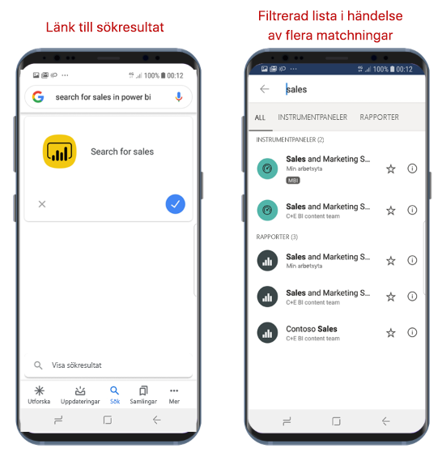

# Hitta och få åtkomst till innehåll med Google Search

Gäller för:

|  |  |
|:--- |:--- |
| Android-telefoner |Android-surfplattor |

Med Google Search kan du hitta och öppna Power BI-mobilappen direkt till önskad rapport eller instrumentpanel. Du behöver inte navigera i appen.

Om du vill öppna ett visst objekt men inte är säker på var det finns, kan du leta reda på objektet med Google Search.

## Söka med Google Search

I Google-sökrutan gör du en sökning enligt formatet ***söker efter &lt;sökobjekt&gt; i power bi***. Du kan till exempel **söka efter försäljning i power bi**.

* Om du bara får en träff öppnas det objekt som du letade efter i Power BI-mobilappen.
* Om du får flera träffar öppnas sökskärmen i Power BI, filtrerad enligt din sökbegäran.

## Nästa steg
* [Använda genvägar till Android-appen i Power BI-appen för Android](mobile-app-quick-access-shortcuts.md)
* [Integrering av iOS-enhetssökning (Spotlight) i Power BI-mobilappen för iOS](mobile-apps-ios-search-integration.md)
* [Favoriter i Power BI-mobilappar](mobile-apps-favorites.md)
