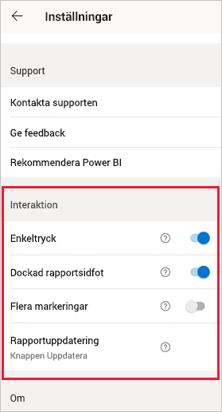
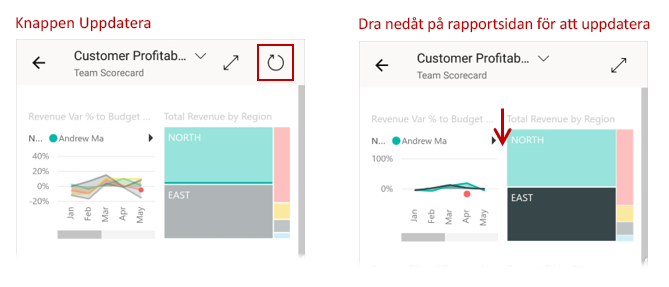
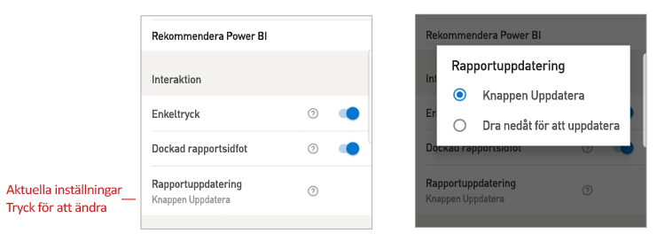

# Konfigurera inställningar för rapportinteraktion

## Översikt

Power BI-mobilappen har ett antal konfigurerbara inställningar för ”interaktion” som gör att du kan styra hur du interagerar med dina data och definiera beteendet för vissa element i Power BI-mobilappen. Tabellen nedan visar de interaktionsinställningar som för närvarande är tillgängliga och de enheter som har dem.

|| Android-telefon | iPhone | Android-surfplatta  | iPad |
|-|:-:|:-:|:-:|:-:|
| [Enkeltryck eller dubbeltryck på visuella rapportobjekt](#single-tap) |✔|✔|||
| [Flerval jämfört med enskild markering av datapunkter i visuella rapportobjekt](#multi-select) |✔|✔|✔|✔|
| [Dockad eller dynamisk rapportsidfot](#docked-report-footer) |✔|✔|||
| [Knappinitierad rapportuppdatering eller ”dra nedåt för att uppdatera”-åtgärden](#report-refresh) |✔||||
|

Om du vill gå till interaktionsinställningarna trycker du på din profilbild för att öppna [sidopanelen](./mobile-apps-home-page.md#header). Välj sedan **Inställningar**och leta reda på avsnittet **Interaktion**.

Interaktionsinställningarna beskrivs i avsnitten nedan.

## Interaktionsinställningar

### Enkeltryck
När du hämtar Power BI-mobilappen är den inställd på enkeltryck. Det innebär att när du trycker på ett visuellt objekt för att utföra en viss åtgärd, till exempel välja ett utsnittsobjekt, korsmarkera, klicka på en länk eller knapp och så vidare, så kommer både det visuella objektet att väljas och den valda åtgärden att utföras.

Om du vill kan du inaktivera interaktion med enkeltryck. I så fall används interaktion med dubbeltryck. När interaktion med dubbeltryck används trycker du först på ett visuellt objekt för att välja det och sedan en gång till i det visuella objektet för att utföra önskad åtgärd.

### Flera markeringar

Med flervalsalternativet kan du välja flera datapunkter på en rapportsida. När flervalsläget är aktiverat, läggs varje datapunkt som du trycker på till övriga valda datapunkter, varvid de kombinerade resultaten automatiskt markeras i alla visuella objekt på sidan. När flervalsläget är avstängt ersätter den nya markeringen den aktuella.

Om du vill avmarkera en datapunkt trycker du på den igen.

>[!NOTE]
>Flervalsalternativet stöds inte i visuella Power BI-objekt.
>
>Flervalsläget kommer att stödjas i nästa version av Power BI-rapportserver.

### Dockad rapportsidfot

Inställningen för dockad rapportsidfot bestämmer om rapportsidfoten ska vara dockad (dvs. fäst och alltid synlig) längst ned i rapporten, eller döljas och visas på nytt beroende på dina åtgärder i rapporten, till exempel när du rullar.

I Android-telefoner är inställningen för dockad rapportsidfot **På** som standard, vilket innebär att rapportsidfoten är dockat och alltid synlig längst ned i rapporten. Ändra inställningen till **Av** om du föredrar en dynamisk rapportsidfot som visas och försvinner, beroende på dina åtgärder i rapporten.

### Rapportuppdatering

Inställningen för rapportuppdatering definierar hur du initierar rapportuppdateringar. Du kan välja att antingen ha en uppdateringsknapp på alla rapportsidhuvuden eller använda ”dra nedåt för att uppdatera”-åtgärden (dra nedåt från den övre kanten till den nedre) på rapportsidan för att uppdatera rapporten. Figuren nedan visar de två alternativen. 

I Android-telefoner läggs en uppdateringsknapp till som standard.

Om du vill ändra inställningen för rapportuppdatering går du till rapportuppdateringsobjektet i interaktionsinställningarna. Den aktuella inställningen visas. Tryck på värdet för att öppna ett popup-fönster där du kan välja ett nytt värde.

## Fjärrkonfiguration

Interaktioner kan också fjärrkonfigureras av en administratör med hjälp av ett MDM-verktyg med en appkonfigurationsfil. På så sätt kan du standardisera upplevelsen för rapportinteraktion i organisationen, eller för specifika grupper med användare i organisationen. Mer information finns i [Konfigurera interaktion med hantering av mobila enheter](./mobile-app-configuration.md).

## Nästa steg
* [Interagera med rapporter](./mobile-reports-in-the-mobile-apps.md#interact-with-reports)
* [Konfigurera interaktion med hjälp av hantering av mobila enheter](./mobile-app-configuration.md)
