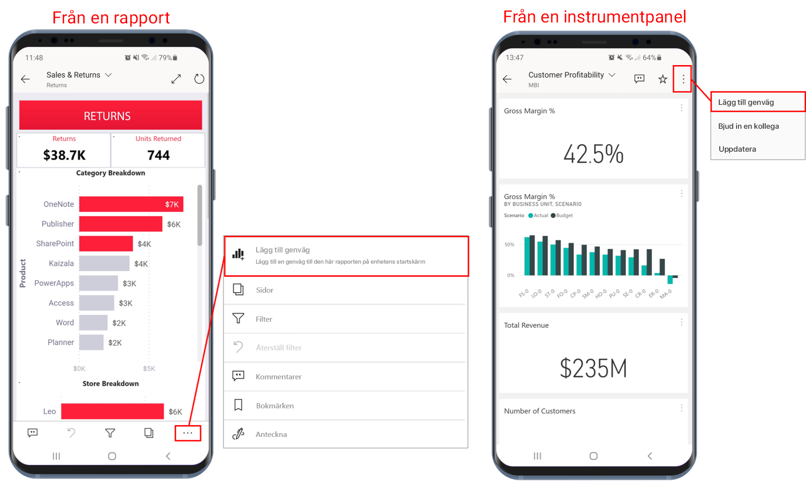
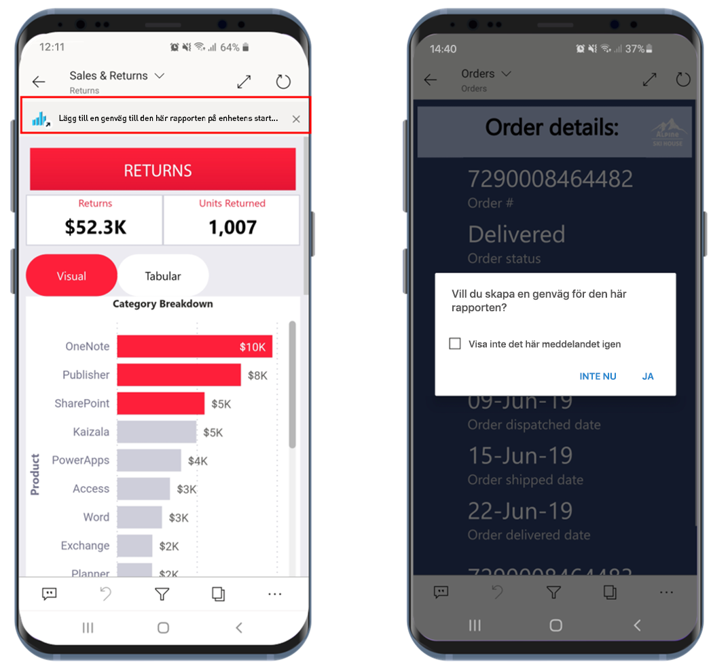
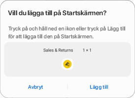
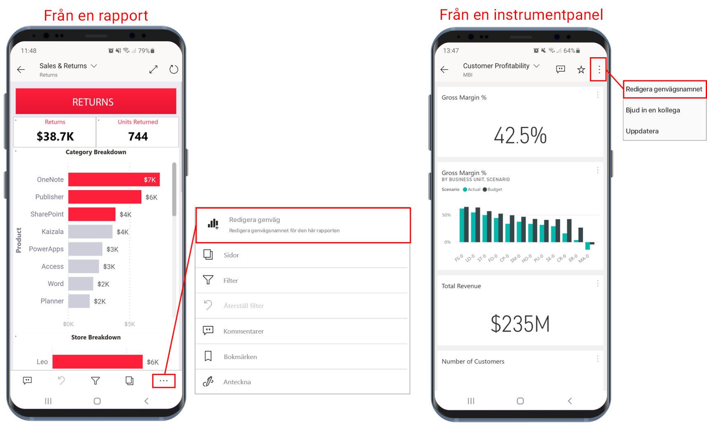
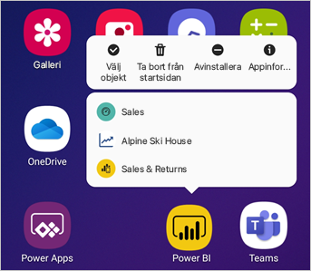

# Använda genvägar till Android-appen i Power BI-appen för Android

Gäller för:

|  |  |
|:--- |:--- |
| Android-telefoner |Android-surfplattor |

I Power BI-mobilappen för Android finns två enkla sätt att gå direkt till de rapporter eller instrumentpaneler du behöver, utan att du behöver navigera i appen: **via genvägar på enhetens startskärm** och **via genvägar i appfönstret**.
 * **Genvägar på enhetens startskärm**: Du kan skapa en genväg till en rapport eller en instrumentpanel och fästa den på enhetens startskärm. Rapporten eller instrumentpanelen behöver inte vara i någon av dina arbetsytor. Du kan även skapa genvägar till rapporter och instrumentpaneler som finns i appar, eller till och med till rapporter och instrumentpaneler som finns på en extern klientorganisation (B2B).
 * **Genvägar i appfönstret**: Du kan gå direkt till rapporter och instrumentpaneler som visas ofta genom att göra en lång tryckning på appikonen på enhetens startskärm för att öppna appfönstret. Därmed visas en snabbmeny med genvägar till tre objekt som visas ofta. De här objekten ändras med tiden – Power BI-mobilappen håller reda på vad du visar ofta och genvägarna ändras utifrån det.

 >[!NOTE]
 >Android-appgenvägar är tillgängliga från Android 8 och senare.

## Skapa en genväg till valfri rapport eller instrumentpanel

Du kan skapa en genväg till valfri rapport eller instrumentpanel.

1. Klicka på **Fler alternativ...** på åtgärdsmenyn och välj **Lägg till genväg**.

   

   Om du använder ett objekt ofta får du ett förslag i Power BI-appen om att skapa en genväg till objektet. Detta sker på två sätt:
   * I rapporter och instrumentpaneler som visas ofta visas alternativet **Lägg till genväg** i en banderoll när du öppnar objektet.
   * Om du använder en viss länk ett par gånger för att komma till en rapport (till exempel från ett delat e-postmeddelande eller en anteckning), öppnas ett fönster där du får en fråga om du vill skapa en genväg. Om du väljer **Ja** öppnas dialogrutan **Lägg till genväg**(se nedan) och om du väljer **Inte nu** går du till det valda objektet.
   
   Dessa två alternativ illustreras nedan.

   

 1. Dialogrutan **Lägg till genväg** visas med namnet på ditt objekt. Du kan ändra namnet om du vill. Tryck på **Lägg till** när du är klar.

    

1. Du uppmanas att bekräfta att du vill lägga till genvägen. Tryck på **Lägg till** för att lägga till genvägen på enhetens startskärm.

   

   En genvägsikon för att gå till instrumentpanelen eller rapporten läggs till på enhetens startskärm med det namn som du har angett.

   

## Redigera genvägsnamnet

Om du vill ändra namnet på en genväg väljer du **Fler alternativ...** på åtgärdsmenyn och sedan **Redigera genvägsnamnet**

 

## Använda Power BI-appfönstret för att komma åt innehåll som visas ofta

Du kan använda Power BI-appfönstret för att gå direkt till objekt som används ofta.

Gör en lång tryckning på appikonen för att visa en snabbmeny för objekt som visas ofta. Tryck sedan på en genväg för att öppna det önskade objektet.

Du kan skapa en permanent genväg till något av de listade objekten genom att dra den önskade genvägsikonen till enhetens startskärm.

## Nästa steg
* [Hitta och få åtkomst till innehåll med Google Search](mobile-app-find-access-google-search.md)
* Om du använder iOS och letar efter Siri-genvägar kan du läsa [Använda Siri-genvägar i Power BI-mobilappen för iOS](mobile-apps-ios-siri-shortcuts.md).
* [Favoriter i Power BI-mobilappar](mobile-apps-favorites.md)
