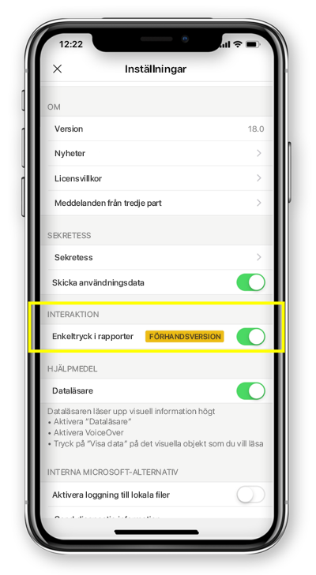

# Konfigurera rapportinteraktion till enkel- eller dubbeltryckningar
Gäller för:

|  |  | 
|:--- |:--- |
| iPhone-telefoner |Android-telefoner |

En Power BI-rapport är en interaktiv vy över dina data med visuell information som representerar olika resultat och insikter från dessa data.

Du kan konfigurera hur du interagerar med dina data. Du kan bestämma om du ska interagera genom enkel- eller dubbeltryckning.

* Med två tryckningar markeras det visuella objektet första gången du trycker och andra gången du trycker på det visuella objektet utförs en åtgärd, som att välja utsnitt, korsmarkera eller klicka på en länk, knapp osv.

* Vid interaktion med enkeltryckning väljer du det visuella objektet och kör åtgärden med en tryckning.

Från och med Power BI appversion 18.0 för iOS- och 112540 för Android, kommer alla nya installationer att konfigureras med enkeltryckning som standard.
Användare som redan har Power BI installerat på telefonen och uppgraderar till de nya versionerna kommer att erbjudas att byta till enkeltryckning.

## Ändra typ av interaktion

Du kan ändra typ av interaktion genom att gå till appinställningarna och aktivera/inaktivera enkeltryckning.

Den här artikeln gäller för både liggande rapporter och telefonrapporter.

## Nästa steg
* [Visa och interagera med Power BI-rapporter som är optimerade för din telefon](mobile-apps-view-phone-report.md)
* Har du några frågor? [Fråga Power BI Community](https://community.powerbi.com/)

