# Visa lokala rapportserverrapporter och KPI:er i Power BI-mobilapparna

I Power BI-mobilapparna finns levande, pekaktiverad mobil åtkomst till lokal företagsinformation i Power BI-rapportserver och SQL Server 2016 Reporting Services (SSRS).

Gäller för:

|  |  |  |  |
|:--- |:--- |:--- |:--- |
| iPhone-enheter |iPad-surfplattor |Android-telefoner |Android-surfplattor |

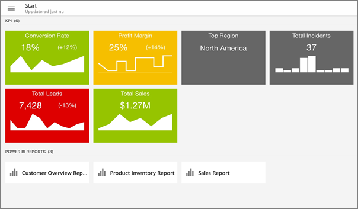

## Vi tar det i ordning
**Mobilapparna är platsen där du kan se Power BI-innehåll, inte där den skapas.**

* Du och andra rapportskapare i din organisation [skapar Power BI-rapporter med Power BI Desktop och publicerar dem sedan på webbportalen för Power BI-rapportservern](../../report-server/quickstart-create-powerbi-report.md). 
* Du skapar [KPI:er direkt i webbportalen](https://docs.microsoft.com/sql/reporting-services/working-with-kpis-in-reporting-services), sorterar dem i mappar och markerar dina favoriter så att du enkelt kan hitta dem. 
* Du [skapar mobila rapporter i Reporting Services](https://docs.microsoft.com/sql/reporting-services/mobile-reports/create-mobile-reports-with-sql-server-mobile-report-publisher) med SQL Server 2016 Enterprise Edition Mobile Report Publisher och publicerar dem på [Reporting Services-webbportalen](https://docs.microsoft.com/sql/reporting-services/web-portal-ssrs-native-mode).  

I Power BI-mobilapparna ansluter du sedan till upp till fem rapportservrar för att se Power BI-rapporterna och KPI:erna, ordnade i mappar eller samlade som favoriter. 

## Utforska exempel i mobilapparna utan en serveranslutning
Även om du inte har åtkomst till en Reporting Services-webbportal, kan du fortfarande utforska funktionerna i mobila rapporter i Reporting Services och KPI:er. 

1. Tryck på din profilbild i det övre vänstra hörnet och sedan på **Inställningar** på den kontopanel som skjuts ut.

2. På den inställningssida som öppnas trycker du på **Reporting Services-exempel** och bläddrar sedan för att interagera med exempel på KPI:er och mobila rapporter.
   
   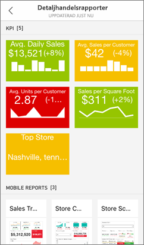

## Ansluta till en lokal rapportserver
Du kan visa lokala Power BI-rapporter, mobila Reporting Services-rapporter och KPI:er i Power BI-mobilapparna. 

1. Öppna Power BI-appen på din mobila enhet.
2. Om du inte har loggat in till Power BI ännu trycker du på **Rapportserver**.
   
   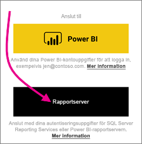
   
   Om du redan har loggat in på Power BI-appen trycker du på din profilbild i det övre vänstra hörnet och sedan på **Inställningar** på den kontopanel som skjuts ut.
3. På den inställningssida som öppnas trycker du på **Anslut till server**.
   
    

    Mobilappen behöver åtkomst till servern på något sätt. Det finns några sätt att göra det:
     * Det enklaste är att vara i samma nätverk/använda VPN.
     * Det är möjligt att använda en webbprogramsproxy för att ansluta från utanför organisationen. Mer information finns i [Använda OAuth för att ansluta till Microsoft SQL Server Reporting Services](mobile-oauth-ssrs.md).
     * Öppna en anslutning (port) i brandväggen.

4. Fyll i serveradressen och ge servern ett eget namn om du vill. Använd följande format för serveradressen:
   
     `https://<servername>/reports`
   
     OR
   
     `https://<servername>/reports`
   
   Inkludera **http** eller **https** framför anslutningssträngen.
   
    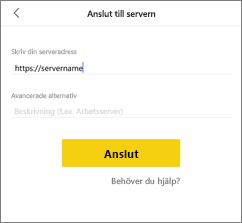
5. När du har skrivit in serveradressen och det valfria namnet trycker du på **Anslut** och fyller sedan i ditt användarnamn och lösenord när du uppmanas till det.
6. Nu ser du servern i fönstret Konton – i det här exemplet heter den "Work server".
   
   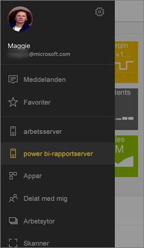

## Ansluta till en lokal rapportserver i iOS eller Android

Om du använder Power BI i mobilappen för iOS eller Android kan det hända att din IT-administratör har definierat en appkonfigurationsprincip. I så fall är anslutningen till rapportservern väldigt smidig och du behöver inte ange så mycket information när du ansluter till en rapportserver. 

1. Du ser ett meddelande som anger att mobilappen har konfigurerats med en rapportserver. Tryck på **Logga in**.

    

2.  Informationen om rapportservern är redan ifylld på sidan **Anslut till server**. Tryck på **Anslut**.

    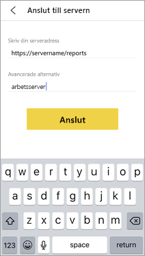

3. Skriv ett lösenord för att autentisera och tryck sedan på **Logga in**. 

    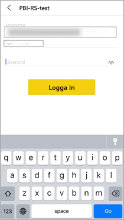

Nu kan du visa och interagera med KPI:er och Power BI-rapporter som lagras på rapportservern.

## Visa Power BI-rapporter och KPI:er i Power BI-appen
Power BI-rapporter, mobila Reporting Services-rapporter och KPI:er visas i samma mappar som de finns i på Reporting Services-webbportalen. 

* Tryck på en Power BI-rapport . Den öppnas i liggande läge och du kan interagera med den i Power BI-appen.

    > [!NOTE]
  > Öka och minska detaljnivån är för närvarande inte aktiverat i Power BI-rapporter på en Power BI-rapportserver.
  
    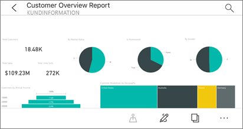
* I Power BI Desktop kan rapportägare [optimera en rapport](../../create-reports/desktop-create-phone-report.md) för Power BI-mobilapparna. På din mobiltelefon har optimerade rapporter en särskild ikon  och layout.
  
    
* Tryck på en KPI för att se den i fokusläge.
  
    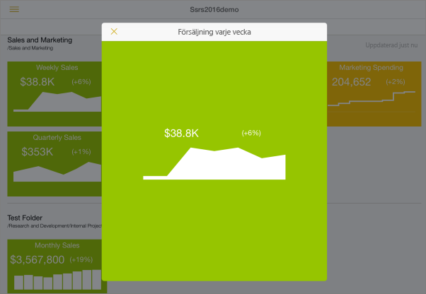

## Se dina favorit-KPI:er och rapporter
Du kan markera KPI:er och rapporter som favoriter i webbportalen och sedan visa dem i en lämplig mapp på din mobila enhet, tillsammans med dina Power BI-favoritinstrumentpaneler.

* Tryck på **Favoriter** i navigeringsfältet.
  
   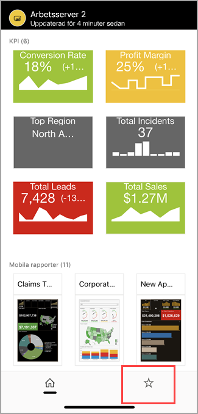
  
   Alla dina favorit-KPI:er och rapporter från webbportalen finns på den här sidan, tillsammans med Power BI-instrumentpaneler i Power BI-tjänsten:
  
   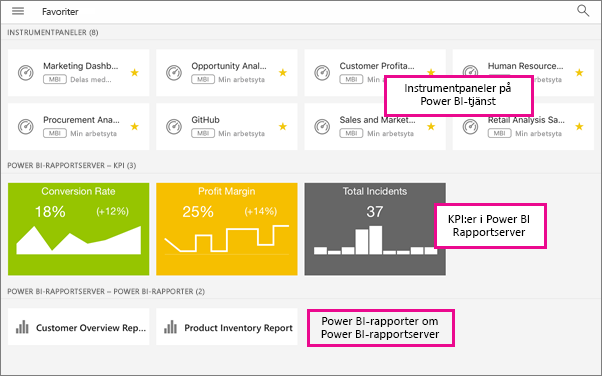

## Ta bort en anslutning till en rapportserver
1. Öppna kontofönstret och tryck på **Inställningar**.
2. Tryck på namnet för den server som du inte vill vara ansluten till.
3. Tryck på **Ta bort server**.

## Nästa steg
* [Vad är Power BI?](../../fundamentals/power-bi-overview.md)  
* Har du några frågor? [Fråga Power BI Community](https://community.powerbi.com/)
