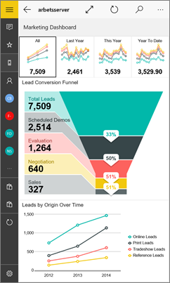
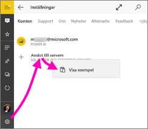
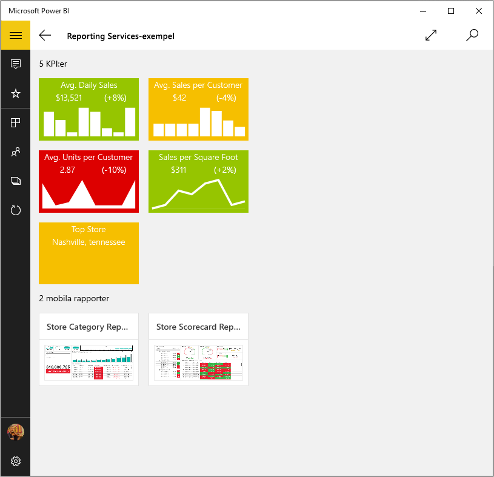
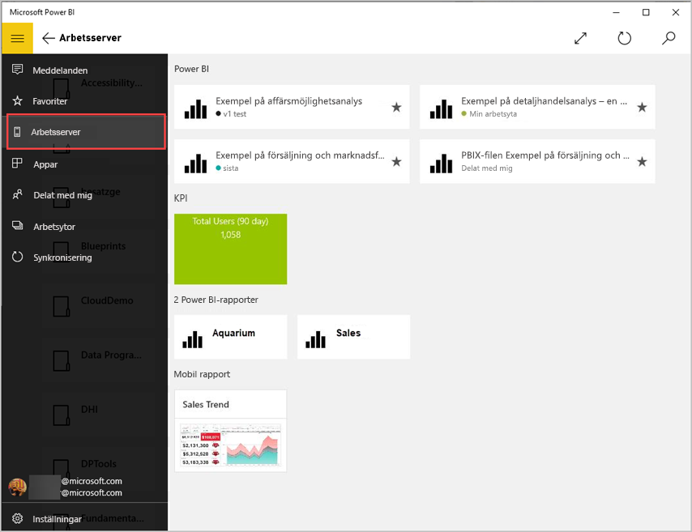
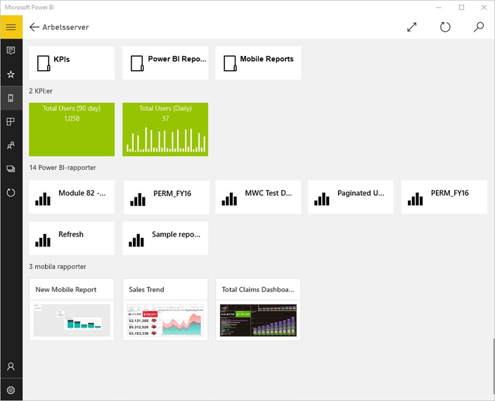
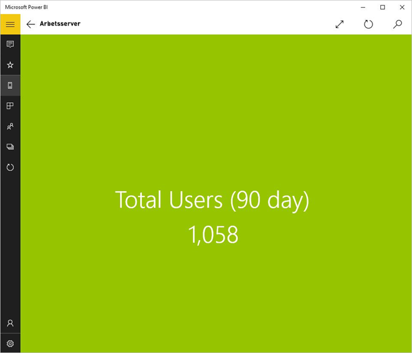
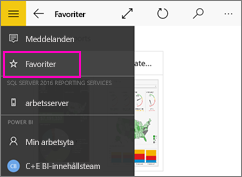
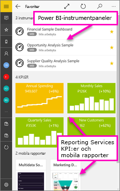
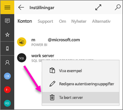

# Visa Reporting Services (SSRS) mobila rapporter och KPI:er i Windows 10 Power BI-mobilappen
Power BI-mobilappen för Windows 10 erbjuder live, pekaktiverad mobil åtkomst till din viktiga lokala företagsinformation i SQL Server 2016 Reporting Services. 

## Vi tar det i ordning
[Skapa mobila rapporter i Reporting Services](https://msdn.microsoft.com/library/mt652547.aspx) med SQL Server 2016 Enterprise Edition Mobile Report Publisher och publicerar dem på [Reporting Services-webbportalen](https://msdn.microsoft.com/library/mt637133.aspx). Skapa KPI:er direkt i webbportalen. Sortera dem i mappar och markerar dina favoriter så att du enkelt kan hitta dem. 

I Power BI-mobilappen för Windows 10, visar du sedan mobila rapporter och KPI:er, ordnade i mappar eller samlade som favoriter. 

> [!NOTE]
> Din enhet måste köra Windows 10. Appen fungerar bäst på enheter med minst 1 GB RAM-minne och 8 GB intern lagring.
> 
> 

## Utforska prover utan en SQL Server 2016 Reporting Services-server
Även om du inte har åtkomst till en Reporting Services-webbportal, kan du fortfarande utforska funktionerna i Reporting Services-mobila rapporter.

1. På din Windows 10-enhet öppnar du Power BI-appen.
2. Tryck på den globala navigeringsknappen  i det övre vänstra hörnet.
3. Tryck på ikonen **Inställningar** , högerklicka eller tryck och håll in **Anslut till server** och tryck sedan på **Visa exempel**.
   
   
4. Öppna mappen för detaljhandelsrapporterna eller försäljningsrapporter om du vill utforska deras KPI:er och mobila rapporter.
   
   

Bläddra exemplen för att interagera med KPI:er och mobila rapporter.

## Anslut till en Reporting Services-rapportserver
1. Längst ner i det vänstra navigeringsfältet, trycker du på **Inställningar** 
2. Tryck på **Anslut till server**.
3. Fyll i serveradressen samt ditt användarnamn och lösenord. Använd följande format för serveradressen:
   
     `http://<servername>/reports` eller `https://<servername>/reports`
   
   > [!NOTE]
   > Inkludera **http** eller **https** framför anslutningssträngen.
   > 
   > 
   
    Tryck på **Avancerade alternativ** för att namnge servern, om du vill.
4. Tryck på bockmarkeringen för att ansluta. 
   
   Nu ser du servern i det vänstra navigeringsfältet.
   
   
   
   >[!TIP]
   >Tryck på den globala navigeringsknappen  när som helst för att gå mellan dina mobila rapporter i Reporting Services och dina instrumentpaneler i Power BI-tjänsten. 
   > 

## Visa Reporting Services KPI:er och mobila rapporter i Power BI-appen
Reporting Services KPI:er och mobila rapporter visas i samma mappar som de finns i på Reporting Services-webbportalen.

* Tryck på en KPI för att se den i fokusläge.
  
    
* Tryck på en mobil rapport för att öppna och interagera med den i Power BI-appen.
  
    

## Se dina favorit-KPI:er och rapporter
Du kan markera KPI:er och mobila rapporter som favoriter i din Reporting Services-webbportal och sedan visa dem i en lämplig mapp på din Windows 10-enhet, tillsammans med dina Power BI-favoritinstrumentpaneler och rapporter.

* Tryck på **Favoriter**.
  
   
  
   Dina favoriter från webbportalen finns på den här sidan.
  
   

Läs mer om [favoriter i Power BI-mobilappar](mobile-apps-favorites.md).

## Ta bort en anslutning till en rapportserver
Du kan bara vara ansluten till en rapportserver i taget från din Power BI-mobilapp. Om du vill ansluta till en annan server, måste du koppla från den nuvarande.

1. Längst ner i det vänstra navigeringsfältet, trycker du på **Inställningar** .
2. Tryck på namnet till den server som du inte vill vara ansluten till och håll in.
3. Tryck på **Ta bort server**.
   
    

## Skapa Reporting Services-mobila rapporter och KPI:er
Du skapar inte Reporting Services KPI:er och mobila rapporter i Power BI-appen. Du skapar dem i SQL Server Mobile Report Publisher och en SQL Server 2016 Reporting Services-webbportal.

* [Skapa dina egna Reporting Services-mobila rapporter](https://msdn.microsoft.com/library/mt652547.aspx) och publicera dem till Reporting Services-webbportalen.
* Skapa [KPI:er på en Reporting Services-webbportal](https://msdn.microsoft.com/library/mt683632.aspx)

## Nästa steg
* [Kom igång med Power BI-mobilappen för Windows 10](mobile-windows-10-phone-app-get-started.md)  
* [Vad är Power BI?](../../power-bi-overview.md)  
* Har du några frågor? [Fråga Power BI Community](http://community.powerbi.com/)

