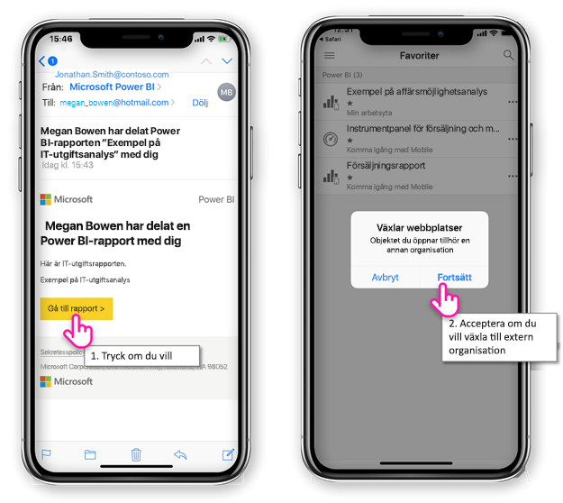
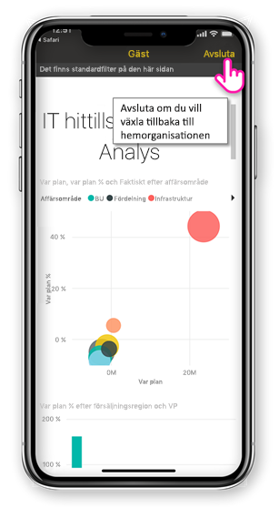
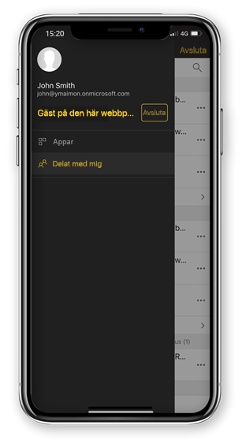

# Visa Power BI-innehåll som delas med dig från en extern organisation

Power BI integreras med Azure Active Directory Business-to-business (Azure AD B2B) för att möjliggöra säker distribution av Power BI-innehåll till gästanvändare utanför din organisation. Och externa gästanvändare kan använda Power BI-mobilappen för att komma åt Power BI-innehåll som delas med dem. 

Gäller för:

|  |  |  |  |
|:--- |:--- |:--- |:--- |
| iPhone-telefoner |iPad-surfplattor |Android-telefoner |Android-surfplattor |

## Komma åt delat innehåll

**Först behöver någon från en extern organisation dela ett objekt med dig.** När någon [delar ett objekt med dig](../../service-share-dashboards.md), antingen från samma organisation eller från en extern organisation, får du ett e-postmeddelande med en länk till det delade objektet. Om du öppnar den länken på din mobila enhet öppnas Power BI-mobilappen. Om appen känner av att objektet delades från en extern organisation återansluter appen till den organisationen med din identitet. Appen läser sedan in alla objekt som delades med dig från den organisationen.

> [!NOTE]
> Om det här är det första objektet som delas med dig som extern gästanvändare måste du lösa in inbjudan i en webbläsare. Det går inte att lösa in inbjudan i Power BI-appen.

Så länge du är ansluten till en extern organisation visas en svart rubrik i appen. Den här rubriken visar att du inte är ansluten till din hemorganisation. Om du vill ansluta tillbaka till din hemorganisation avslutar du gästläget.

Du behöver en Power BI-artefaktlänk för att ansluta till en extern organisation, men när din app har växlat kan du komma åt alla objekt som delas med dig (inte bara det objekt som du öppnade från e-postmeddelandet). Om du vill visa alla objekt som du har åtkomst till i den externa organisationen går du till appmenyn och väljer **Delat med mig**. Under **Appar** finns även appar som du kan använda.

## Begränsningar

- Användare måste ha ett aktivt Power BI-konto och en hemklientorganisation.
- Användarna måste vara inloggade på sin Power BI-hemklientorganisation innan de kan komma åt det innehåll som delas med dem från en extern klientorganisation.
- Villkorsstyrd åtkomst och andra Intune-principer stöds inte i Azure AD B2B och i Power BI Mobile. Det innebär att appen endast framtvingar hemorganisationens principer, om de finns.
- Push-meddelanden tas emot från hemorganisationens webbplats (även när användaren är ansluten som gäst till en extern organisation). När meddelandet öppnas så återansluts appen till användarens hemorganisations webbplats.
- Om användaren avslutar appen så ansluter appen automatiskt till användarens hemorganisation när den öppnas igen.
- Vid anslutning till en extern organisation inaktiveras vissa åtgärder: favoritobjekt, datavarningar, kommentarer och delning.
- Offlinedata är inte tillgängliga vid anslutning till en extern organisation.
- Om du har Företagsportal-appen installerad på din enhet måste enheten vara registrerad.
