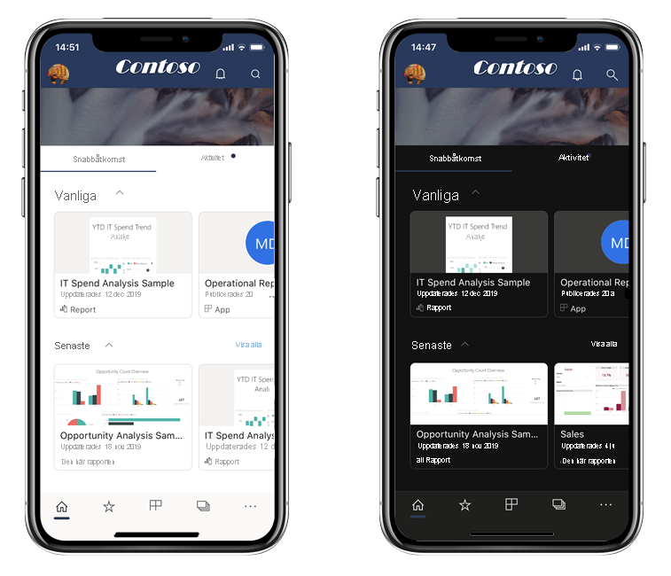
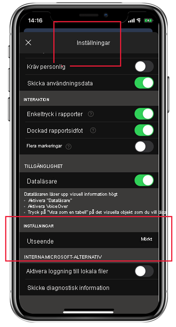

# Mörkt läge

För att underlätta hanteringen av dina individuella visningsinställningar stöder Power BI-mobilappen för iOS både ljust och mörkt skärmläge. Mörkt läge minskar skärmens ljusstyrka, vilket gör det lättare att se innehållet.

 I mörkt läge visas alla appar med en mörk bakgrund. Power BI-innehållet påverkas dock inte. Dina rapporter, instrumentpaneler och appar visas alltid så som deras designers avsett.
 
 En Power BI-mobilapp använder som standard enhetens inställningar för att avgöra vilket skärmutseende som visas. Om enheten har konfigurerats för mörkt läge visas appen i mörkt läge.
 
 Om du vill växla mellan ljust och mörkt läge, eller om du vill att enhetsinställningarna ska bestämma läget, går du till **Inställningar > Inställningar** och tryck på **Utseende** och välj önskat läge.

