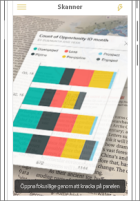
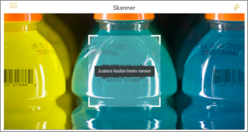

# Hämta data från den verkliga världen med Power BI-mobilappar
Power BI-mobilapparna kan ansluta den verkliga världen direkt till relaterad BI-information på ett antal olika sätt. 

## QR-koder för paneler
Skapa en QR-kod för en rapport, eller en panel på en instrumentpanel, och placera QR-koden var du vill. När dina kollegor skannar koden med sina iPhone-telefoner, Android-telefoner eller appen Power BI for Mixed Reality visas den panel som du har associerat med QR-koden. På en iPhone visas panelen i förhöjd verklighet.

Mer om:

* [Skapa en QR-kod för en panel i Power BI](../../create-reports/service-create-qr-code-for-tile.md)
* [Skanna en Power BI-QR-kod från din mobila enhet](mobile-apps-qr-code.md)
* [Skanna QR-kod med appen Power BI for Mixed Reality](mobile-mixed-reality-app.md#scan-a-report-qr-code-in-holographic-view).

## QR-koder för rapporter
Du kan skapa en QR-kod för en rapport.  När dina kollegor skannar koden med sina iPhone (stöd för Android-telefoner kommer snart), ser de rapporten som du har kopplat till QR-koden. 

Mer om att [skapa en QR-kod för en rapport i Power BI](../../create-reports/service-create-qr-code-for-report.md)

## Streckkoder
Du kan tagga streckkodsdata i din rapport så att dina kollegor kan skanna en streckkod på en produkt och gå direkt till rapporten, filtrerad för produkten.

Mer om:

* [Tagga streckkodsdata i en rapport](../../transform-model/desktop-mobile-barcodes.md)
* [Skanna en streckkod från Power BI-appen på din iPhone](mobile-apps-scan-barcode-iphone.md)

## Filtrera efter plats
Du kan kategorisera geografiska data i en rapport i Power BI Desktop. Sedan visar dina kollegor rapporten i Power BI-mobilappen för iOS, varpå Power BI automatiskt tillhandahåller geografiska filter som matchar var de befinner sig.

Mer om att [filtrera efter plats](mobile-apps-geographic-filtering.md).

## Nästa steg
* [Skapa en QR-kod för en panel i Power BI](../../create-reports/service-create-qr-code-for-tile.md)
* [Skapa en QR-kod för en rapport i Power BI](../../create-reports/service-create-qr-code-for-report.md)
