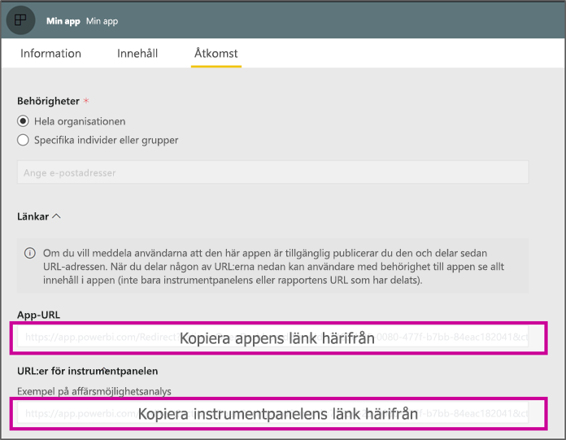

# <a name="create-a-link-to-a-specific-location-in-the-power-bi-mobile-apps"></a>Skapa en länk till en specifik plats i Power BI-mobilapparna
Du kan använda länkar för att direkt komma åt specifika objekt i Power BI: Rapport, Instrumentpanel och Panel.

Det finns huvudsakligen två scenarier för användning av länkar i Power BI Mobile: 

* Öppna Power BI **utanför appen** och landa på specifikt innehåll (rapport/instrumentpanel/app). Detta är vanligtvis ett integreringsscenario där du vill öppna Power BI Mobile från en annan app. 
* **Navigera** i Power BI. Detta är vanligtvis när du vill skapa en anpassad navigering i Power BI.


## <a name="use-links-from-outside-of-power-bi"></a>Använda länkar utanför Power BI
När du använder en länk utanför Power BI-appen bör du se till att den öppnas av appen. Om appen inte är installerad på enheten ska användaren erbjudas att installera den. Vi har skapat ett särskilt länkformat för att kunna stödja just det. Det här länkformatet ser till att enheten använder appen för att öppna länken samt att användaren erbjuds att gå till appbutiken och hämta den om den inte är installerad på enheten.

Länken bör inledas med följande  
```html
https://app.powerbi.com/Redirect?[**QUERYPARAMS**]
```

> [!IMPORTANT]
> Om ditt innehåll finns i ett särskilt datacenter såsom Goverment, Kina osv. ska länken börja med rätt Power BI-adress, till exempel `app.powerbigov.us` eller `app.powerbi.cn`.   
>


**QUERY PARAMS** (frågeparametrarna) är:
* **action** (obligatorisk) = OpenApp/OpenDashboard/OpenTile/OpenReport
* **appId** = om du vill öppna en rapport eller instrumentpanel som ingår i en app 
* **groupObjectId** = om du vill öppna en rapport eller instrumentpanel som ingår i arbetsytan (men inte min arbetsyta)
* **dashboardObjectId** = objekt-ID för instrumentpanel (om åtgärden är OpenDashboard eller OpenTile)
* **reportObjectId** = objekt-ID för rapport (om åtgärden är OpenReport)
* **tileObjectId** = objekt-ID för panel (om åtgärden är OpenTile)
* **reportPage** = om du vill öppna ett specifikt rapportavsnitt (om åtgärden är OpenReport)
* **ctId** = organisations-ID för objekt (relevant för B2B-scenario. Detta kan utelämnas om objektet tillhör användarens organisation).

**Exempel:**

* Länk för att öppna app 
  ```html
  https://app.powerbi.com/Redirect?action=OpenApp&appId=appidguid&ctid=organizationid
  ```

* Öppna en instrumentpanel som är en del av en app 
  ```html
  https://app.powerbi.com/Redirect?action=OpenDashboard&appId=**appidguid**&dashboardObjectId=**dashboardidguid**&ctid=**organizationid**
  ```

* Öppna en rapport som är en del av en arbetsyta
  ```html
  https://app.powerbi.com/Redirect?Action=OpenReport&reportObjectId=**reportidguid**&groupObjectId=**groupidguid**&reportPage=**ReportSectionName**
  ```

### <a name="how-to-get-the-right-link-format"></a>Så ordnar du rätt länkformat

#### <a name="links-of-apps-and-items-in-app"></a>Länkar för appar och objekt i app

För **appar, rapporter och instrumentpaneler som ingår i en app** är det enklaste sättet att hämta länken att gå till arbetsytan och välja ”Uppdatera app”. Då öppnas upplevelsen ”Publicera app”, och på fliken Åtkomst finns avsnittet **Länkar**. Om du expanderar det avsnittet visas en lista över appen och alla dess innehållslänkar som kan användas för att komma åt dem direkt.



#### <a name="links-of-items-not-in-app"></a>Länkar för objekt som inte är i appen 

För rapporter och instrumentpaneler som inte ingår i en app behöver du extrahera ID:n från objekt-URL:en.

Om du till exempel vill hitta objekt-ID med 36 tecken för **instrumentpanel** går du till den specifika instrumentpanelen i Power BI-tjänsten 

```html
https://app.powerbi.com/groups/me/dashboards/**dashboard guid comes here**?ctid=**organization id comes here**`
```

Om du vill hitta objekt-ID med 36 tecken för **rapport** går du till den specifika rapporten i Power BI-tjänsten.
Det här är ett exempel på en rapport från ”Min arbetsyta”

```html
https://app.powerbi.com/groups/me/reports/**report guid comes here**/ReportSection3?ctid=**organization id comes here**`
```
Ovanstående URL innehåller även den specifika rapportsidan **”ReportSection3”** .

Detta är ett exempel på en rapport från en arbetsyta (inte Min arbetsyta)

```html
https://app.powerbi.com/groups/**groupid comes here**/reports/**reportid comes here**/ReportSection1?ctid=**organizationid comes here**
```

## <a name="use-links-inside-power-bi"></a>Använda länkar i Power BI

Länkar i Power BI fungerar exakt likadant i mobilapparna som i Power BI-tjänsten.

Om du vill lägga till en länk i rapporten som pekar på ett annat Power BI objekt behöver du bara kopiera objekt-URL:en från webbläsarens adressfält. Läs mer om [hur du lägger till en hyperlänk i en textruta i en rapport](https://docs.microsoft.com/power-bi/service-add-hyperlink-to-text-box).

## <a name="use-report-url-with-filter"></a>Använda rapport-URL med filter
På samma sätt som Power BI-tjänsten har Power BI-mobilappar även stöd för rapport-URL som innehåller en parameter för filterfråga. Du kan öppna en rapport i en Power BI-mobilapp och filtrera den till ett specifikt tillstånd. Till exempel öppnar den här URL:en rapporten Försäljning och filtrerar den efter Territorium

```html
https://app.powerbi.com/groups/me/reports/**report guid comes here**/ReportSection3?ctid=**organization id comes here**&filter=Store/Territory eq 'NC'
```

Läs mer om [hur du skapar frågeparametrar för att filtrera rapporter](https://docs.microsoft.com/power-bi/service-url-filters).

## <a name="next-steps"></a>Nästa steg
Din feedback hjälper oss att bestämma vad som ska implementeras i framtiden, så glöm inte att rösta för andra funktioner som du skulle vilja se i Power BI-mobilapparna. 

* [Power BI-appar för mobila enheter](mobile-apps-for-mobile-devices.md)
* Följ @MSPowerBI på Twitter
* Delta i konversationen i [Power BI Community](https://community.powerbi.com/)
* [Vad är Power BI?](../../fundamentals/power-bi-overview.md)

