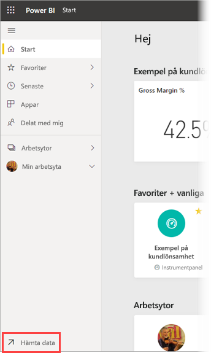
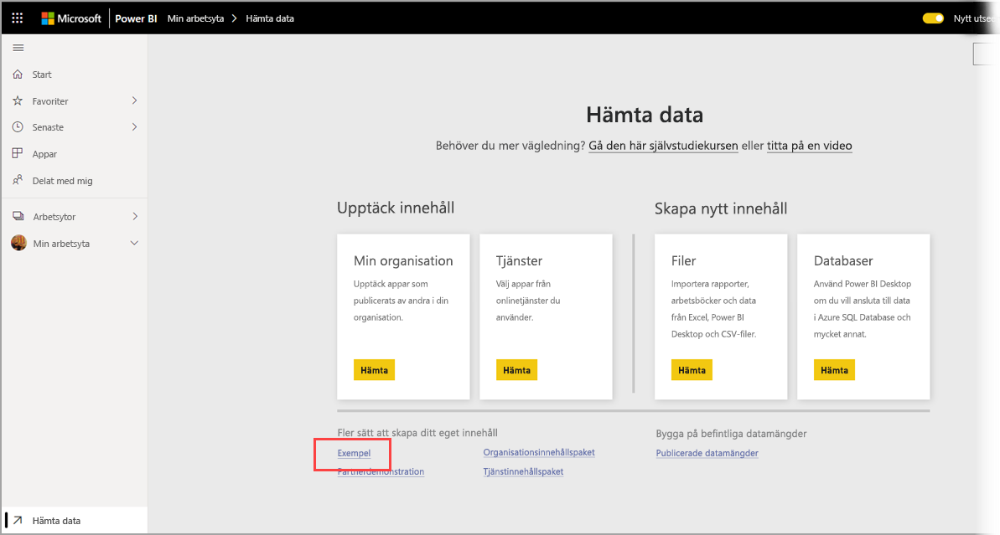
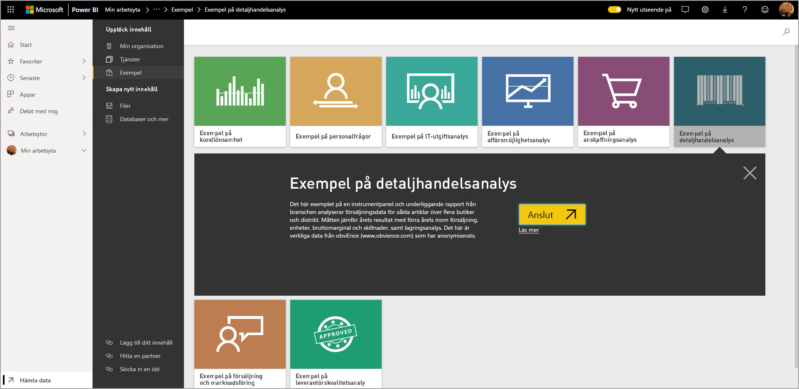
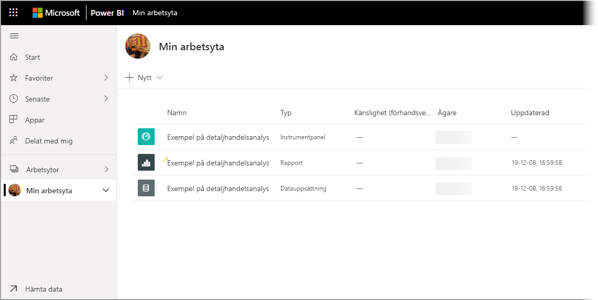

# Ladda ned exempel till Min arbetsyta i Power BI-tjänsten

En del av den dokumentation för mobilappar som finns här använder exempeldata i illustrationssyfte. Om du vill följa med på din enhet kan du ladda ned exempeldata till ditt Power BI-tjänstkonto, där du kan visa det från Power BI Mobile-appen på enheten. I den här artikeln beskrivs hur du laddar ned exempeldata till ditt Power BI-tjänstkonto. 

## Förutsättningar

Du måste ha ett Power BI-tjänstkonto för att kunna ladda ned data. Om du inte har registrerat dig för Power BI ännu [registrerar du dig för en kostnadsfri utvärderingsversion](https://app.powerbi.com/signupredirect?pbi_source=web) innan du börjar.

## Ladda ned ett exempel

1. Öppna [Power BI-tjänsten](https://app.powerbi.com) i webbläsaren och logga in.

2. Välj **Hämta data** i navigeringsfönstrets nedre vänstra hörn. Om navigeringsfönstret är dolt och du inte kan se länken Hämta data så kan du visa fönstret genom att klicka på ikonen Visa/Dölj navigeringsfönstret .  
   
    

3. På sidan Hämta data väljer du länken **Exempel**.
   
   

4. Välj ett exempel att ladda ned. Se till att välja det exempel som används i självstudien, snabbstarten eller artikeln. När du har valt det klickar du på **Anslut**.
  
   
   
5. Power BI importerar exemplet och lägger till en ny instrumentpanel, rapport och datauppsättning till din Min arbetsyta.
   
   
  
Nu är du redo att visa exemplen på din mobila enhet.

## Nästa steg
* [Snabbstart](mobile-apps-quickstart-view-dashboard-report.md)
* Har du några frågor? Kontrollera avsnittet [Mobilappar i Power BI Community](https://go.microsoft.com/fwlink/?linkid=839277)
