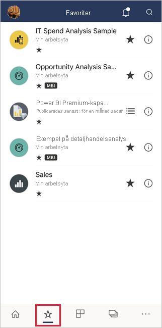
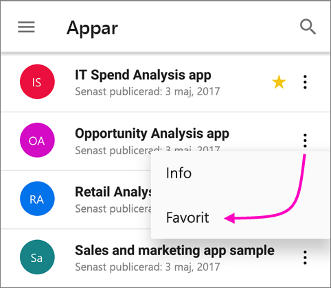
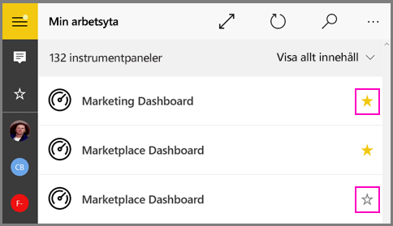
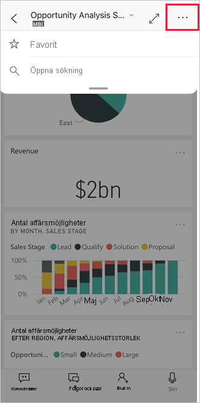
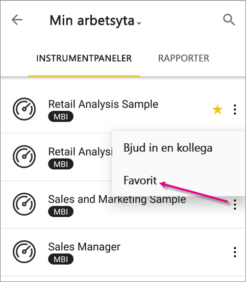
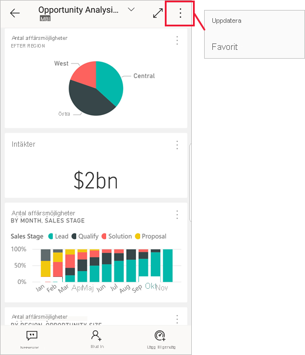

# Skapa och visa favoriter i Power BI-mobilappar
Gäller för:

|  |  |  |  |  |
|:--- |:--- |:--- |:--- |:--- |
| iPhone-telefoner |iPad-surfplattor |Android-telefoner |Android-surfplattor |Windows 10-enheter |

>[!NOTE]
>Stöd för Power BI-mobilappen för **telefoner som använder Windows 10 Mobile** kommer att upphöra den 16 mars 2021. [Läs mer](https://go.microsoft.com/fwlink/?linkid=2121400)

Läs om hur du kan skapa och visa dina Power BI-favoritinstrumentpaneler, rapporter och appar, tillsammans med dina lokala Power BI-rapportserver- och Reporting Services-KPI:er och rapporter i mobilappar.

När du skapar en favorit i Power BI-mobilapparna visas den på sidan Favoriter i [Power BI-tjänsten](https://powerbi.com) och på alla dina mobila enheter.

Om du vill se din sida för favoriter trycker du på ikonen Favoriter i navigeringsfältet:

Du kan också [göra Power BI-instrumentpaneler och appar till favoriter i Power BI-tjänsten](../end-user-favorite.md). Då visas de på sidan Favoriter i mobilappen.

Du kan markera KPI:er och rapporter som favoriter i en webbportal för Power BI-rapportserver eller Reporting Services, och sedan visa dem i en lämplig mapp på din mobila enhet, tillsammans med dina Power BI-favoritinstrumentpaneler.

## Göra en app till en favorit
1. Tryck på ikonen Appar i det nedre navigeringsfältet för att visa din sida med appar.

2. På en iOS-enhet trycker du på knappen Info till höger om namnet på den app som du vill göra till favorit. På Android-enheter visas Fler alternativ (...) i stället för knappen Info. 

3. I avsnittet Appinformation som visas trycker du på stjärnan.
   
    
   
    Appen visas nu på sidan Favoriter tillsammans med dina andra instrumentpaneler, rapporter och appar som är favoriter.
   
## Gör en instrumentpanel eller rapport till en favorit i iOS- och Windows 10-mobilappar
Du kan göra en Power BI-instrumentpanel eller rapport till en favorit från listan med instrumentpaneler eller rapporter från själva instrumentpanelen eller rapporten i sig.

* Tryck på den tomma stjärnan bredvid namnet i listan över instrumentpaneler eller rapporter i mobilappen . Stjärnan blir svart .
  
    
* Om du är på en instrumentpanel eller rapport trycker du på **Fler alternativ** (...) i sidhuvudet och trycker därefter på den tomma stjärnan  på menyn som visas. Stjärnan blir svart .
  
    

## Gör en instrumentpanel eller rapport till en favorit i Android-mobilappar
Du kan göra en instrumentpanel eller rapport till en favorit från listan med instrumentpaneler eller rapporter från själva instrumentpanelen eller rapporten i sig.

* I listan över instrumentpaneler eller rapporter i mobilappen trycker du på stjärnan bredvid namnet på rapporten eller instrumentpanelen för att lägga till eller ta bort objektet från favoriter.
  
    

* När du är på en instrumentpanel eller rapport, trycker du på **Fler alternativ (...)** och väljer därefter **Favoritmarkera**.
  
    

## Gör Power BI-rapportserver- och Reporting Services-rapporter och KPI:er till favoriter
Du kan visa dina Power BI-rapportserver- och Reporting Services-favoritrapporter och KPI:er i Power BI-mobilappar, men du kan inte göra dem till favoriter i mobilapparna. Du [tagga dem som favoriter i webbportalen](../../report-server/tutorial-explore-report-server-web-portal.md#tag-your-favorites). 

## Nästa steg
* [Favoritinstrumentpaneler i Power BI-tjänsten](../end-user-favorite.md) 
* Har du några frågor? [Fråga Power BI Community](https://community.powerbi.com/)

