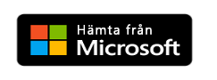

# Vad är Power BI-mobilappar?
Power BI ger en uppsättning av mobila appar för mobila iOS-, Android- och Windows 10-enheter. I mobilappar, ansluter du till och interagerar med dina molntjänster och lokala data. 

Du skapar rapporter i Power BI Desktop. Du skapar instrumentpaneler, och visar instrumentpaneler och rapporter i Power BI-rapporttjänsten ([https://powerbi.com](https://powerbi.com)). Du kan visa lokala Power BI-rapporter på [Power BI Report Server](../../report-server/get-started.md). Dessa rapporter och instrumentpaneler är tillgängliga i Power BI-apparna, oavsett om de finns lokalt eller i molnet. Prova att visa och interagera med dem på din mobila enhet, både i iOS (iPad, iPhone, iPod Touch och Apple Watch), i Android-telefoner eller -surfplattor och i Windows 10-enheter.

### Hämta appen från programarkivet 

  

## Mobila appar för olika enheter

| **Enhet** | **Höjdpunkter** |
| --- | --- |
|  |**iPhone** fungerar överallt, och [Power BI-mobilappen för iPhone](mobile-iphone-app-get-started.md) fungerar också. Förutom att visa dina Power BI[-rapporter i en särskild mobillayoutvy](mobile-apps-view-phone-report.md), kan du [lägga till Power BI till din Apple Watch](mobile-apple-watch.md) och [ställa frågor med den virtuella frågor och svar analyseraren](mobile-apps-ios-qna.md).  Kom igång med [Power BI-mobilappen för iOS](mobile-iphone-app-get-started.md). |
|  |På en **iPad** visar Power BI-mobilappen instrumentpaneler och rapporter på det sätt som de formaterats för Power BI-tjänsten. Dessutom kan du visa dina [KPI:er och rapporter från Power BI-rapportserver och Reporting Services](mobile-app-ssrs-kpis-mobile-on-premises-reports.md) direkt i din iPad. Du kan [ställa in dataaviseringar i Power BI-mobilappen](mobile-set-data-alerts-in-the-mobile-apps.md) för att meddela dig när data i en instrumentpanel ändras utöver de gränser som du anger.  Kom igång med [Power BI-mobilappen för iOS](mobile-iphone-app-get-started.md). |
|  |Power BI-mobilappen för **Android-telefoner** gör att du kan ta med Power BI i fickan med uppdaterad, pekaktiverad mobil åtkomst till företagets information. Du kan [filtrera en rapport efter din geografiska plats](mobile-apps-geographic-filtering.md). Du kan [skanna QR-koder med din Android-telefon](mobile-apps-qr-code.md) och gå direkt till en Power BI-instrumentpanel eller -rapport.  Kom igång med [Power BI-mobilappen för Android](mobile-android-app-get-started.md). |
|  |Den här mobilappen körs på ett antal olika **Android-surfplattor** och ger dig uppdaterad, pekaktiverad mobil åtkomst till företagets information. På en Android-surfplatta visar den mobila Power BI-appen instrumentpaneler och rapporter på det sätt som de formaterats för Power BI-tjänsten. Du kan [markera dina favoritinstrumentpaneler och -rapporter](mobile-apps-favorites.md), så att du kan nå dem snabbt, tillsammans med din favorit-Power BI-rapportserver och Reporting Services-KPI:er och -rapporter.  Kom igång med [Power BI-mobilappen för Android](mobile-android-app-get-started.md). |
|  |Power BI-mobilappen för Windows 10 kan köras på alla Windows 10-enheter, inklusive Windows 10-telefoner. Utöver funktioner i många av de andra mobilapparna, erbjuder Power BI-mobilappen för Windows 10 även specialfunktioner. Du kan till exempel [fästa en Power BI-instrumentpanel på startskärmen i Windows 10](mobile-pin-dashboard-start-screen-windows-10-phone-app.md) från Power BI-mobilappen. Dessutom kan du [köra Power BI i presentationsläge på Surface Hub](mobile-windows-10-app-presentation-mode.md) och i Power BI-mobilappen för Windows 10.  Kom igång med [Power BI-mobilappen för Windows 10-enheter](mobile-windows-10-phone-app-get-started.md). |||

>[!NOTE]
>Stöd för Power BI-mobilappen för **telefoner som använder Windows 10 Mobile** kommer att upphöra den 16 mars 2021. [Läs mer](https://go.microsoft.com/fwlink/?linkid=2121400)

## Företagsstöd för Power BI-mobilapparna
Organisationer kan använda Microsoft Intune för att hantera enheter och program, inklusive Power BI-mobilappar för Android och iOS.

Microsoft Intune låter organisationer kontrollera objekt och kräva en PIN-kod för åtkomst, styra hur data hanteras av programmet och till och med kryptera programdata när appen inte används.

Läs mer om att [konfigurera Power BI-mobilappar för Android och iOS med Microsoft Intune](../../service-admin-mobile-intune.md). 

## Nästa steg
[Visa en instrumentpanel i mobila appar](mobile-apps-quickstart-view-dashboard-report.md)

