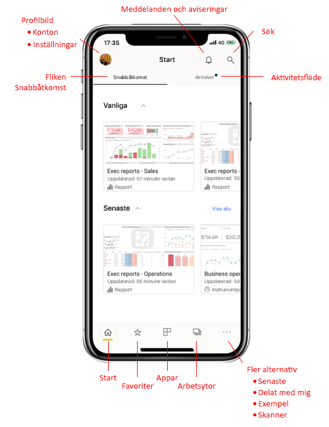
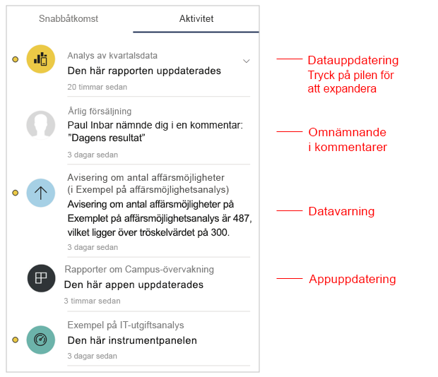
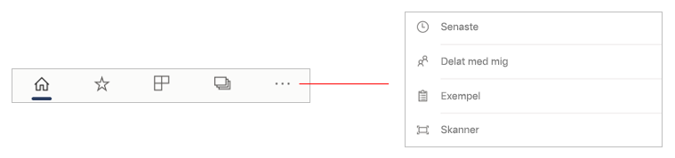
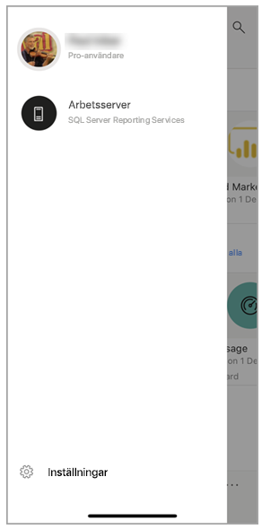
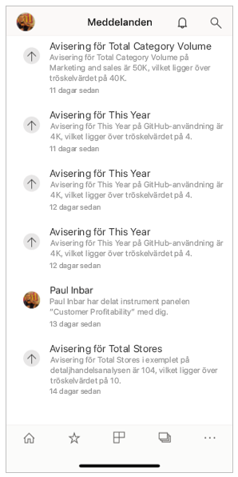
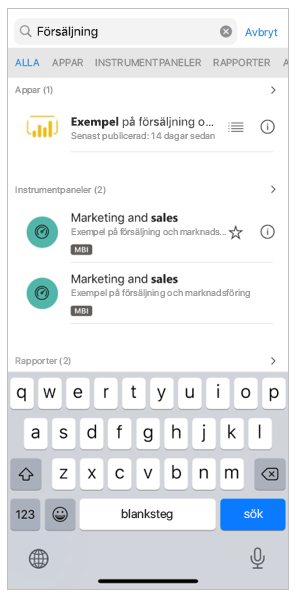

# En snabbtur för mobilappens startsida
I den här turen får du bekanta dig med startsidan i Power BI-mobilappen och den navigeringshjälp som den innehåller så att du kommer igång snabbt.

Gäller för:

|  |  |  |
|:--- |:--- |:--- |
| iPhone | iPad | Android | 

När du öppnar Power BI Mobile-appen visas startsidan, där du får snabb åtkomst till dina vanligaste eller nyligen besökta rapporter, instrumentpaneler och appar. Dessutom finns det ett aktivitetsflöde som håller dig uppdaterad om vad som händer med ditt Power BI-innehåll samt praktiska navigeringshjälpmedel så att du snabbt kommer till det innehåll du behöver.

 
## Fliken Snabbåtkomst

På fliken Snabbåtkomst visas dina vanligaste och nyligen visade rapporter, instrumentpaneler och appar grupperade i två komprimerbara avsnitt. Om du vill se en längre lista över dina nyligen visade objekt trycker du på **Visa alla** till höger om Senaste. 

## Aktivitetsflöde

Med aktivitetsflödet kan du hålla koll på vad som händer med ditt Power BI-innehåll. Det visar alla dina senaste meddelanden, aviseringar, kommentarer och @mentions.

Uppdateringarna i flödet omfattar:
* **Uppdaterade data**: när underliggande data i en av rapporterna eller instrumentpanelerna i dina favoriter eller senaste uppdateras.
* **Nya kommentarer**: när användare skapar en kommentar i en rapport eller en instrumentpanel som finns i dina favoriter eller senaste, eller när någon nämner dig i en kommentar.
* **Dataaviseringar**: när data når ett tröskelvärde som du tidigare angett i en [dataavisering](../../mobile-set-data-alerts-in-the-mobile-apps.md).
* **Appuppdateringar**: när en appskapare publicerar en uppdatering av en app som du använder.

 Tryck på ett aktivitetsobjekt för att gå till relevant plats där du kan utforska vidare.

Aktivitetsobjekt aggregeras så att alla datauppdateringar som kommer från samma app eller arbetsyta grupperas ihop. Använd  pil för att expandera och visa de aggregerade objekten. Det senaste objektet är alltid överst i listan.

## Navigeringsfält

Längst ned på sidan finns navigeringsfältet.

Navigeringsfältet ger snabb åtkomst till:

*  **Start** – återgår till startsidan.
*  **Favoriter** – de rapporter, instrumentpaneler och appar som du har markerat som [favoriter](../../mobile-apps-favorites.md).
*  **Appar** – de appar som du har installerat i ditt konto.
*  **Arbetsytor** – de arbetsmappar som samlar rapporter och instrumentpaneler som skapas av innehållsskapare.
*  **Senaste** – de objekt som du nyligen har visat.
*  **Delat med mig** – de objekt som andra personer har delat med dig.
*  **Exempel** – Power BI-exempel som du kan använda för att lära dig mer om Power BI-funktioner.
*  **Skanner** – den enhetskamera som du kan använda som skanner för att skanna [streckkoder](../../mobile-apps-scan-barcode-iphone.md) och [QR-koder](../../mobile-apps-qr-code.md).

## Sidhuvud

Överst på sidan visar sidhuvudet namnet på den Power BI-sida, rapport eller instrumentpanel som du för närvarande visar.

Rubriken innehåller följande navigeringsobjekt:
* **Profilbild eller avatar** – öppnar den sidopanel där du kan [växla mellan dina konton för Power BI-tjänsten och rapportservern](../../mobile-app-ssrs-kpis-mobile-on-premises-reports.md) samt gå till inställningar för Power BI-mobilappen.

    

* **Meddelanden** – öppnar [sidan för meddelanden](../../mobile-apps-notification-center.md) där du kan visa och få åtkomst till dina meddelanden. En punkt på meddelandeklockan indikerar att du har nya meddelanden.

    

* **Sök** – sök efter Power BI-innehåll i din prenumeration.

    

## Nästa steg
I den här rundturen utforskade startsidan för Power BI-mobilappen. Läs mer om hur du använder Power BI-mobilappen. 
* [Utforska instrumentpaneler och rapporter](../../mobile-apps-quickstart-view-dashboard-report.md)
* [Utforska rapporter i Power BI-mobilapparna](../../mobile-reports-in-the-mobile-apps.md)
