# Det virtuella analysverktyget Frågor och svar i iOS-appar – Power BI

Det enklaste sättet att lära dig om dina data är att ställa frågor om dem med dina egna ord. I den här artikeln ställer du frågor och visar aktuella insikter om exempeldata med det virtuella analysverktyget Frågor och svar i Microsoft Power BI-mobilappen på din iPad, iPhone och iPod Touch. 

Gäller för:

|  |  |
|:--- |:--- |
| iPhone-telefoner |iPad-surfplattor |

Det virtuella analysverktyget Frågor och svar är en Bi-upplevelse av konversationstyp som använder sig av underliggande frågor och svar-data i Power BI-tjänsten [(https://powerbi.com)](https://powerbi.com). Det föreslår datainsikter och du kan skriva in eller ställa egna frågor muntligt.

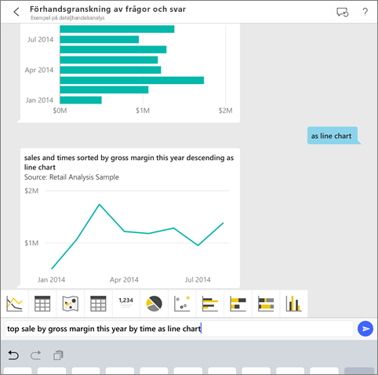

Om du inte har registrerat dig för Power BI [registrerar du dig för en kostnadsfri utvärderingsversion](https://app.powerbi.com/signupredirect?pbi_source=web) innan du börjar.

## Förutsättningar

### Installera Power BI för iOS-appen
[Hämta iOS-appen](http://go.microsoft.com/fwlink/?LinkId=522062 "Hämta iPhone-appen") från Apples App Store till din iPad, iPhone eller iPod Touch.

Dessa versioner stöder Power BI för iOS-appen:
- iPad med iOS 10 eller senare.
- iPhone 5 och senare, med iOS 10 eller senare. 
- iPad med iOS 10 eller senare.

### Hämta exempel
Det första steget är att hämta exemplen på detaljhandelanalys och affärsmöjlighetsanalys i Power BI-tjänsten.

**Hämta exemplet på detaljhandelanalys**

1. Öppna Power BI-tjänsten (app.powerbi.com) och logga in.

2. I det vänstra navigeringsfönstret väljer du **Arbetsytor**, **Min arbetsyta**.

3. Längst ned i vänster hörn väljer du **Hämta data**.
   
    

3. På sidan Hämta data väljer du ikonen **Exempel**.
   
   

4. Välj **Exempel på detaljhandelsanalys**.
 
    
 
8. Välj **Anslut**.  
  
   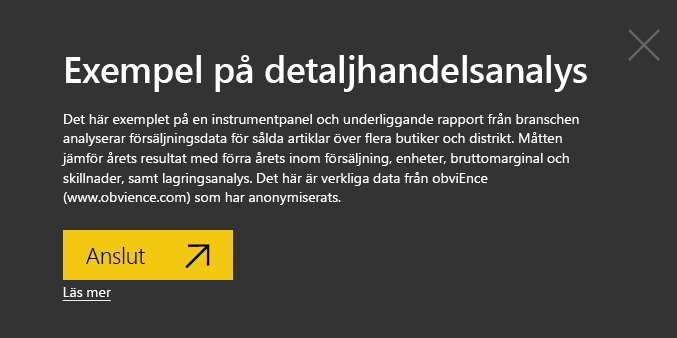
   
5. Power BI importerar innehållspaketet och lägger till en ny instrumentpanel, rapport och datauppsättning till din aktuella arbetsyta.
   
   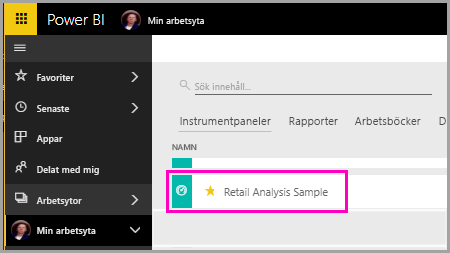

**Hämta exemplet på affärsmöjlighetsanalys**

- Gå igenom samma steg som du gjorde för exemplet på detaljhandelsanalys, men välj **Exempel på affärsmöjlighetsanalys** i steg 4.

    
  
OK, nu är du redo att visa exemplen på din iOS-enhet.

## Försök att ställa frågor om din iPhone eller iPad
1. På din iPhone eller iPad trycker du på den  > **Arbetsytor** > **Min arbetsyta** och öppnar instrumentpanelen Exempel på detaljhandelsanalys.

2. Tryck på ikonen för Frågor och svar  längst ned på sidan (överst på sidan på en iPad).
     Det virtuella analysverktyget Frågor och svar erbjuder några förslag för att komma igång.
3. Skriv **Visa**, tryck på **Försäljning** från listan över förslag > **Skicka** .

    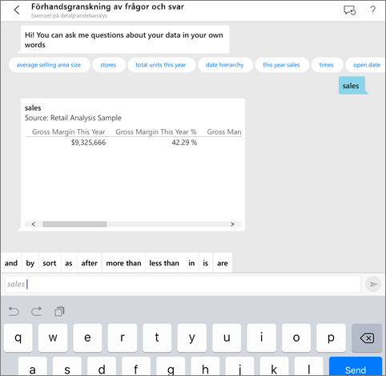
4. Tryck på **av** från nyckelord, tryck **objektet** från listan över förslag > **skicka** .

    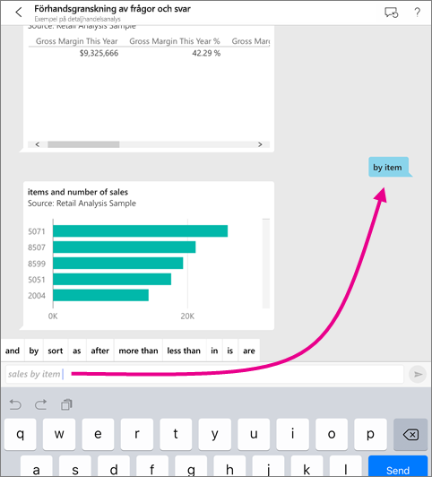
5. Tryck på **Som** från nyckelord, därefter på kolumndiagramikonen och sedan på **Skicka** .
6. Tryck och håll kvar på diagrammet som skapas och sedan på **Expandera**.

    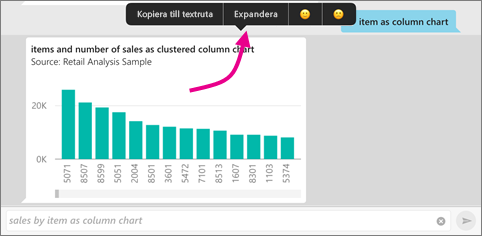

    Diagrammet öppnas i appen i fokusläge.

    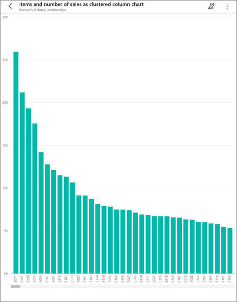
7. Tryck på pilen i det övre vänstra hörnet att gå tillbaka till chattfönstret för frågor och svar.
8. Tryck på X till höger i textrutan för att ta bort texten och börja om.
9. Försök med en ny fråga: Tryck på **Topp** från nyckelord och därefter på **Försäljning efter genomsnittlig $/enhet ly** > **Skicka** .

    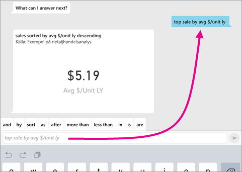
10. Välj **enligt** från nyckelord, tryck på **tid** från listan över förslag längst upp > **Skicka** .

     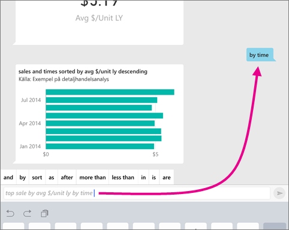
11. Skriv **som**, välj raddiagramikonen  från listan över förslag > **Skicka** .

    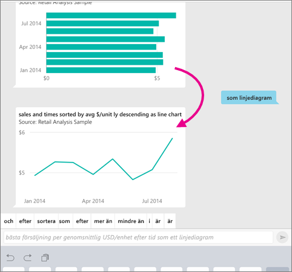

## Försök att säga dina frågor
Du kan nu ställa frågor om dina data i mobilappen för Power BI genom att tala i stället för att skriva.

1. Peka på ikonen för Frågor och svar  från åtgärdsmenyn längst ner på sidan (överst på sidan om du använder en iPad).
2. Tryck på mikrofonikonen .

    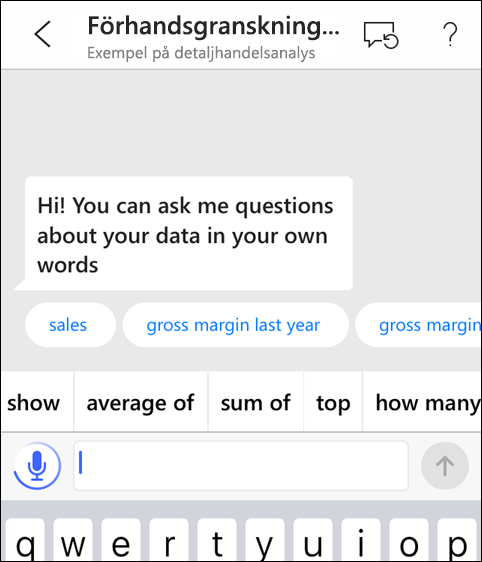

1. Börja tala när mikrofonikonen är aktiv. Till exempel, säg ”genomsnittligt enhetspris vid tidpunkten” och tryck på **Skicka** .

    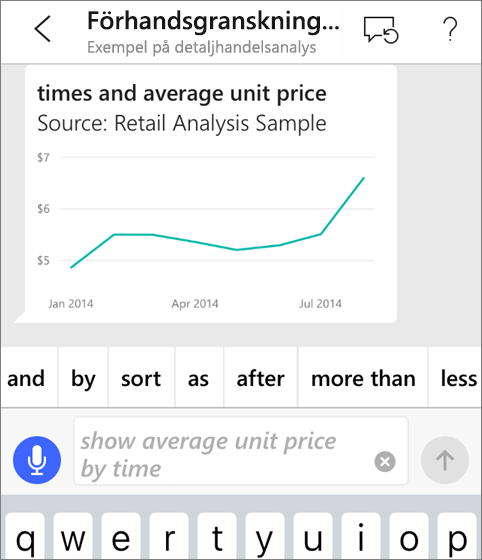

### Frågor om sekretess när du använder tal till text?
Se avsnittet taligenkänning i [Vad är nytt i iOS](https://go.microsoft.com/fwlink/?linkid=845624) i Apple iOS guider för utvecklare.

## Hjälp och feedback
* Behöver du hjälp? Säga bara ”Hej” eller ”Hjälp” så får du hjälp med att starta en ny fråga.
* Vill du ge feedback om resultaten? Tryck länge på ett diagram eller något annat resultat och peka sedan på det glada eller bistra ansiktet.

    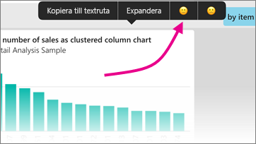

    Din feedback är anonym och hjälper oss att förbättra våra svar på frågor.

## Förbättra resultat från frågor och svar
Du kan förbättra de resultat som du och dina kunder får när de använder det virtuella analysverktyget Frågor och svar på en datauppsättning, antingen genom att ställa mer riktade frågor eller genom att förbättra datauppsättningen.

### Så här ställer du frågor
* Följ dessa [tips för att ställa frågor i Frågor och svar](../end-user-q-and-a-tips.md) i Power BI-tjänsten eller det virtuella analysverktyget Frågor och svar på din iOS-mobilapp.

### Så här förbättrar du datauppsättningen
* Förbättra datauppsättningen i Power BI Desktop eller i Power BI-tjänsten så att [dina data fungerar bra med Frågor och svar och det virtuella analysverktyget Frågor och svar](../../service-prepare-data-for-q-and-a.md).

## Nästa steg
* [Frågor och svar i Power BI-tjänsten](../end-user-q-and-a.md)
* Har du några frågor? Kontrollera avsnittet [Mobilappar i Power BI Community](https://go.microsoft.com/fwlink/?linkid=839277)
