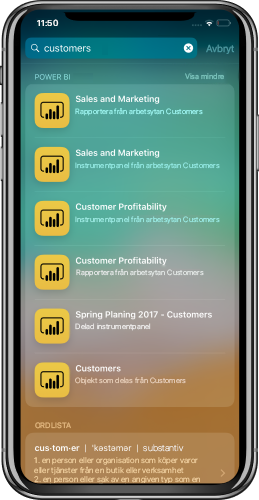

# Integrering av iOS-enhetssökning (Spotlight) i Power BI-mobilappen för iOS (förhandsversion)
Använd iOS-enhetssökning till att hitta och komma åt det innehåll du behöver.

När du använder iOS-enhetssökning (spotlight) till att söka efter specifikt innehåll så ingår Power BI-objekt i resultatlistan. Om du trycker på ett Power BI-objekt i resultatlistan kommer du direkt till objekt i Power BI-appen.

## Hitta objekt med enhetssökning

Så här hittar du objekt med enhetssökning:

1. Svep nedåt från mitten av **startskärmen** för att öppna enhetssökningen.

2. Tryck på **sökfältet** och skriv den text du söker efter.
 
   I sökresultaten ingår Power BI-objekt av följande typer:

    * Instrumentpaneler
    * Rapporter
    * Appar
    * Arbetsytor
    * Objekt som delas av den kontakt du söker efter

    

 3. När du hittat det objekt du letar efter trycker du på det. Power BI-appen öppnas direkt med det valda objektet. 

Enhetssökningen drivs av Siri och innehåller även förslag baserade på dina vanligaste åtgärder i Power BI-appen. Siri-förslagen visas på sök- och låsskärmen.

>[!NOTE]
>
>Om du vill inaktivera enhetssökning och Siri-förslagen går du till **Enhetsinställningar** > **Power BI-inställningar** > **Siri och sökning** och inaktiverar inställningen **Siri och förslag**.
>

## Nästa steg
Så här kan du läsa mer om Power BI-mobilappen: 

* Ladda ned [Power BI-mobilappen för iPhone](http://go.microsoft.com/fwlink/?LinkId=522062)
* Följ [@MSPowerBI på Twitter](https://twitter.com/MSPowerBI)
* Delta i konversationerna i [Power BI-communityn](http://community.powerbi.com/)

