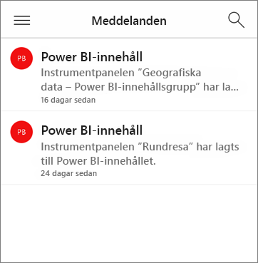
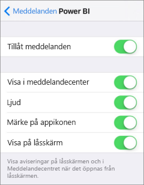
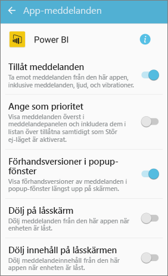
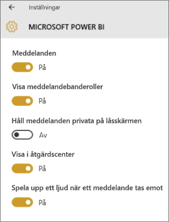

# Få aviseringar i Power BI-mobilapparna
Gäller för:

|  |  |  |  |  |
|:--- |:--- |:--- |:--- |:--- |
| iPhone-telefoner |iPad-surfplattor |Android-telefoner |Android-surfplattor |Windows 10-enheter |

>[!NOTE]
>Stöd för Power BI-mobilappen för **telefoner som använder Windows 10 Mobile** kommer att upphöra den 16 mars 2021. [Läs mer](https://go.microsoft.com/fwlink/?linkid=2121400)

Meddelanden ger dig information som rör din Power BI-användning direkt i Power BI-tjänsten eller på din mobila enhet. När du öppnar Meddelanden visas ett sekventiellt flöde av meddelanden om [aviseringar som du har ställt in](mobile-set-data-alerts-in-the-mobile-apps.md), nya instrumentpaneler har delats med dig, ändringar i din grupparbetsyta, information om Power BI-händelser och -möten med mera.

> [!NOTE]
> Första gången som du loggar in på den [uppdaterade version av Power BI-apparna](https://powerbi.microsoft.com/mobile/) på en iOS-enhet, så visas ett meddelande som frågar om du vill att Power BI ska skicka dig meddelanden. Du kan också konfigurera hur Power BI meddelar dig i **Inställningar** för din enhet. 
> 
> 

## Visa meddelanden på din mobila enhet
1. När du tar emot meddelanden på din mobila enhet så avger Power BI ett ljud och visar en meddelandebanderoll som standard.
   
   
   

   Du kan [ändra hur Power BI meddelar dig](mobile-apps-notification-center.md#change-or-turn-off-notifications-on-your-mobile-device).
2. Om du har fått meddelanden visas en gul punkt på klockikonen för meddelanden när du loggar in på Power BI på din mobila enhet  (iOS och Android) eller på den globala navigeringsknappen  (Windows 10-enheter). 

3. Om du vill se meddelanden i Meddelandecenter trycker du på meddelandeklockan  (iOS och Android) eller ikonen för Meddelandecenter  (Windows 10-enheter).
   
    Meddelandena visas med de senaste överst, och olästa meddelanden är markerade. Meddelanden behålls under 90 dagar, såvida du inte tar bort dem eller når maxgränsen på 100.
   
   
4. Om du vill stänga ett meddelande på iOS- och Android-enheter trycker du, håller ned och sveper. På Windows 10-enheter högerklickar du och väljer **Stäng**.

## Ändra eller stäng av meddelanden på din mobila enhet
Du kan ändra hur du får meddelanden i Power BI.

1. Gå till **Inställningar** > **Meddelanden** på en iOS-enhet. 
   
    På Android-telefoner går du till **Inställningar** > **Meddelanden**.
   
    Gå till **System** > **Meddelanden och åtgärder** i **Inställningar** på en Windows-enhet.
2. Välj **Power BI** i listan med appar. 
3. Här kan du stänga av meddelanden helt och hållet, eller ange vilka meddelanden du vill ha.
   
    **På en iPhone**
   
    
   
    **På en Android-telefon**
   
    

    **På en Windows 10-enhet**

    

## Nästa steg
* [Dataaviseringar i Power BI-tjänsten](../../create-reports/service-set-data-alerts.md)
* [Ställ in dataaviseringar i iPhone-appen (Power BI för iOS)](mobile-set-data-alerts-in-the-mobile-apps.md)
* [Ställ in dataaviseringar i Power BI-mobilappen för Windows 10](mobile-set-data-alerts-in-the-mobile-apps.md)
* [Hämta den senaste versionen av Power BI-apparna](https://powerbi.microsoft.com/mobile/) för mobila enheter
