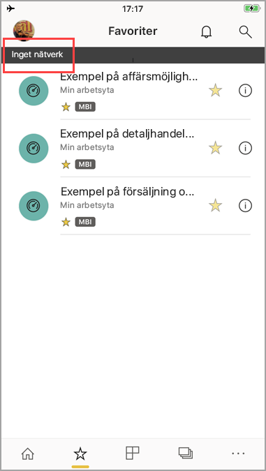

# Visa dina data offline i Power BI-mobilapparna
Gäller för:

|  |  |  |  |  |
|:--- |:--- |:--- |:--- |:--- |
| iPhone-telefoner |iPad-surfplattor |Android-telefoner |Android-surfplattor |Windows 10-enheter |

En fördel med att visa Power BI i en mobilapp istället för en mobil webbläsare är att du kan se dina data, även om du inte är ansluten till ett nätverk. 

Som standard, uppdaterar Power BI data ofta så att du får de senaste uppdaterade svaren på dina företagsfrågor när som helst, även när du roamar eller åker till jobbet.

## Dataåtkomst medan du är offline
När du är offline kan du komma åt och interagera med instrumentpaneler som du tidigare har hämtat från mobilappen.

Du har också läsbehörighet till alla Power BI-rapporter som du tidigare har hämtat från mobilappen. Du kan se den fullständiga rapporten men kan inte filtrera, korsfiltrera, sortera eller använda utsnitt på dem.

## Uppdatering av bakgrundsdata
Bakgrundsuppdatering uppdaterar dina favoritinstrumentpaneler, plus instrumentpaneler och rapporter som du har besökt under de senaste två veckorna med data i Power BI-tjänsten (inte datakällan). Om du är ansluten till WI-FI, uppdaterar bakgrundsuppdateringen varannan timme. Annars, om du befinner dig i ett 3G-nätverk, uppdaterar Power BI innehållet var 24:e timme.

Du kan stänga av bakgrundsuppdatering, till exempel för att undvika nätverksanvändning. Kontrollera inställningarna på din enhet.

> [!NOTE]
> Om du använder Power BI-mobilappen på din iOS-enhet och din organisation har konfigurerat Microsoft Intune MAM, stängs datauppdatering i bakgrunden av. Nästa gång du använder appen uppdaterar Power BI data från Power BI-tjänsten på webben.
> 
> Läs mer om att [konfigurera Power BI-mobilappar med Microsoft Intune](../../service-admin-mobile-intune.md). 
> 
> 

## Offline-indikatorer
Power BI ger tydliga indikatorer när du går till och från offline-läge, samt indikatorer för saknade instrumentpaneler, rapporter och paneler som inte är tillgängliga offline.

## Begränsningar
När du är offline med Power BI på din mobila enhet, kan du stöta på dessa begränsningar:

* Power BI kan cachelagra upp till 250 MB data offline.
* Vissa paneltyper kräver en aktiv serveranslutning så de finns inte tillgängliga offline &#151; till exempel Bing-kartpaneler och vissa anpassade paneler.
* Hela Excel-arbetsböcker i Power BI är inte tillgängliga offline.
* Du kan se Reporting Services-mobila rapporter och KPI:er offline, om du har visat dem när du var ansluten. De uppdateras inte i bakgrunden. De uppdateras varje gång du öppnar dem.
* I Power BI-mobilapparna kan du inte se Power BI Desktop-filer (.pbix) som sparats i Power BI-rapportservern. 
* Sidnumrerade rapporter (RDL) är inte tillgängliga när nätverket är offline.

## Nästa steg
Din feedback hjälper oss att bestämma vad som ska implementeras i framtiden, så glöm inte att rösta för andra funktioner som du skulle vilja se i Power BI-mobilapparna. 

* [Power BI-appar för mobila enheter](mobile-apps-for-mobile-devices.md)
* Följ @MSPowerBI på Twitter
* Delta i konversationen i [Power BI Community](http://community.powerbi.com/)
* [Vad är Power BI?](../../power-bi-overview.md)

