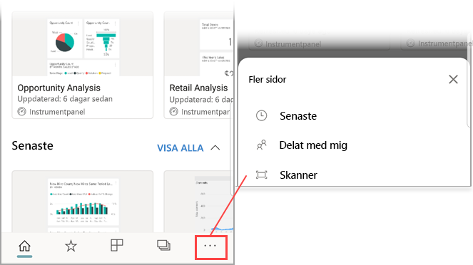
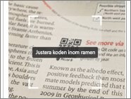
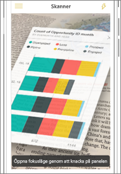
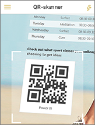
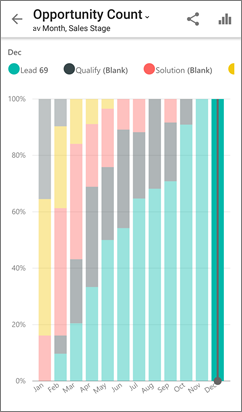

# Skanna en QR-kod i Power BI från din mobila enhet
Gäller för:

|  |  |  |
|:--- |:--- |:--- |:--- |
| iPhone-enheter |Android-telefoner |Android-surfplattor |

Med QR-koderna i Power BI kan du ansluta vad som helst i verkligheten direkt till relaterad BI-information &#151; Ingen navigering eller sökning behövs.

Anta att en kollega har [skapat en QR-kod i Power BI-tjänsten](../../service-create-qr-code-for-tile.md) för en rapport eller för en panel i en instrumentpanel, och har delat instrumentpanelen eller rapporten med dig och placerat QR-koden i en nyckelplats &#151; exempelvis i ett e-postmeddelande eller på ett specifikt objekt. 

Du kan skanna QR-koden om du vill ha omedelbar åtkomst till den relevanta panelen eller rapporten direkt från din telefon, antingen med skannern i Power BI-appen, eller någon annan skanner som har installerats på din telefon. 

Om en kollega inte har delat instrumentpanelen eller rapporten med dig, kan du begära åtkomst direkt från mobilappen. 

> [!NOTE]
> Du kan också [skanna en QR-kod för en rapport med appen Power BI for Mixed Reality](mobile-mixed-reality-app.md#scan-a-report-qr-code-in-holographic-view).

## Skanna en Power BI QR-kod på din iPhone med Power BI-skannern

1. I navigeringsfältet trycker du på **Fler alternativ** (...) och sedan på **Skanner**.

    

2. Du måste godkänna Power BI-appen för att använda kameran om din kamera inte är aktiverad. Det här är ett engångsgodkännande. 
 
3. Peka skannern på Power BI QR-koden. 
   
    
4. Panelen eller rapporten ser ut att hovra över bakgrunden som i en förhöjd verklighet.
   
    

5. Tryck på rapporten eller öppna den i fokusläge, eller gå tillbaka till skannern.

### Skanna QR-kod från en extern skanner på din iPhone
1. Om du har installerat någon skanner på mobiltelefonen, så peka med den mot den relevanta Power BI QR-koden så att du får omedelbar åtkomst till panelen eller rapporten. 
2. Om du inte har installerat Power BI-appen omdirigeras du till [Apple App Store så att du kan hämta den](https://go.microsoft.com/fwlink/?LinkId=522062) till din iPhone.

## Skanna en Power BI QR-kod på din Android-enhet med Power BI-skannern

1. I navigeringsfältet trycker du på **Fler alternativ** (...) och sedan på **Skanner**.

    

2. Du måste godkänna Power BI-appen för att använda kameran om din kamera inte är aktiverad. Det här är ett engångsgodkännande. 

3. Peka skannern på Power BI QR-koden. 
   
    
4. Panelen eller rapporten öppnas automatiskt i Power BI.
   
    

### Skanna QR-kod från en extern skanner på din Android-enhet
1. Om du har installerat någon skanner på din Android-enhet, så peka med den mot den relevanta Power BI QR-koden så att du får omedelbar åtkomst till panelen eller rapporten. 
2. Om du inte har installerat Power BI-appen omdirigeras du till [Google Play så att du kan hämta den](https://go.microsoft.com/fwlink/?LinkID=544867). 

## Nästa steg
* [Ansluta till Power BI-data från verkligheten](mobile-apps-data-in-real-world-context.md) med mobilapparna
* [Skapa en QR-kod för en panel i Power BI-tjänsten](../../service-create-qr-code-for-tile.md)
* [Skapa en QR-kod för en rapport i Power BI-tjänsten](../../service-create-qr-code-for-report.md)
* Du kan också [skanna en QR-kod med appen Power BI for Mixed Reality](mobile-mixed-reality-app.md)
* Har du några frågor? [Fråga Power BI Community](https://community.powerbi.com/)

