# Snabbstart: Utforska instrumentpaneler och rapporter i Power BI-mobilappar
I den här snabbstarten får du utforska en exempel-instrumentpanel och rapport i Power BI-mobilappen på en Android-telefon. Du kan också följa med i andra mobila appar. 

Gäller för:

|  |  |  |  |
|:--- |:--- |:--- |:--- |
| iPhone | iPad | Android | Windows 10 |

Instrumentpaneler är en portal till ditt företags livscykel och processer. En instrumentpanel är en översikt, en enda plats där du har översikt över verksamheten. Rapporter är en interaktiv vy över dina data med visuell information som representerar olika resultat och insikter från dessa data. 

## Förutsättningar

### Registrera dig för Power BI
Om du inte har registrerat dig för Power BI [registrerar du dig för en kostnadsfri utvärderingsversion](https://app.powerbi.com/signupredirect?pbi_source=web) innan du börjar.

### Installera Power BI för Android-appen
[Ladda ner Power BI för Android-appen](http://go.microsoft.com/fwlink/?LinkID=544867) från Google Play.

Power BI fungerar på Android-enheter som kör operativsystemet Android 5.0 eller senare. Om du vill kontrollera din enhet, går du till **Inställningar** > **Om enheten** > **Android-version**.

### Hämta Exempel på detaljhandelsanalys
Det första steget i den här snabbstarten är att hämta exemplet på detaljhandelsanalys i Power BI-tjänsten.

1. Öppna Power BI-tjänsten i din webbläsare (app.powerbi.com) och logga in.

1. Välj den globala navigeringsikonen för att öppna det vänstra navigeringsfönstret.

    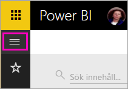

2. I det vänstra navigeringsfönstret väljer du **Arbetsytor** > **Min arbetsyta**.

    

3. Längst ned i vänster hörn väljer du **Hämta data**.
   
    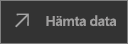

3. På sidan Hämta data väljer du ikonen **Exempel**.
   
   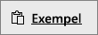

4. Välj **Exempel på detaljhandelsanalys**.
 
    
 
8. Välj **Anslut**.  
  
   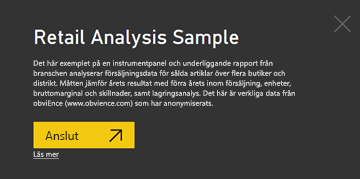
   
5. Power BI importerar exemplet och lägger till en ny instrumentpanel, rapport och datauppsättning till din Min arbetsyta.
   
   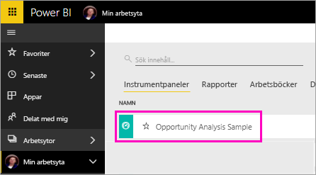

OK, nu är du redo att visa exemplet på din Android-enhet.

## Visa en instrumentpanel på din Android-enhet
1. På din Android-enhet, öppnar du Power BI-appen och loggar in med dina Power BI-kontouppgifter, samma som du använde i Power BI-tjänsten i webbläsaren.

1.  Tryck på den globala navigeringsknappen .

2.  Tryck på **Arbetsytor** > **Min arbetsyta**

    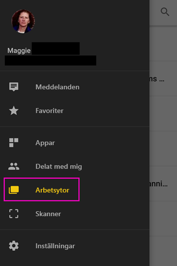

3. Tryck på instrumentpanelen för Exempel på detaljhandelsanalys för att öppna den.
 
    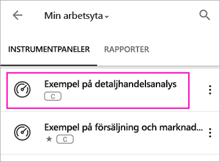
   
    En anteckning under instrumentpanelsnamnet (i det här fallet bokstaven C) visar hur data i varje instrumentpanel klassificeras. Läs mer om [dataklassificering i Power BI](../../service-data-classification.md).

    Power BI-instrumentpaneler ser lite annorlunda ut på din Android-telefon. Alla paneler visas med samma bredd och de är placerade efter varandra uppifrån och ned.

4. Tryck på stjärnikonen  i namnlisten för att göra det här till en favorit-instrumentpanel.

    När du gör en favorit i mobilappen, är det en favorit i Power BI-tjänsten och vice versa.

4. Bläddra nedåt och tryck på det ifyllda linjediagrammet Årets försäljning, förra årets försäljning.

    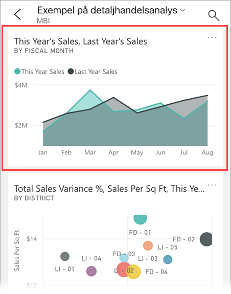

    Det öppnas i fokusläge.

7. I fokusläge, trycker du på apr i diagrammet. Du får se värdena för april överst i diagrammet.

    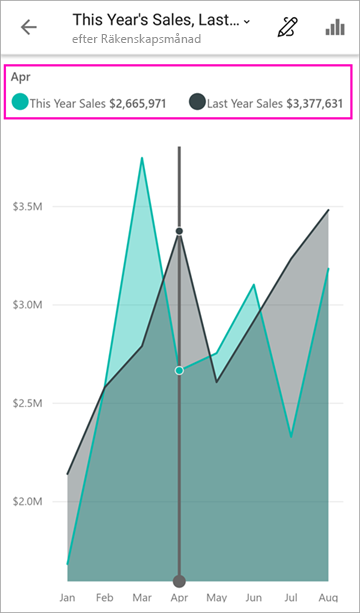

8. Knacka på rapportikonen  i det övre högra hörnet. Rapporten relaterad till den här ikonen öppnas i liggande läge.

    

9. Tryck på den gula bubblan 040 – Juniors i bubbeldiagrammet. Ser du hur den visar relaterade värden i de andra diagrammen? 

    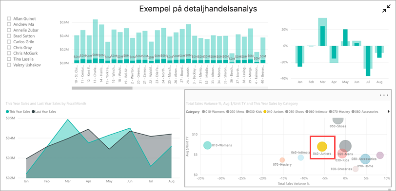

10. Svep upp för att se verktygsfältet längst ned botten och tryck på pennikonen.

    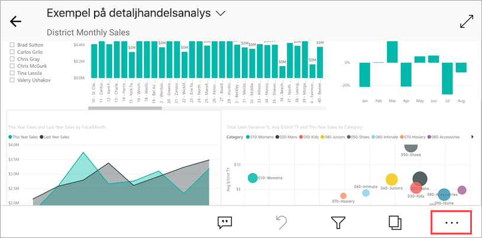

11. Tryck på smiley-ikonen i verktygsfältet Kommentera och lägga till några smileys på din rapportsida.
 
    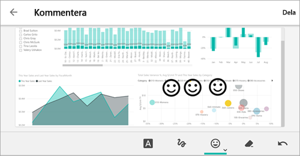

12. Tryck på **Dela** i det övre högra hörnet.

1. Fyll i deras e-postadresser och lägga till ett meddelande om du vill.  

    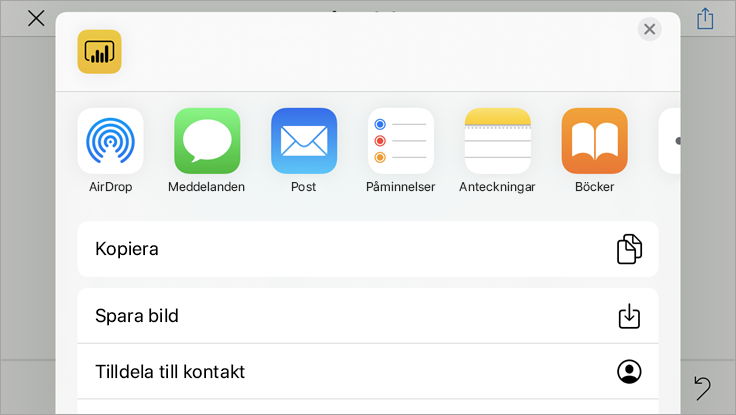

    Du kan dela den här ögonblicksbilden med personer i eller utanför din organisation. Om de finns inom din organisation och har sina egna Power BI-konto, kommer de också att kunna öppna exempelrapporten Detaljhandelsanalys.

## Rensa resurser

När du har slutfört den här snabbstarten kan du ta bort exempelinstrumentpanelen med detaljhandelsanalys, rapporter och datauppsättningen om du vill.

1. Öppna Power BI-tjänsten (app.powerbi.com) och logga in.

2. I det vänstra navigeringsfönstret väljer du **Arbetsytor** > **Min arbetsyta**.

    Ser du den gula stjärnan som visar att det är en favorit?

3. På fliken **Instrumentpaneler** väljer du papperskorgens ikon för att **ta bort** bredvid instrumentpanelen för detaljhandelsanalys.

    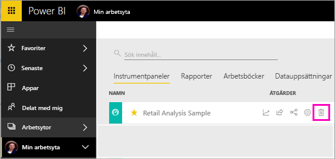

4. Välj fliken **Rapporter** och gör samma sak för rapporten med detaljhandelsanalys.

5. Välj fliken **Datauppsättningar** och gör samma sak för datauppsättningen med detaljhandelsanalys.

## Nästa steg

I den här snabbstarten utforskade du en exempel-instrumentpanel och rapport på din Android-enhet. Läs mer om att arbeta i Power BI-tjänsten. 

> [!div class="nextstepaction"]
> [Snabbstart: Navigera i Power BI-tjänsten](../end-user-experience.md)

