# Visa instrumentpaneler och rapporter i Power BI-mobilappar
Gäller för:

|  |  |  |  | 
|:--- |:--- |:--- |:--- |:--- |
| [iPhone-telefoner](mobile-apps-view-dashboard.md#view-dashboards-on-your-iphone) |[iPad-surfplattor](mobile-apps-view-dashboard.md#view-dashboards-on-your-ipad) |[Android-telefoner](mobile-apps-view-dashboard.md#view-dashboards-on-your-android-phone) |[Android-surfplattor](mobile-apps-view-dashboard.md#view-dashboards-on-your-android-tablet) |

Instrumentpaneler är en portal till ditt företags livscykel och processer. En instrumentpanel är en översikt, en enda plats där du har översikt över verksamheten.

## Skapa instrumentpaneler i Power BI-tjänsten (https://powerbi.com)
**Instrumentpaneler skapas inte i mobilapparna.** 

Om du vill visa instrumentpaneler och rapporter på din mobila enhet måste du skapa eller ansluta dem i en webbläsare. 

1. Gå till Power BI-tjänsten ([https://www.powerbi.com](https://www.powerbi.com)) och [registrera dig för ett konto](../../service-self-service-signup-for-power-bi.md).
2. [Skapa egna Power BI-instrumentpaneler och rapporter](../../service-get-started.md) eller anslut till befintliga [Power BI-appar](../../service-connect-to-services.md) för en mängd olika tjänster, som till exempel [Microsoft Dynamics CRM](../../service-connect-to-microsoft-dynamics-crm.md).

Här är en instrumentpanel i Power BI-tjänsten:

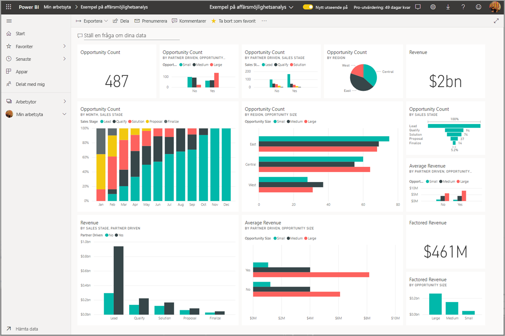

## Visa instrumentpaneler på din iPhone
1. Öppna Power BI-appen på din iPhone och logga in.
   
   Behöver du [hämta iPhone-appen](http://go.microsoft.com/fwlink/?LinkId=522062) från Apple App Store?
2. Tryck på en instrumentpanel för att öppna den.  
   
    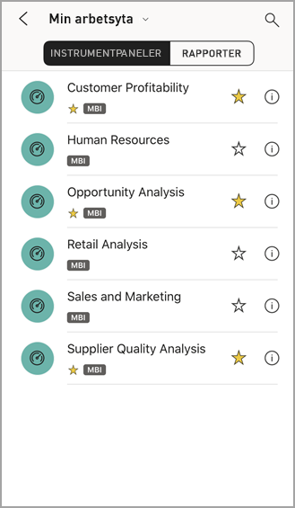
   
   * Gula stjärnor  visar vilka instrumentpaneler som är Favoriter. 
   * Anteckningen under varje instrumentpanelsnamns (i det här fallet ”MBI”)  visar hur data i varje instrumentpanel klassificeras. Läs mer om [dataklassificering i Power BI](../../service-data-classification.md).
   
   Som standard visas Power BI-instrumentpaneler lite annorlunda på din iPhone. Alla paneler visas samma storlek och de är placerade efter varandra uppifrån och ned.
   
    
   
   > [!TIP]
   > Om du är instrumentpanelens ägare i Power BI-tjänsten kan du [skapa en vy på instrumentpanelen för telefoner](../../service-create-dashboard-mobile-phone-view.md) i stående läge. 
   > 
   > 
   
    Eller bara lägg din telefon på sidan för att visa instrumentpanelen i liggande läge.
   
    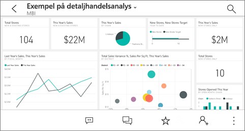
3. Svep uppåt och nedåt för att se alla paneler på instrumentpanelen. Du kan:
   
   * [Trycka på en panel](mobile-tiles-in-the-mobile-apps.md) för att öppna den i fokusläge och interagera med den.
   * Tryck på stjärnan  för att [göra den till en favorit](mobile-apps-favorites.md).
   * Tryck på **Bjuda in**  för att [Bjuda in en kollega](mobile-share-dashboard-from-the-mobile-apps.md) att visa instrumentpanelen.
   * [Synkronisera instrumentpanelen med din Apple Watch](mobile-apple-watch.md).
4. Om du vill återgå till listan över instrumentpaneler trycker du på pilen bredvid instrumentpanelrubriken och sedan på **Min arbetsyta**.
   
   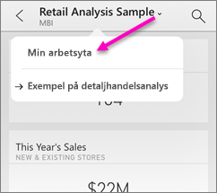

### Visa instrumentpaneler i liggande läge i din iPhone
Eller bara lägg din telefon på sidan för att visa instrumentpanelen i liggande läge. Instrumentpanelens layout ändras från en serie brickor till en vy över hela instrumentpanelen &#151; du se alla paneler på instrumentpanelen, precis som i Power BI-tjänsten.

Du kan använda gesten ”Zooma” för att zooma in och ut på olika områden i instrumentpanelen. Och du kan fortfarande [trycka på en panel](mobile-tiles-in-the-mobile-apps.md) för att öppna panelen i fokusläge och interagera med dina data.

## Visa instrumentpaneler på din iPad
1. Öppna Power BI-appen.
   
   Behöver du [hämta iPad-appen](http://go.microsoft.com/fwlink/?LinkId=522062) från Apple App Store?
2. Tryck på **instrumentpaneler** överst i appen.  
   
   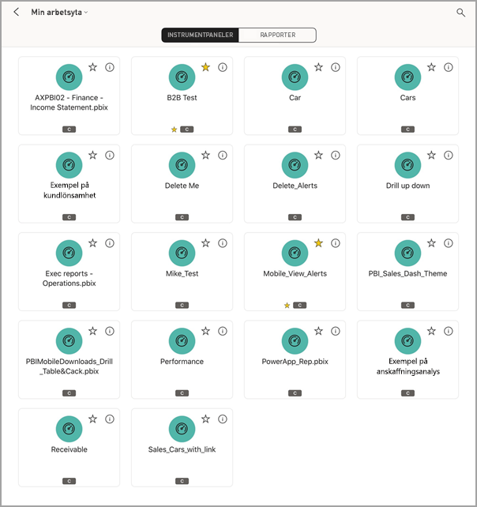
   
   * Gula stjärnor  visar vilka instrumentpaneler som är Favoriter. 
   * Anteckningen under varje instrumentpanelsnamns (i det här fallet ”MBI”)  visar hur data i varje instrumentpanel klassificeras. Läs mer om [dataklassificering i Power BI](../../service-data-classification.md).
3. Du kan dela en instrumentpanel från en arbetsyta. Tryck på knappen ( **...** ) i det nedre högra hörnet av instrumentpanelens sida och tryck på **Bjud in andra**.
   
   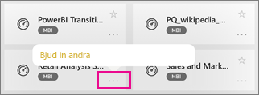
4. Du kan också trycka på en instrumentpanel om du vill öppna den och se paneler på instrumentpanelen. Du kan interagera den medan du är på instrumentpanelen:
   
   * [Tryck på en panel för att interagera](mobile-tiles-in-the-mobile-apps.md) med panelen.
   * [Öppna rapporterna](mobile-reports-in-the-mobile-apps.md) bakom panelerna.
   * [Bjud in andra att visa instrumentpanelen](mobile-share-dashboard-from-the-mobile-apps.md).
   * [Lägga till anteckningar och dela en ögonblicksbild](mobile-annotate-and-share-a-tile-from-the-mobile-apps.md) av en panel.
5. Om du vill gå tillbaka till Min arbetsyta, trycker du på namnet på instrumentpanelen i det övre vänstra hörnet och sedan **Min arbetsyta**.
   
   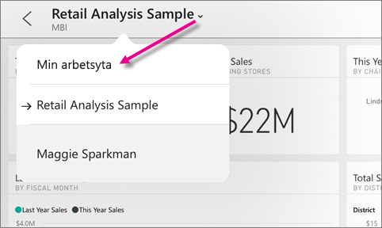

## Visa instrumentpaneler på din Android-telefon
1. Öppna Power BI-appen på din Android-telefon och logga in.
   
   Behöver du först [ladda ned Android-appen](http://go.microsoft.com/fwlink/?LinkID=544867)?
2. Tryck på en instrumentpanel för att öppna den.   
   
   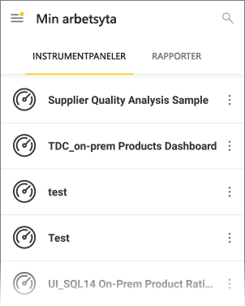

    Gula stjärnor  visar vilka instrumentpaneler som är Favoriter. 

    Anteckningen under varje instrumentpanelsnamns (i det här fallet ”MBI”)  visar hur data i varje instrumentpanel klassificeras. Läs mer om [dataklassificering i Power BI](../../service-data-classification.md).

    Power BI-instrumentpaneler ser lite annorlunda ut på din Android-telefon. Alla paneler visas med samma bredd och de är placerade efter varandra uppifrån och ned.

    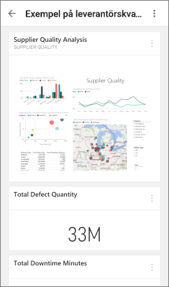

    Om du är instrumentpanelens ägare i Power BI-tjänsten kan du [skapa en vy på instrumentpanelen för telefoner](../../service-create-dashboard-mobile-phone-view.md) i stående läge. 

1. På instrumentpanelen kan du trycka på den lodräta knappen **Fler alternativ** (...) bredvid namnet för att bjuda in en kollega, uppdatera eller hämta information om instrumentpanelen:
   
   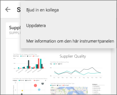
2. Svep uppåt och nedåt för att se alla [paneler på instrumentpanelen](mobile-tiles-in-the-mobile-apps.md). 
3. Om du vill gå tillbaka till startsidan för instrumentpaneler trycker du på namnet på instrumentpanelen för att öppna den dynamiska länken.Tryck sedan på **Min arbetsyta**.   

## Visa instrumentpaneler på din Android-surfplatta
1. Öppna Power BI-appen på din Android-surfplatta och logga in.
   
   Behöver du först [ladda ned Android-appen](http://go.microsoft.com/fwlink/?LinkID=544867)?
2. Tryck på en instrumentpanel för att öppna den.   
   
   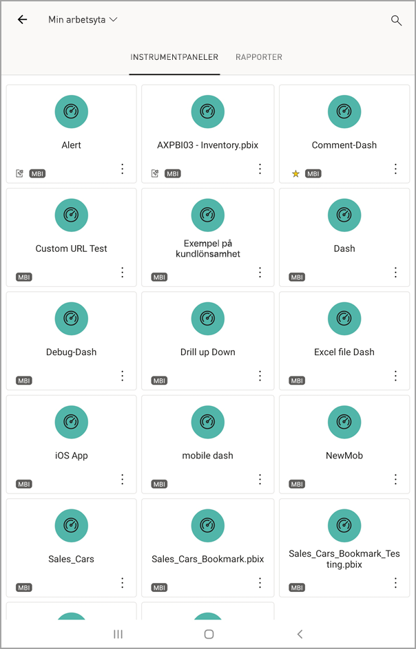
   
   * Gula stjärnor  visar vilka instrumentpaneler som är Favoriter. 
   * Anteckningen under varje instrumentpanelsnamns (i det här fallet ”MBI”)  visar hur data i varje instrumentpanel klassificeras. Läs mer om [dataklassificering i Power BI](../../service-data-classification.md).
3. På instrumentpanelen kan du trycka på den lodräta knappen **Fler alternativ** (...) bredvid namnet för att bjuda in en kollega, uppdatera eller hämta information om instrumentpanelen:
   
   
4. Svep uppåt och nedåt för att se alla [paneler på instrumentpanelen](mobile-tiles-in-the-mobile-apps.md). 
   
   Du kan använda gesten ”Zooma” för att zooma in och ut på olika områden i instrumentpanelen. Och du kan fortfarande [trycka på en panel](mobile-tiles-in-the-mobile-apps.md) för att öppna panelen i fokusläge och interagera med dina data.
5. Om du vill gå tillbaka till startsidan för instrumentpaneler trycker du på namnet på instrumentpanelen för att öppna den dynamiska länken.Tryck sedan på **Min arbetsyta**:
   
    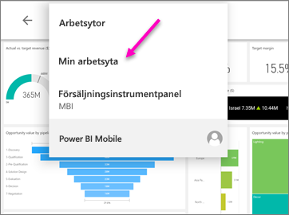

    Du kan använda gesten ”Zooma” för att zooma in och ut på olika områden i instrumentpanelen. Och du kan fortfarande [trycka på en panel](mobile-tiles-in-the-mobile-apps.md) för att öppna panelen i fokusläge och interagera med dina data.

## Skapa en telefonvy av en instrumentpanel i Power BI-tjänsten
Om du är instrumentpanelens ägare i *Power BI-tjänsten* kan du skapa en vy på instrumentpanelen för telefoner i stående läge. 

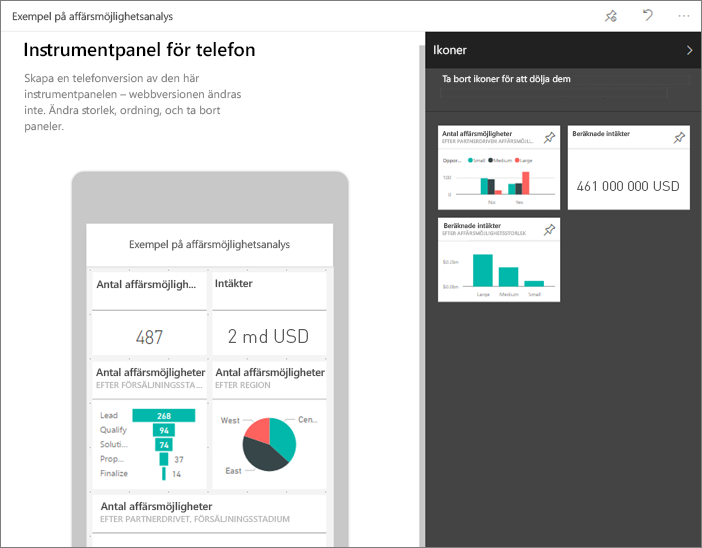

Läs mer om [skapar en telefonvy av en instrumentpanel](../../service-create-dashboard-mobile-phone-view.md).

## Nästa steg
* [Hämta Android-appen](http://go.microsoft.com/fwlink/?LinkID=544867) från Google play  
* [Kom igång med Android-appen för Power BI](mobile-android-app-get-started.md)  
* [Vad är Power BI?](../../fundamentals/power-bi-overview.md)
* Har du några frågor? [Fråga Power BI Community](http://community.powerbi.com/)

