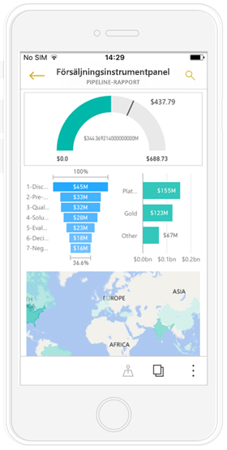
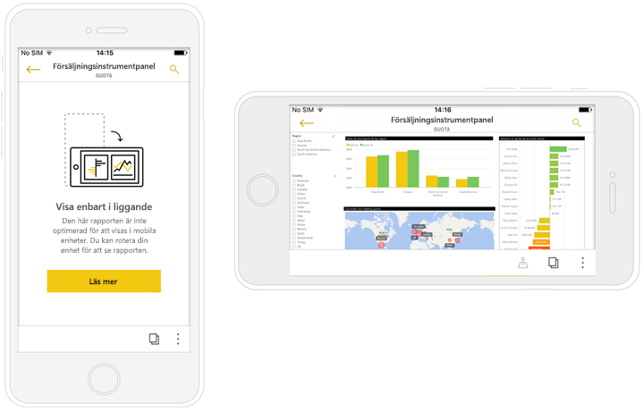
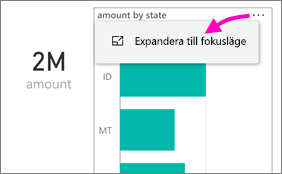
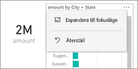
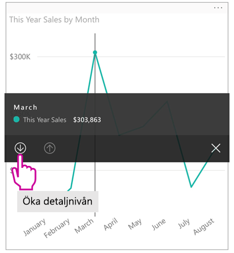
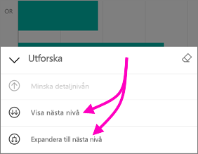
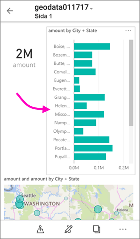
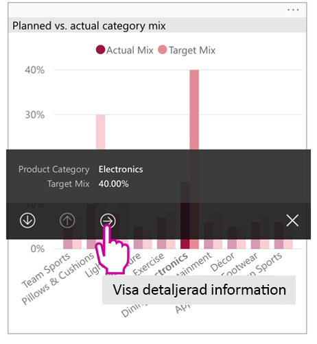
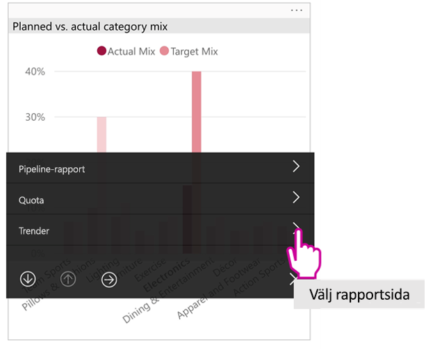

# Visa Power BI-rapporter som är optimerade för din telefon

Gäller för:

|  |  |
|:--- |:--- |
| iPhone-telefoner |Android-telefoner |

När du visar en Power BI-rapport på din telefon, kontrollerar Power BI om rapporten har optimerats för telefoner. Om den har öppnas Power BI automatiskt den optimerade rapporten i stående vy.

Om det inte finns någon telefonoptimerad rapport kommer rapporten öppnas i ett icke-optimerat liggande läge. Rapporten öppnas i icke-optimerat läge med den ursprungliga rapportlayouten om du vrider din telefon åt sidan, även om den ursprungligen är telefonoptimerad. Om du enbart optimerar vissa sidor kommer läsarna att se ett meddelande i stående vy som visar att rapporten är tillgänglig i liggande vy.

Alla andra funktioner i Power BI-rapporter fungerar fortfarande i telefon-optimerade rapporter. Läs mer om funktioner i:

* [Rapporter på iPhone](mobile-reports-in-the-mobile-apps.md). 
* [Rapporter på Android-telefoner](mobile-reports-in-the-mobile-apps.md).

## Filtrera rapportsidan på en telefon
Om en telefonoptimerad rapport har filter definierade, kan du använda dessa filter när du visar rapporten på en telefon. Rapporten öppnas på din telefon filtrerad enligt de värden som filtreras i rapporten på webben. Ett meddelande om att det finns aktiva filter på sidan visas. Du kan ändra filtren på din telefon.

1. Tryck på filterikonen  längst ned på sidan. 
2. Använda grundläggande eller avancerad filtrering för att se resultatet som du är intresserad av.
   
    

## Korsmarkera visuella objekt
Korsmarkering i stående fungerar vy som det gör i Power BI-tjänsten och på telefonen i liggande läge: När du väljer data i ett visuellt objekt markeras relaterade data i övriga visuella objekt på samma sida.

Läs mer om [filtrering och markering i Power BI](../../power-bi-reports-filters-and-highlighting.md).

## Välj visuella objekt
I rapporter på telefonen markeras det visuella objektet när du väljer det, vilket neutraliserar gester på arbetsytan.

Du kan bläddra i det visuella objektet när det är markerat. Om du vill avmarkera ett visuellt objekt är det bara att trycka var som helst utanför det.

## Öppna visuella objekt i fokusläge
Telefonrapporter erbjuder också en Fokusläge: Du får en större vy över en enda visual och utforska den enklare.

* Knacka på ellipsen i en telefonrapport ( **...** ) i det övre högra hörnet i ett visuellt objekt > **Expandera till fokusläge**.
  
    

Vad du gör i fokusläget överförs till rapportarbetsytan och vice versa. Om du markerar ett värde i ett visuellt objekt och sedan gå tillbaka till hela rapporten, till exempel filtreras rapporten till det värde som du markerade i det visuella objektet.

Vissa åtgärder kan endast utföras i fokusläge på grund av skärmens storlek:

* **Ändra detaljnivån** i informationen som visas i ett visuellt objekt. Läs mer om att ändra detaljnivån [nedåt och uppåt](mobile-apps-view-phone-report.md#drill-down-in-a-visual) i en telefonrapport nedan.
* **Sortera** värdena i det visuella objektet.
* **Återställa**: Rensa de utforskningssteg du har genomfört för ett visuellt objekt och återgå till de definitioner som gällde när rapporten skapades.
  
    Tryck på ellipsen ( **...** ) > **Återställ** för att rensa all utforskningsaktivitet från ett visuellt objekt.
  
    
  
    Återställ är tillgängligt på rapportnivå, avmarkera alla visuella objekt, eller på visuell nivå, rensa utforskning från det valda visuella objektet.   

## Öka detaljnivån i ett visuellt objekt
Om hierarkinivåerna har definierats i ett visuellt objekt kan du öka detaljnivån för informationen i ett visuellt objekt och sedan återgå. Du kan[ öka detaljnivån](../end-user-drill.md) i antingen Power BI-tjänsten eller Power BI Desktop.

Det finns några typer av detaljnivå:

### Öka detaljnivån för ett värde
1. Tryck länge på (tryck och håll ned) på en datapunkt i ett visuellt objekt.
2. Knappbeskrivning visas, och om hierarkin har definierats använder sedan knappbeskrivning sidfoten visas gå nedåt och uppåt-pilen.
3. Tryck på nedpilen för nedåt

    
    
4. Tryck på uppåt-pilen för ökad detaljnivå uppåt.

### Gå till nästa nivå
1. Knacka på ellipsen i en telefonrapport ( **...** ) i det övre högra hörnet > **Expandera till fokusläge**.
   
    
   
    I det här exemplet visar staplarna värden för delstater.
2. Tryck på utforskningsikonen  i nedre vänstra hörnet.
   
    
3. Tryck på **Visa nästa nivå** eller **Expandera till nästa nivå**.
   
    
   
    Nu visar staplarna värden för städer.
   
    
4. Om du trycker på pilen i det övre vänstra hörnet återgår du till telefonrapporten med värden som fortfarande expanderas för den lägre nivån.
   
    
5. Om du vill gå tillbaka upp till den ursprungliga nivån, tryck på ellipsen ( **...** ) igen > **Återställ**.
   
    

## Visa detaljerad information från ett-värde
Gå igenom ansluter värden i en rapportsida med andra rapportsidor. När detaljgranska från en datapunkt till en annan rapportsida punktvärden data används för att filtrera de detaljerad via sidan eller kommer att finnas i kontexten för den valda data.
Rapportförfattarna kan [definiera detaljnivå](https://docs.microsoft.com/power-bi/desktop-drillthrough) när de skapar rapporten.

1. Tryck länge på (tryck och håll ned) på en datapunkt i ett visuellt objekt.
2. Knappbeskrivning visas och om detaljnivå definieras knappbeskrivning sidfoten sedan att visa detaljerad pilen.
3. Tryck på pilen för detaljerad

    

4. Välj vilken rapportsida som ska visa detaljerad information

    

5. Använd Bakåt-knappen på app-huvudet för att gå tillbaka till sidan som du utgick från.

## Nästa steg
* [Skapa rapporter som är optimerade för Power BI-telefonappar](../../desktop-create-phone-report.md)
* [Skapa en telefonvy av en instrumentpanel i Power BI](../../service-create-dashboard-mobile-phone-view.md)
* [Skapa dynamiska visuella objekt som optimerats för alla storlekar](../../visuals/desktop-create-responsive-visuals.md)
* Har du fler frågor? [Fråga Power BI Community](http://community.powerbi.com/)

