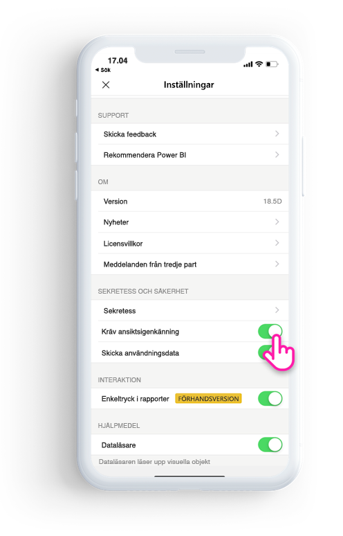
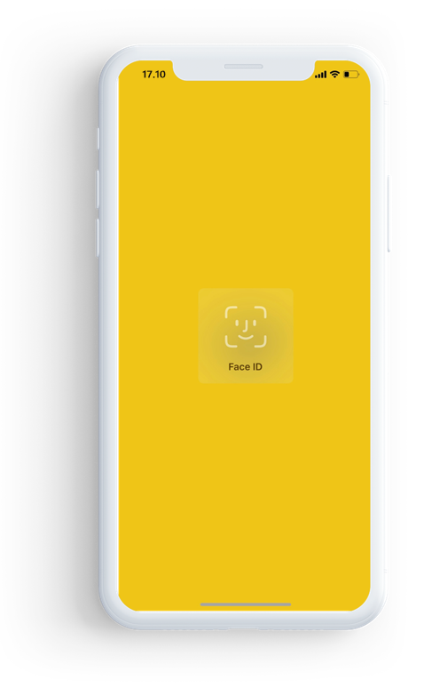

# Skydda Power BI-appen med Face ID, Touch ID eller lösenord 

I många fall är de data som hanteras i Power BI konfidentiella och måste därför skyddas så att endast behöriga användare kommer åt dem. 

I Power BI-appen för iOS kan du skydda dina data genom att konfigurera ytterligare identifiering. Du måste då använda Face ID, Touch ID eller ett lösenord varje gång du startar appen, eller när du hämtar upp appen från bakgrunden.

|  |  |
|:--- |:--- |
| iPhone-telefoner |iPad-surfplattor |

## Aktivera Face ID, Touch ID eller lösenord i appinställningarna

Om du vill använda ytterligare identifiering för Power BI går du till appinställningarna under **Sekretess och säkerhet**. Du ser alternativet för att aktivera Face ID, Touch ID eller lösenord baserat på enhetens funktioner.

När du har aktiverat inställningen måste du identifiera dig varje gång du startar Power BI eller hämtar upp appen från bakgrunden. 

Beslutet att fråga efter Face ID, Touch ID eller lösenord görs av iOS baserat på enhetens funktioner. Om enheten har stöd för Face ID måste du använda Face ID. Om enheten har stöd för Touch ID måste du använda Touch ID. Om inget av de här alternativen stöds måste du ange ett lösenord.

## Använda MDM till att tvinga användningen av Face ID, Touch ID eller lösenord

En del organisationer har säkerhetsprinciper och efterlevnadskrav där det krävs ytterligare identifiering innan du kan komma åt känsliga affärsdata. 

I Power BI-appen för IOS kan administratörer styra den här inställningen genom att push-överföra appens konfigurationsinställningar från Microsoft Intune eller någon annan MDM-lösning. Administratörer kan använda appskyddsprincipen för att aktivera den här inställningen för alla användare eller för en grupp användare.

|Nyckel  |Typ  |Beskrivning  |
|---------|---------|---------|
| com.microsoft.powerbi.mobile.ForceDeviceAuthentication | Boolesk | Standardvärdet är False.  När värdet är True tvingas appanvändarna att identifiera sig med Face ID, Touch ID eller lösenord innan de kan visa Power BI-data i appen. Användare som inte har Face ID, Touch ID eller ett lösenord konfigurerat på enheten måste konfigurera detta innan de kan använda Power BI.  |

## Nästa steg

[Använda MDM till att konfigurera Power BI-appen för iOS via fjärranslutning](mobile-app-configuration.md)
