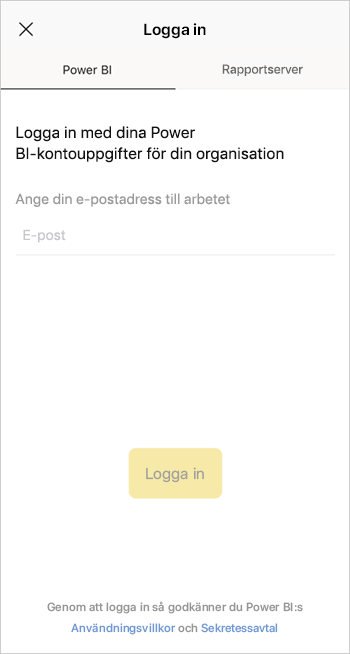
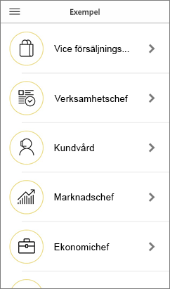

# Kom igång med Power BI-mobilappen på iOS-enheter
Microsoft Power BI-appen för iOS på iPhone och iPad ger dig den mobila BI-upplevelsen för Power BI, Power BI-rapportservern och Reporting Services. Visa och interagera med ditt företags instrumentpaneler lokalt och i molnet överallt, med pekaktiverad mobil åtkomst i realtid. Utforska data i instrumentpaneler och dela med dina kollegor via e-post eller sms. Och hålla dig uppdaterad med dina mest aktuella data på din [Apple Watch](mobile-apple-watch.md).  

Du skapar Power BI-rapporter i Power BI Desktop och publicerar dem:

* [Publicera dem i Power BI-tjänsten](../../fundamentals/service-get-started.md) och skapa instrumentpaneler.
* [Publicera dem lokalt på Power BI-rapportservern](../../report-server/quickstart-create-powerbi-report.md).

Sedan interagerar du i Power BI-mobilappen för iOS med dina instrumentpaneler och rapporter, antingen lokalt eller i molnet.

Ta reda på [nyheterna i Power BI-mobilapparna](mobile-whats-new-in-the-mobile-apps.md).

## Hämta appen
[Ladda ned iOS-appen](https://go.microsoft.com/fwlink/?LinkId=522062 "Ladda ned iOS-appen") från Apple App Store till din iPhone eller iPad.

Du kan köra Power BI-mobilappen för iOS på alla enheter med iOS 11 eller senare. 

## Registrera dig för Power BI-tjänsten
Om du inte har registrerat dig än kan du gå till [powerbi.com](https://powerbi.microsoft.com/get-started/), och under **Power BI – Samarbete och delning i molnet** väljer du sedan**Testa kostnadsfritt**.

## Kom igång med Power BI-appen
1. Öppna Power BI-appen på din iOS-enhet.
2. Om du vill logga in i Power BI trycker du på fliken **Power BI** och fyller i dina inloggningsuppgifter.  
   Om du vill logga in i dina mobila rapporter och KPI:er i Reporting Services trycker du på fliken **Rapportserver** och fyller i dina inloggningsuppgifter.
   
   
   
   När du är i appen trycker du bara på kontoprofilbilden uppe till vänster på skärmen för att växla mellan Power BI och rapportservern. 

## Testa Power BI- och Reporting Services-exemplen
Även om du inte registrerar dig kan du visa och interagera med Power BI- och Reporting Services-exemplen.

Om du vill gå till exemplen trycker du på **Fler alternativ** (...) i navigeringsfältet och väljer **Exempel**.

Ett antal Power BI-exempel åtföljs av flera exempel på rapportservern.

   
   
   > [!NOTE]
   > Alla funktioner är inte tillgängliga i exemplen. Du kan till exempel inte visa de exempelrapporter som ligger bakom instrumentpanelerna, du kan inte dela exemplen med andra och du kan inte göra dem till favoriter. 
   > 
   >

## Hitta ditt innehåll i Power BI-mobilapparna

Tryck på förstoringsglaset i rubriken för att börja söka efter Power BI-innehåll.

## Visa dina favoritinstrumentpaneler och -rapporter
Tryck på **Favoriter** () i navigeringsfältet för att visa sidan Favoriter. 

Läs mer om [favoriter i Power BI-mobilappar](mobile-apps-favorites.md).

## Företagsstöd för Power BI-mobilapparna
Organisationer kan använda Microsoft Intune för att hantera enheter och program, inklusive Power BI-mobilappar för Android och iOS.

Microsoft Intune låter organisationer kontrollera objekt och kräva en PIN-kod för åtkomst, styra hur data hanteras av programmet och till och med kryptera programdata när appen inte används.

> [!NOTE]
> Om du använder Power BI-mobilappen på din iOS-enhet och din organisation har konfigurerat Microsoft Intune MAM, stängs datauppdatering i bakgrunden av. Nästa gång du använder appen uppdaterar Power BI data från Power BI-tjänsten på webben.
> 

Läs mer om att [konfigurera Power BI-mobilappar med Microsoft Intune](../../admin/service-admin-mobile-intune.md). 

## Nästa steg

* [Vad är Power BI?](../../fundamentals/power-bi-overview.md)
* Har du några frågor? [Fråga Power BI Community](https://community.powerbi.com/)
