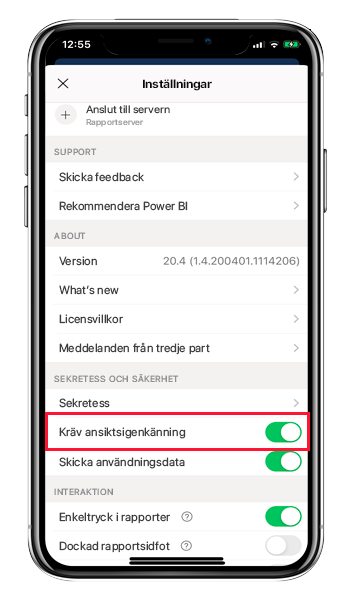
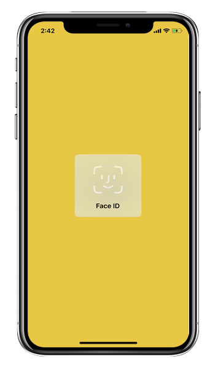
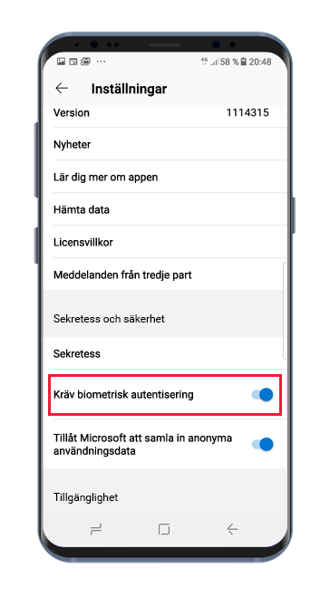
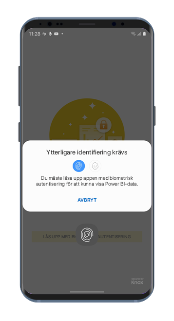

# Skydda Power BI-appen med Face ID, Touch ID, lösenord eller biometriska data 

I många fall är de data som hanteras i Power BI konfidentiella och måste därför skyddas så att endast behöriga användare kommer åt dem. 

I Power BI-appar för iOS och Android kan du skydda dina data genom att konfigurera ytterligare identifiering. Varje gång appen startas eller hämtas till förgrunden krävs identifiering. I iOS krävs identifiering med Face ID, Touch ID eller lösenord. I Android krävs identifiering med biometriska data (fingeravtrycks-ID).

Gäller för:

|  |  |  |  |
|:--- |:--- |:--- |:--- |
|iPhone-enheter |iPad-surfplattor |Android-telefoner |Android-surfplattor |

## Aktivera Face ID, Touch ID eller lösenord i iOS

Om du vill använda ytterligare identifiering för Power BI-mobilappen för iOS går du till appinställningarna under **Sekretess och säkerhet**. Därmed visas alternativ för att aktivera Face ID, Touch ID eller lösenord. Vilka alternativ som visas beror på vilka funktioner som finns på enheten.

När du har aktiverat inställningen måste du ange ditt ID varje gång du startar appen eller hämtar den till förgrunden.

Vilken typ av ID du ombeds ange beror på vilka funktioner som finns på enheten. Om enheten har stöd för Face ID måste du använda Face ID. Om enheten har stöd för Touch ID måste du använda Touch ID. Om inget av de här alternativen stöds måste du ange ett lösenord. På bilden nedan visas skärmen för autentisering med Face ID.

## Aktivera biometriska data (fingeravtrycks-ID) i Android

Om du vill använda ytterligare identifiering för Power BI-mobilappen för Android går du till appinställningarna under **Sekretess och säkerhet**. Därmed visas alternativet att aktivera biometriska data.

När du har aktiverat inställningen måste du tillhandahålla biometriska data (fingeravtrycks-ID) varje gång du startar appen eller hämtar den till förgrunden.

På bilden nedan visas skärmen för autentisering med fingeravtryck.

>[!NOTE]
>För att kunna använda inställningen som kräver autentisering med biometriska data i mobilappen måste du först konfigurera biometri på Android-enheten. Om enheten inte stöder biometri kan du inte skydda åtkomsten till dina Power BI-data med den här mobilappsinställningen.
>
>Om din administratör har [aktiverat säker åtkomst via fjärranslutning](#mdm-enforcement-of-secure-access-to-your-power-bi-mobile-app) för mobilappen måste du konfigurera biometri på enheten för att kunna komma åt appen, om du inte redan gjort det. Du påverkas inte av fjärrinställningen om din enhet saknar stöd för biometri. Åtkomsten till din mobilapp förblir oskyddad.

## MDM används för säker åtkomst till din Power BI-mobilapp.

En del organisationer har säkerhetsprinciper och efterlevnadskrav där det krävs ytterligare identifiering innan du kan komma åt känsliga affärsdata.

I Power BI-mobilappen kan administratörer styra mobilappens inställning för säker åtkomst genom att push-överföra appens konfigurationsinställningar från Microsoft Intune eller någon annan MDM-lösning. Administratörer kan använda appskyddsprincipen för att aktivera den här inställningen för alla användare eller för en grupp användare. Mer information finns i [Fjärrkonfigurera Power BI-mobilappen med MDM](mobile-app-configuration.md#data-protection-settings-ios-and-android).

## Nästa steg
* [Fjärrkonfigurera Power BI-mobilappen med MDM](mobile-app-configuration.md)
