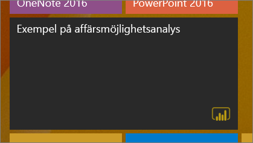
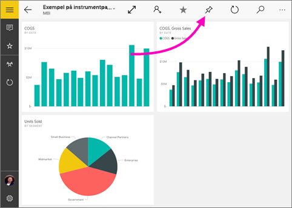
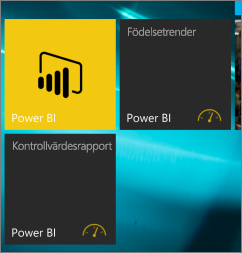

# Fäst instrumentpanelen på din Windows 10-startskärm från den mobila Power BI-appen
Du kan fästa Power BI-instrumentpaneler på Windows startskärm från den mobila Power BI-appen för Windows 10. När du trycker på panelen på startskärmen öppnas instrumentpanelen i den mobila Power BI-appen för Windows 10.

>[!NOTE]
>Stöd för Power BI-mobilappen för **telefoner som använder Windows 10 Mobile** kommer att upphöra den 16 mars 2021. [Läs mer](https://go.microsoft.com/fwlink/?linkid=2121400)

## Fästa en instrumentpanel på startskärmen som en panel
1. Öppna en instrumentpanel.
2. Tryck på **Fäst på Start** .
   
   
   
   Gå till enhetens startskärm om du vill se panelen.
   
   

## Nästa steg
* [Hämta den mobila Power BI-appen för Windows 10](https://go.microsoft.com/fwlink/?LinkID=526478) från Windows Store  
* [Kom igång med Power BI-mobilappen för Windows 10](mobile-windows-10-phone-app-get-started.md)  
* [Vad är Power BI?](../../fundamentals/power-bi-overview.md)
* Har du några frågor? [Fråga Power BI Community](https://community.powerbi.com/)
