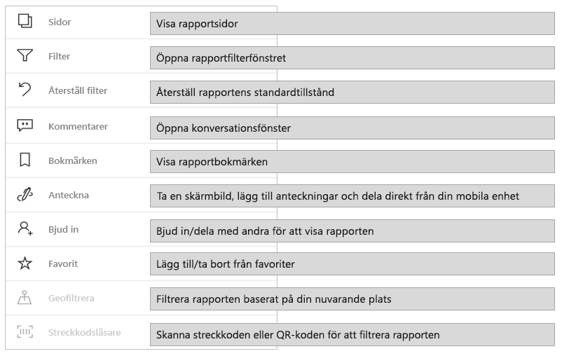
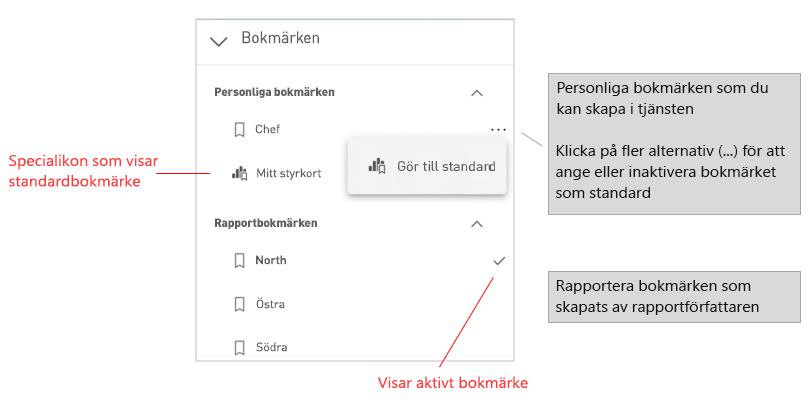
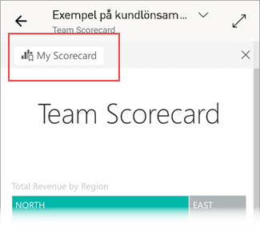

# Utforska rapporter i Power BI-mobilappar
Gäller:

|  |  |  |  |  |
|:---: |:---: |:---: |:---: |:---: |
| iPhone-telefoner |iPad-surfplattor |Android-telefoner |Android-surfplattor |Windows 10-enheter |

>[!NOTE]
>Stöd för Power BI-mobilappen för **telefoner som använder Windows 10 Mobile** kommer att upphöra den 16 mars 2021. [Läs mer](https://go.microsoft.com/fwlink/?linkid=2121400)

En Power BI-rapport är en interaktiv vy över dina data med visuella objekt som representerar olika resultat och insikter från dessa data. Att visa rapporter i Power BI-mobilappar är det tredje steget i en trestegsprocess:

1. [Skapa rapporter i Power BI Desktop](../../create-reports/desktop-report-view.md). Du kan även [optimera en rapport för telefoner](mobile-apps-view-phone-report.md) i Power BI Desktop.
2. Publicera de rapporterna till Power BI-tjänsten [(https://powerbi.com)](https://powerbi.com) eller [Power BI-rapportserver](../../report-server/get-started.md).  
3. Interagera med rapporter i Power BI-mobilapparna.

## Öppna en Power BI-rapport i mobilappen
Power BI-rapporter lagras på olika ställen i mobilappen, beroende på var du fick dem från. De kan vara i appar, delade med mig, arbetsytor (inklusive Min arbetsyta) eller på en rapportserver. Du går ibland igenom en relaterad instrumentpanel för att komma till en rapport, och ibland anges de.

I listor och menyer finns en ikon intill ett rapportnamn som visar att objektet är en rapport:

Det finns två ikoner för rapporter i Power BI-mobilapparna:

*  anger en rapport som kommer att visas i liggande orientering i appen. Den ser ut som på samma sätt som i en webbläsare.

*  anger en rapport som har minst en telefonoptimerad rapportsida som visas i stående orientering.

> [!NOTE]
> Genom att hålla telefonen i liggande orientering får du alltid liggande layout, även om rapportsidan har en mobillayout.

Om du vill gå till en rapport från en instrumentpanel trycker du på **Fler alternativ** (...) uppe till höger på en panel och sedan på **Öppna rapport**:
  
  
  
  Det går inte att öppna alla paneler som rapporter. Paneler som har skapats genom att ställa en fråga i frågor och svar-rutan, öppnar inte rapporter när du klickar på dem.
  
## Interagera med rapporter
När du har öppnat en rapport i appen kan du börja arbeta med den. Det finns många saker du kan göra med rapporten och dess data. I rapportens sidfot finns åtgärder som du kan utföra i rapporten. Genom att trycka och trycka länge på de data som visas i rapporten, kan du också dela upp och blanda datan.

### Interaktion med enkelknackning respektive dubbelknackning
När du hämtar Power BI-mobilappen är den inställd på enkeltryck. Det innebär att när du trycker på ett visuellt objekt för att utföra en viss åtgärd, till exempel välja ett utsnittsobjekt, korsmarkera, klicka på en länk eller knapp och så vidare, så kommer både det visuella objektet att väljas och den valda åtgärden att utföras.

Om du vill kan du växla till interaktion med dubbelknackning. När interaktion med dubbeltryck används trycker du först på ett visuellt objekt för att välja det och sedan en gång till i det visuella objektet för att utföra önskad åtgärd.

Om du vill växla till dubbelknackningsinteraktion, eller om du vill växla tillbaka till enkelknackningsinteraktion, går du till [inställningarna för appinteraktion](./mobile-app-interaction-settings.md).

### Envalsläge respektive flervalsläge vid markering av datapunkter

I en rapport trycker du på en datapunkt för att markera den. Du kan välja om du vill använda envalsläget eller flervalsläget. När du trycker på en datapunkt för att välja den i envalsläget ersätter markeringen alla tidigare val som du har gjort. När du trycker på en datapunkt för att markera den i flervalsläget *läggs markeringen till* i det den markering som du för närvarande har, och det kombinerade resultatet av alla dina markeringar markeras i alla rapportens visuella objekt.

Om du vill avmarkera en markerad datapunkt trycker du bara på den igen.

Om du vill växla mellan envalsläget och flervalsläget går du till [interaktionsinställningarna för appen](./mobile-app-interaction-settings.md).

### Använda tryckning och lång tryckning
En tryckning är detsamma som en musklickning. Om du vill korsmarkera rapporten baserat på en datapunkt trycker du därför på den datapunkten.
När du trycker på ett sektorvärde markeras värdet och resten av rapporten delas upp med det värdet.
När du trycker på en länk, knapp eller ett bokmärke kommer den åtgärd som har definierats av rapportens författare att utföras.

Du märkte förmodligen att en kantlinje visas när du trycker på ett visuellt objekt. Du ser **Fler alternativ** (...) uppe till höger på kantlinjen. Om du trycker på ellipsen visas en meny med åtgärder som du kan utföra på det visuella objektet:

### Knappbeskrivning och detaljgranskningsåtgärder
När du trycker länge (trycker och håller ned) på en datapunkt, visas en knappbeskrivning med de värden som datapunkten representerar:

Om rapportens författare har konfigurerat en knappbeskrivning på rapportsidan, ersätts standardbeskrivningen med rapportsidans knappbeskrivning:

> [!NOTE]
> Knappbeskrivningar för rapporter stöds för enheter som har minst 640 bildpunkter och ett visningsområde på 320 bildpunkter. Om enheten är mindre visar appen standardknappbeskrivningarna.

Rapportens författare kan definiera hierarkier i data och relationer mellan rapportsidor. Med hierarkier kan du öka detaljnivån, minska detaljnivån och visa detaljerad information från ett visuellt objekt och ett värde. När du trycker länge på ett värde visas utöver knappbeskrivningen de relevanta alternativen för detaljnivån i sidfoten:

När du trycker på en viss del av ett visuellt objekt och sedan trycker för att visa *detaljerad information*, växlar Power BI till en annan sida i rapporten som filtreras till det värde som du tryckt på. Rapportens författare kan definiera ett eller flera alternativ för visning av detaljerad information som växlar till olika sidor. I dessa fall kan du välja vilket alternativ som du vill visa detaljerad information för. Bakåtknappen tar dig tillbaka till föregående sida.

Läs mer om hur du [lägger till visning av detaljerad information i Power BI Desktop](../../create-reports/desktop-drillthrough.md).
   
   > [!IMPORTANT]
   > I Power BI-mobilapparna är detaljgranskningsåtgärder i matriser och visuella tabellobjekt enbart möjliga via cellvärden, inte i kolumn- eller radrubriker.
   
   
   
### Använda åtgärderna i rapportsidfoten
Från rapportens sidfot kan du utföra flera åtgärder på den aktuella rapportsidan eller i hela rapporten. Sidfoten ger snabb åtkomst till de vanligaste åtgärderna. Du kan komma åt fler åtgärder genom att trycka på knappen **Fler alternativ** (...):

De åtgärder som du kan utföra från sidfoten är:
* Återställa rapportfiltret och korsmarkera urvalet tillbaka till ursprungligt läge.
* Öppna konversationsfönstret för att se eller lägga till kommentarer om rapporten.
* Öppna filterfönstret för att se eller ändra det filter som för närvarande tillämpas på rapporten.
* Skapa en lista med alla sidor i rapporten. När du trycker på sidnamnet läses den sidan in och visas.
Du kan flytta mellan rapportsidor genom att svepa från kanten av skärmen till mitten.
* Visa alla rapportåtgärder.

#### Alla rapportåtgärder
När du trycker på **Fler alternativ** (...) i rapportens sidfot ser du alla åtgärder som du kan utföra i en rapport:

Vissa av åtgärderna kan vara inaktiverade eftersom de är beroende av de specifika rapportfunktionerna.
Till exempel:

**Bokmärken** finns bara om [bokmärken](mobile-reports-in-the-mobile-apps.md#bookmarks) har angetts i rapporten. Både personliga bokmärken som du kan definiera i Power BI-tjänsten och bokmärken som definieras av rapportens skapare visas. Om ett av bokmärkena har definierats som standardbokmärke öppnas rapporten till den vyn när den läses in.

**Anteckna och dela** kan vara inaktiverat om det finns en [Intune-skyddsprincip](https://docs.microsoft.com/intune/app-protection-policies) i din organisation som förbjuder delning från Power BI-mobilappen.

**Bjud in** är endast aktiverat om du har behörighet att dela rapporten med andra. Du får bara behörighet om du är ägare till rapporten eller om du har fått behörighet att dela vidare av ägaren.

**Filtrera efter aktuell plats** är aktiverat om rapportens författare har kategoriserat rapporten med geografiska data. Mer information finns i avsnittet om att [identifiera geografiska data i en rapport](https://docs.microsoft.com/power-bi/desktop-mobile-geofiltering).

**Genomsök för att filtrera rapporten efter streckkod** är endast aktiverat om datamängden i rapporten har taggats som **Streckkod**. Mer information finns i artikeln om att [tagga streckkoder i Power BI Desktop](https://docs.microsoft.com/power-bi/desktop-mobile-barcodes).

### Bokmärken

Power BI-mobilappen stöder både rapportbokmärken som rapportens skapare har definierat och personliga bokmärken som du kan definiera i Power BI-tjänsten. Bokmärkesmenyn finns under **Fler alternativ** (...) i [verktygsfältet för rapportåtgärder](mobile-reports-in-the-mobile-apps.md#all-report-actions).

Standardbokmärken indikeras av en specialikon. För personliga bokmärken kan du ange, ta bort eller ändra standardinställningen genom att trycka på **Fler alternativ (...)** bredvid det bokmärke som du vill ändra och välja **Gör till**  eller **Rensa standardinställningen**.

När en bokmärkesvy för en rapport är öppen visas namnet på det bokmärket överst i rapporten.

[Läs mer om bokmärken i Power BI-tjänsten](https://docs.microsoft.com/power-bi/consumer/end-user-bookmarks).

## Konfigurera din upplevelse med rapporter
Power BI-mobilappen har ett antal inställningar som gör att du kan styra din rapportanvändning. För närvarande kan du konfigurera
* **Interaktion med rapportvisualiseringar**: Du kan välja att använda antingen enkelknackning eller dubbelknackning.
* **Metod för datauppdatering**: Du kan välja att antingen ha en uppdateringsknapp eller att dra nedåt uppdatera rapportdata.
* **Synlighet för rapportsidfot**: Du kan välja att antingen ha en dockad sidfot som alltid är synlig eller en dynamisk sidfot som döljs och visas på olika sätt beroende på dina åtgärder (rullning till exempel).

Information om hur du ändrar de här inställningarna finns i [inställningarna för appinteraktion](./mobile-app-interaction-settings.md).

## Nästa steg
* [Visa och interagera med Power BI-rapporter som är optimerade för din telefon](mobile-apps-view-phone-report.md)
* [Skapa en version av en rapport som är optimerad för telefoner](../../create-reports/desktop-create-phone-report.md)
* Har du några frågor? [Fråga Power BI Community](https://community.powerbi.com/)
