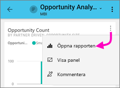
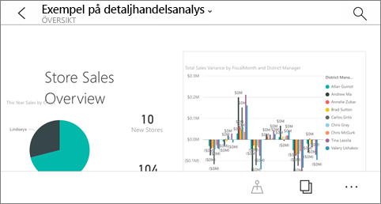
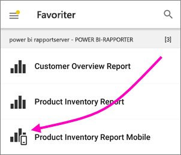
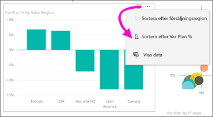
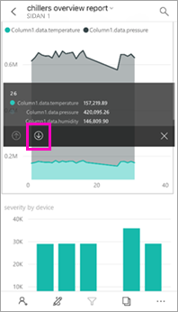
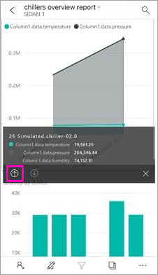
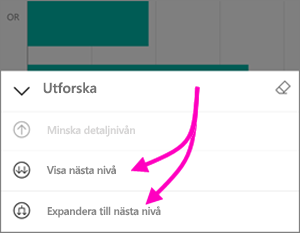
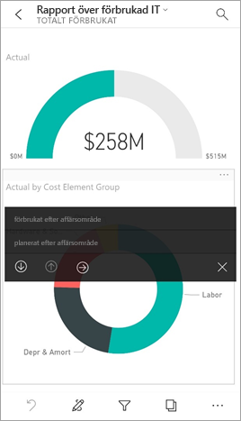

# Utforska rapporter i Power BI-mobilappar
Gäller:

|  |  |  |  |  |
|:--- |:--- |:--- |:--- |:--- |
| iPhone-telefoner |iPad-surfplattor |Android-telefoner |Android-surfplattor |Windows 10-enheter |

En Power BI-rapport är en interaktiv vy över dina data med visuell information som representerar olika resultat och insikter från dessa data. Att visa rapporter i Power BI-mobilappar är det tredje steget i en trestegsprocess.

1. [Skapa rapporter i Power BI Desktop](../../desktop-report-view.md). Du kan även [optimera en rapport för telefoner](mobile-apps-view-phone-report.md) i Power BI Desktop. 
2. Publicera de rapporterna till Power BI-tjänsten [(https://powerbi.com)](https://powerbi.com) eller [Power BI-rapportserver](../../report-server/get-started.md).  
3. Interagera sedan med dessa rapporter i Power BI-mobilappar.

## Öppna en Power BI-rapport i mobilappen
Power BI-rapporter lagras på olika ställen i mobilappen, beroende på var du fick dem från. De kan vara i appar, delade med mig, arbetsytor (inklusive Min arbetsyta) eller på en rapportserver. Du går ibland igenom en relaterad instrumentpanel för att komma till en rapport och ibland listas de.

* I en instrumentpanel, knackar du på ellipsen (...) i det övre högra hörnet på en panel > **öppna rapporten**.
  
  
  
  Alla paneler går inte att öppna i en rapport. Paneler som skapats genom att ställa en fråga i frågor och svar-rutan, öppnar inte rapporter när du klickar på dem. 
  
  På en telefon öppnas rapporten i liggande läge, om den inte har [optimerats för visning på en telefon](mobile-reports-in-the-mobile-apps.md#view-reports-optimized-for-phones).
  
  

## Visa rapporter optimerade för telefoner
Power BI-rapportskribenter kan skapa en rapportlayout som optimerats för telefoner. Rapportsidor som optimerats för telefoner har ytterligare funktioner: till exempel kan du öka detaljnivån och sortera i visuella objekt och du kan komma åt [filter som rapportskaparen lagt till på rapportsidan](mobile-apps-view-phone-report.md#filter-the-report-page-on-a-phone). Rapporten öppnas på din telefon filtrerad enligt de värden som filtreras i rapporten på webben, och med ett meddelande om att det finns aktiva filter på sidan. Du kan ändra filtren på din telefon.

I en lista över rapporter, har en optimerad rapport en särskild ikon :

När du visar den rapporten på en telefon, öppnas den i stående vy.

 En rapport kan ha en blandning av sidor som inte är optimerade för telefoner. I så fall, kommer vyn att ändras från stående till liggande läge för varje sida, när du bläddrar genom rapporten.

Läs mer om [rapporter optimerade för telefonvy](mobile-apps-view-phone-report.md).

## Använd utsnitt för att filtrera en rapport
När du skapar en rapport i Power BI Desktop eller Power BI-tjänsten bör du överväga att [lägga till utsnitt till en rapportsida](../../visuals/power-bi-visualization-slicers.md). Du och dina kollegor kan använda utsnitt för att filtrera sidan i en webbläsare och i mobila appar. När du visar rapporten på en telefon kan du se och använda utsnitt i liggande läge och på en sida som är optimerad för telefonens stående läge. Om du väljer ett värde i en utsnitt eller filter i webbläsaren, så väljs värdet även när du visar sidan i mobilappen. Ett meddelande om att det finns aktiva filter på sidan visas.  

* När du väljer ett värde i ett utsnitt på rapportsidan, filtreras övrig visuell information på sidan.
  
  
  
  I den här bilden, filtrerar utsnittet stapeldiagrammet för att endast visa julivärden.

## Korsfiltrera och markera en rapport
När du väljer ett värde i en visuell information så filtreras inte övrig visuell information. Den visar relaterade värden i övrig visuell information.

* Knacka på ett värde i en visualisering.
  
  
  
  Om du trycker på den stora kolumnen i en visuell information så markeras relaterade värden i övrig visuell information. 

## Sortera en visualisering på en iPad eller en surfplatta
* Tryck på diagrammet, tryck på ellipsen (**...** ) och tryck på fältnamnet.
  
   
* För att kasta om sorteringsordningen, trycker du på ellipsen (**...** ) igen och trycker sedan på samma fältnamn igen.

## Öka och minska detaljnivån i ett visuellt objekt
Om en rapportskapare har lagt till detaljnivåfunktionen i en visualisering kan du öka detaljnivån i visualiseringen för att se de värden som utgör en del av den. Du kan [lägga till öka detaljnivån för en visualisering](../end-user-drill.md) i Power BI Desktop eller Power BI-tjänsten. 

* Tryck på och håll ned ett specifikt fält eller en punkt i ett visuellt objekt för att visa dess knappbeskrivning. Om den har detaljnivåfunktion finns det pilar längst ned på knappbeskrivningen som du kan trycka på. 
  
  

* Tryck på uppåt-pilen i knappbeskrivningen för att minska detaljnivån igen.
  
  

* Du kan också öka detaljnivån i alla datapunkter i en visualisering. Öppna den i fokusläge, tryck på ikonen Utforska och välj sedan att visa alla på nästa nivå eller expandera för att visa aktuell nivå och nästa nivå.

   

## Visning av detaljerad information från en sida till en annan

Med *visning av detaljerad information*, när du trycker på en viss del av en visualisering, växlar Power BI till en annan sida i rapporten som filtreras till det värde som du tryckt på. Rapportförfattare kan definiera ett eller flera alternativ för visning av detaljerad information som växlar till olika sidor. I så fall kan du välja vilken som du vill visa detaljerad information för. När du trycker på värdet på mätaren i följande exempel kan du välja mellan att visa detaljerad information för **utgifter efter affärsområde** eller **planering efter affärsområde**.

När du visar detaljerad information kan du använda bakåtknappen för att gå tillbaka till föregående rapportsida.

Läs mer om hur du [lägger till visning av detaljerad information i Power BI Desktop](../../desktop-drillthrough.md).

## Nästa steg
* [Visa och interagera med Power BI-rapporter som är optimerade för din telefon](mobile-apps-view-phone-report.md)
* [Skapa en version av en rapport som är optimerad för telefoner](../../desktop-create-phone-report.md)
* Har du några frågor? [Fråga Power BI Community](http://community.powerbi.com/)

