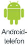
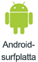

# Dela en instrumentpanel eller rapport från Power BI-mobilapparna
Gäller för:

|  |  |  |  |  |
|:--- |:--- |:--- |:--- |:--- |
| iPhone-enheter |iPad-surfplattor |Android-telefoner |Android-surfplattor |Windows 10-enheter |

>[!NOTE]
>Stöd för Power BI-mobilappen för **telefoner som använder Windows 10 Mobile** kommer att upphöra den 16 mars 2021. [Läs mer](https://go.microsoft.com/fwlink/?linkid=2121400)

Med en [Power BI Pro-licens](../../service-features-license-type.md) kan du bjuda in andra att visa dina instrumentpaneler och rapporter genom att dela länkar från Power BI-mobilapparna. Du kan dela med vem som helst, inom eller utanför din organisation, och med eller utan ett e-postkonto som tillhör företaget. De måste även ha en Power BI Pro-licens, eller så måste innehållet finnas i en [Premium-kapacitet](../../service-premium-what-is.md).

Du kan [kommentera på eller lägga till en ögonblicksbild i en panel, rapport eller visualisering](mobile-annotate-and-share-a-tile-from-the-mobile-apps.md) och sedan dela den med vem som helst med hjälp av Power BI-mobilapparna för iOS- och Android-enheter. 

## Dela från din iPhone eller iPad

1. Du kan dela en instrumentpanel eller rapport från antingen själva instrumentpanelen eller rapporten eller från startsidan för instrumentpanelen eller rapporten:
    *  Från en instrumentpanel eller en rapport trycker du på ikonen **Dela**  i aktivitetsfältet längst ner på instrumentpanelen eller i rapporten.
    *  På startsidan för en instrumentpanel eller en rapport trycker du på ikonen **Infor**  intill instrumentpanelens eller rapportens namn och trycker sedan på ikonen **Dela**  på fliken Info som visas.
2. Ange namn, avgränsade med komman, och ett meddelande som medföljer din inbjudan. Om du vill tillåta omdelning låter du **Tillåt mottagare att dela vidare** vara markerad. Med omdelning kan dina kollegor vidarebefordra din e-postinbjudan till andra i din organisation, antingen via webben eller mobila appar.
3. Tryck på **Skicka** i det övre högra hörnet.
   
   Mottagarna får en e-postinbjudan med en direktlänk till instrumentpanelen eller rapporten. Inbjudan upphör att gälla efter en månad. När de öppnar den i Power BI-tjänsten eller Power BI-mobilappen läggs den till i avsnittet **Delat med mig** i deras Power BI-konto. Så här kommer du till avsnittet Delat med mig:
   
   * I Power BI-mobilappen trycker du på **Fler alternativ** (...) i navigeringsfältet och väljer  **Delat med mig**.
   * I Power BI-tjänsten klickar du på  **Delat med mig** i det vänstra navigeringsfönstret.
   
   Läs mer [information om att dela med dina kollegor](../../service-share-dashboards.md).

### Sluta dela från din iPhone eller iPad
Du kan bara avsluta delningen om du är ägaren.

1. Klicka på ikonen **Dela** i aktivitetsfältet längst ner på instrumentpanelen eller i rapporten.
2. Tryck på **Delat med**. Du kan se en lista över kollegor med vilka du har delat den här instrumentpanelen eller rapporten.

3. Tryck på **Fler alternativ** (...) intill namnet på den person som du vill sluta dela med och välj om du vill ta bort åtkomsten till bara den delade instrumentpanelen eller även till allt underliggande innehåll som den använder.

## Dela från din Android-enhet
1. Du kan dela en instrumentpanel eller rapport från antingen själva instrumentpanelen eller rapporten eller från startsidan för instrumentpanelen eller rapporten:
    *  I en instrumentpanel eller en rapport trycker du på **Fler alternativ** (...) överst på instrumentpanelen eller rapporten och väljer **Bjud in en kollega**.
    *  På startsidan för en instrumentpanel eller en rapport trycker du på **Fler alternativ** (...) intill instrumentpanelens eller rapportens namn och trycker sedan på ikonen **Dela**  på fliken Info som visas.
 
2. Skriv e-postadresser och ett meddelande som medföljer din instrumentpanelinbjudan. Annars skickar Power BI ett standardmeddelande. Om du vill tillåta omdelning låter du **Tillåt mottagarna att dela den här instrumentpanelen** vara markerad. Med omdelning kan dina kollegor vidarebefordra din e-postinbjudan till andra i din organisation, antingen via webläsare eller mobila appar.
   
3. Tryck på ikonen **Skicka** i det övre högra hörnet för att skicka e-postmeddelandet.
   
    Mottagarna får en e-postinbjudan med en direktlänk till instrumentpanelen eller rapporten. Inbjudan upphör att gälla efter en månad. När de öppnar den i Power BI-tjänsten eller Power BI-mobilappen läggs den till i avsnittet **Delat med mig** i deras Power BI-konto. Så här kommer du till avsnittet Delat med mig:
   * I Power BI-mobilappen trycker du på **Fler alternativ** (...) i navigeringsfältet och väljer  **Delat med mig**.
   * I Power BI-tjänsten klickar du på  **Delat med mig** i det vänstra navigeringsfönstret.
   
   Läs mer [information om att dela med dina kollegor](../../service-share-dashboards.md).

### Sluta dela från din Android-enhet
Du kan bara avsluta delningen om du är ägaren.

1. Du kan sluta dela en instrumentpanel eller rapport från själva instrumentpanelen eller rapporten eller från startsidan för instrumentpanelen eller rapporten:
    *  I en instrumentpanel eller en rapport trycker du på **Fler alternativ** (...) överst på instrumentpanelen eller rapporten och väljer **Bjud in en kollega**.
    *  På startsidan för en instrumentpanel eller en rapport trycker du på **Fler alternativ** (...) intill instrumentpanelens eller rapportens namn och trycker sedan på ikonen **Dela**  på fliken Info som visas.

2. Längst ned på sidan **Lägg till personer** som öppnas visas en lista över kollegor som du har delat den här instrumentpanelen eller rapporten med. Tryck på namnet på den kollega som du vill sluta dela med.
3. På sidan **Vem har åtkomst** som visas trycker du på ikonen **Ta bort**  och väljer om du vill ta bort åtkomsten till bara den delade instrumentpanelen eller även till allt underliggande innehåll som den använder.

## Dela från din Windows 10-enhet

1. Du kan dela en instrumentpanel eller rapport från själva instrumentpanelen eller rapporten eller från startsidan för instrumentpanelen eller rapporten:
    * Från en instrumentpanel eller en rapport trycker du på ikonen **Dela** .
    * På startsidan för en instrumentpanel eller en rapport högerklickar eller trycker du och håller ned, och väljer sedan **Bjud in**.
   
   Om du är ägare till instrumentpanelen visas en lista över kollegor som du har delat den här instrumentpanelen eller rapporten med.

2. Skriv e-postadresser och ett meddelande som medföljer din inbjudan. Annars skickar Power BI ett standardmeddelande. Om du vill tillåta omdelning låter du **Tillåt mottagarna att dela den här instrumentpanelen** vara markerad. Med omdelning kan dina kollegor dela med andra i din organisation, antingen via webbläsaren eller mobilapparna.
   
3. Tryck på ikonen **Skicka**.
   
    Mottagarna får en e-postinbjudan med en direktlänk till instrumentpanelen eller rapporten. Inbjudan upphör att gälla efter en månad. När de öppnar den i Power BI-tjänsten eller Power BI-mobilappen läggs den till i avsnittet **Delat med mig** i deras Power BI-konto. Så här kommer du till avsnittet Delat med mig:
   
   * I Power BI-mobilappen trycker du på **Fler alternativ** (...) i navigeringsfältet och väljer  **Delat med mig**.
   * I Power BI-tjänsten klickar du på  **Delat med mig** i det vänstra navigeringsfönstret.
   
   Läs mer [information om att dela med dina kollegor](../../service-share-dashboards.md).

## Nästa steg
* [Lägga till anteckningar och dela ögonblicksbild av en panel, en rapport eller ett visuellt objekt i mobilapparna](mobile-annotate-and-share-a-tile-from-the-mobile-apps.md)
* [Dela en instrumentpanel eller rapport i Power BI](../../service-share-dashboards.md)
* Har du några frågor? [Fråga Power BI Community](https://community.powerbi.com/)

