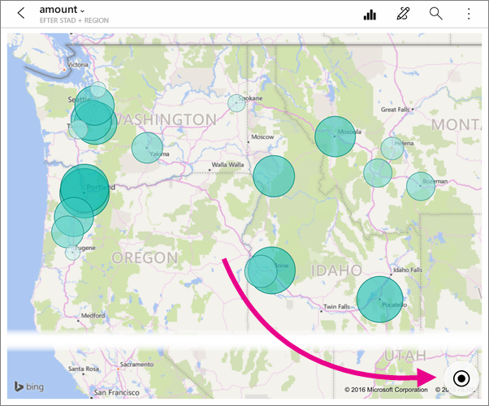
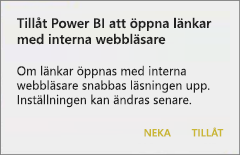
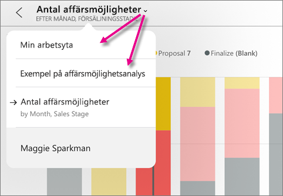
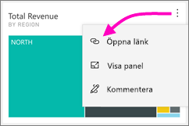
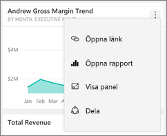
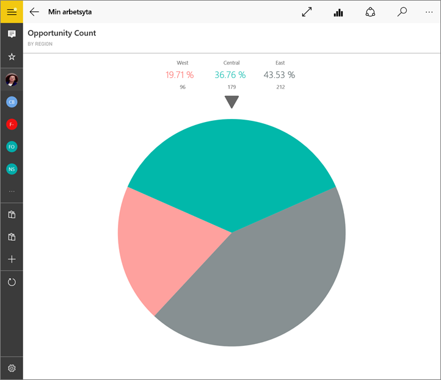
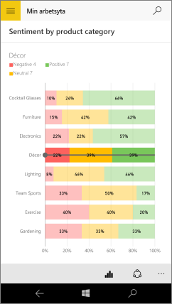
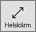

# Utforska paneler i Power BI-mobilappar
Gäller för:

|  |  |  |  |  |
|:--- |:--- |:--- |:--- |:--- |
| iPhone-telefoner |iPad-surfplattor |Android-telefoner |Android-surfplattor |Windows 10-enheter |

Paneler är ögonblicksbilder i realtid av dina data, fästa på en instrumentpanel. Deras värden ändras när berörda data ändras. **Du [lägger till paneler på en instrumentpanel i Power BI-tjänsten](../end-user-tiles.md).** 

Sedan öppnar du panelerna i fokusläge i Power BI-mobilapparna och interagerar med dem. Du kan öppna paneler med alla typer av visuella objekt, inklusive paneler baserade på Bing och R.

## Paneler i iOS-apparna

1. Öppna en [instrumentpanel i mobilappen för iOS](mobile-apps-view-dashboard.md).
2. Tryck på en panel. Den öppnas i fokusläge, där det är enklare att visa och utforska paneldata. I fokusläge kan du:
   
   Trycka i ett linje-, stapel- eller kolumndiagram för att visa värdena för vissa delar av visualiseringen.
   
    
   
   *I till exempel det här linjediagrammet är de valda värdena för **This Year Sales (Årets försäljning)** och **Last Years Sales (Förra årets försäljning)** i **augusti**.*  
   
   Tryck på en sektor i ett cirkeldiagram för att visa sektorns värde högst upp i diagrammet.  
   
   
3. Tryck på ikonen **Centrera karta** på en karta  för att centrera kartan på din aktuella plats.

   

4. Tryck på pennikonen  för att [kommentera en panel](mobile-annotate-and-share-a-tile-from-the-mobile-apps.md#annotate-and-share-the-tile-report-or-visual) och sedan på delningsikonen  för att [dela den med andra](mobile-annotate-and-share-a-tile-from-the-mobile-apps.md#annotate-and-share-the-tile-report-or-visual).

5. [Lägg till en avisering till panelen](mobile-set-data-alerts-in-the-mobile-apps.md). Om värdena går över eller under målen, meddelar Power BI dig om detta.

6. Ibland har skaparen av instrumentpanelen lagt till en länk till en panel. I så fall har den en länkikon  som visas när den är i fokusläge:
   
    
   
    Länkarna kan gå till andra Power BI-instrumentpaneler eller till en extern URL. Du kan [trycka på länken](../../create-reports/service-dashboard-edit-tile.md#hyperlink) för att öppna den i Power BI-appen. Om det är en extern webbplats, frågar Power BI om du tillåter det.
   
    
   
    När du har öppnat länken i Power BI-appen kan du kopiera länken och öppna den i ett webbläsarfönster i stället.
7. [Öppna den rapport](mobile-reports-in-the-mobile-apps.md)  som panelen baseras på.
8. Om du vill lämna panelen i fokusläge trycker du på panelens namn och sedan på instrumentpanelens namn eller på **Min arbetsyta**.
   
    

## Paneler i mobilappen för Android-telefoner och -surfplattor
1. Öppna en [instrumentpanel i Power BI-mobilappen](mobile-apps-view-dashboard.md).
2. Tryck på en panel för att öppna den i fokusläge, där det är enklare att visa och utforska paneldata.
   
   
   
    I fokusläge kan du:
   
   * Tryck på diagrammet för att flytta stapeln i ett linje-, stapel- eller bubbeldiagram för att visa värdena för en specifik punkt i visualiseringen.  
   * Tryck på pennikonen  för att [kommentera en panel](mobile-annotate-and-share-a-tile-from-the-mobile-apps.md#annotate-and-share-the-tile-report-or-visual) och sedan på ikonen Dela ögonblicksbild  för att [dela den med andra](mobile-annotate-and-share-a-tile-from-the-mobile-apps.md#annotate-and-share-the-tile-report-or-visual).
   * trycka på ikonen Öppna rapport  för att [visa rapporten](mobile-reports-in-the-mobile-apps.md) i mobilappen.
3. Ibland har skaparen av instrumentpanelen lagt till en länk till en panel. När du trycker på den vertikala ellipsen ( **...** ) visas i så fall **Öppna länk** :
   
    
   
    Länkarna kan gå till andra Power BI-instrumentpaneler eller till en extern URL. Du kan [trycka på länken](../../create-reports/service-dashboard-edit-tile.md#hyperlink) för att öppna den i Power BI-appen. Om det är en extern webbplats, frågar Power BI om du tillåter det.
   
    
   
    När du har öppnat länken i Power BI-appen kan du kopiera länken och öppna den i ett webbläsarfönster i stället.
4. Tryck på pilen i det övre vänstra hörnet för att stänga panelen och gå tillbaka till instrumentpanelen.

## Paneler i mobilappen för Windows 10

>[!NOTE]
>Stöd för Power BI-mobilappen för **telefoner som använder Windows 10 Mobile** kommer att upphöra den 16 mars 2021. [Läs mer](https://go.microsoft.com/fwlink/?linkid=2121400)

1. Öppna en [instrumentpanel i Power BI-mobilappen](mobile-apps-view-dashboard.md) för Windows 10.
2. Tryck på den lodräta ellipsen på panelen. Här kan göra du följande: 
   
    
   
    [Dela en ögonblicksbild av panelen](mobile-windows-10-phone-app-get-started.md).
   
    Trycka på **Öppna rapport**  för att [visa den underliggande rapporten](mobile-reports-in-the-mobile-apps.md).
   
    [Öppna länken](../../create-reports/service-dashboard-edit-tile.md#hyperlink), om den har en länk. Länkarna kan gå till Power BI-instrumentpaneler eller till en extern URL.
3. Tryck på **Visa panel** . Den öppnas i fokusläge, där det är enklare att visa och utforska paneldata. I det här läget kan du:
   
   Rotera cirkeldiagrammet för att visa sektorns värden överst i diagrammet.  
   
   
   
   Tryck på diagrammet för att flytta stapeln i ett linje-, stapel- eller bubbeldiagram för att visa värdena för en specifik punkt i visualiseringen.  
   
   
   
   *I den här stapeldiagrammet visas värdena för **Decor (Dekor)** överst i diagrammet.*
   
   Tryck på ikonen **Fullskärm**för att öppna panelen i fullskärmsläge, utan navigerings- och menyrader.
   
   > [!NOTE]
   > Du kan också [visa instrumentpaneler och rapporter i fullskärmsläge](mobile-windows-10-app-presentation-mode.md) i Power BI-mobilappen för Windows 10.
   > 
   > 
   
   Tryck på ikonen **Centrera karta** på en karta  för att centrera kartan på din aktuella plats.
   
   
   
   Tryck på ikonen för att dela ögonblicksbild  för att [kommentera och dela en panel](mobile-windows-10-phone-app-get-started.md) med andra.   
   
   Tryck på ikonen Öppna rapport  för att [visa rapporten](mobile-reports-in-the-mobile-apps.md) som panelen baseras på. 
4. Tryck på bakåtpilen eller på tillbakaknappen för att stänga panelen och gå tillbaka till instrumentpanelen.

## Nästa steg
* [Vad är Power BI?](../../fundamentals/power-bi-overview.md)
* Har du några frågor? [Fråga Power BI Community](https://community.powerbi.com/)
