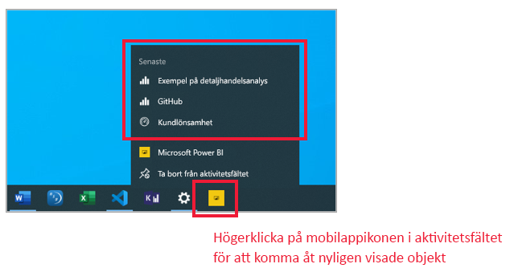
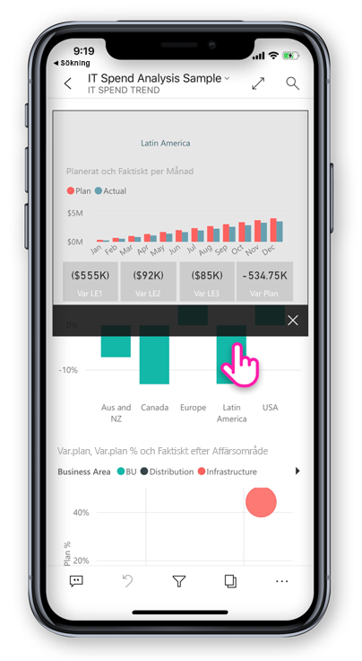
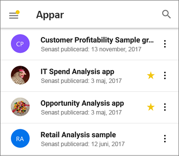
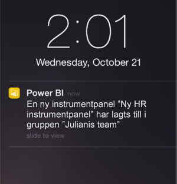

# Nyheter i Power BI-mobilapparna
Relaterad information om nyheter finns i:

* [Power BI-teambloggen för mobilappar](https://powerbi.microsoft.com/blog/tag/mobile/)
* [Nyheter i Power BI Desktop](../../fundamentals/desktop-latest-update.md)  
* [Nyheter i Power BI-tjänsten](../../fundamentals/service-whats-new.md)

>[!NOTE]
>Stöd för Power BI-mobilappen för **telefoner som använder Windows 10 Mobile** kommer att upphöra den 16 mars 2021. [Läs mer](https://go.microsoft.com/fwlink/?linkid=2121400)

## April 2020

### Delning från arbetsytor är nu tillgängligt
Vi har lagt till möjligheten att dela rapporter och instrumentpaneler från arbetsytor. Du kan nu dela innehållet från "Min arbetsyta" och från andra arbetsytor om arbetsytans ägare tillåter det, precis som i Power BI-tjänsten. 

### Instrumentpanelerna stöder nu fullskärmsläge (iOS och Android)
Nu kan du visa dina instrumentpaneler i fullskärmsläge, vilket ger dig mer utrymme att visa instrumentpanelens innehåll. 

## Mars 2020

### Använda genvägar och Google Search för att öppna innehåll (Android)
Vi har gjort det enklare att hitta och visa data genom att integrera både genvägar och Google Search med Power BI-appen. Skapa genvägar för enkel åtkomst till rapporter och instrumentpaneler du använder ofta direkt från enhetens startskärm. Och använd Google Search för att snabbt leta reda på och öppna Power BI-innehåll. Läs mer om [Android-appgenvägar](mobile-app-quick-access-shortcuts.md) och [Google Search](mobile-app-find-access-google-search.md)!

### Förbättrad säkerhet med enhetsskydd (förhandsversion) (Android)
Använd enhetens inbyggda skyddsfunktioner för att skydda din Power BI-app och få den sekretess du behöver. Genom att kräva biometrisk autentisering (fingeravtrycks-ID) för att komma åt Power BI-appen kan du säkerställa att bara du kan se dina data. [Läs om inbyggd säker åtkomst](mobile-native-secure-access.md)

### Genomsökning är nu tillgängligt på iPad
Nu kan du skanna streckkoder för att filtrera rapporter eller använda QR-koder för att snabbt öppna en rapport, direkt från din iPad.  

### Uppdaterad filtreringsfunktion
Filtren i Power BI-appen har nya funktioner och en ny design. Detta omfattar förbättrad synlighet för tillämpade filter som påverkar rapportvisualiseringar och möjligheten att låsa, och till och med dölja, filter. Dessa ändringar ger också bättre kompatibilitet med filtreringen i Power BI-tjänsten.

## Februari 2020

### Flervalsläge (Android och iOS)

Vi har lagt till möjligheten att välja flera datapunkter på en rapportsida. När flervalsläget är aktiverat, läggs varje datapunkt som du trycker på till övriga valda datapunkter, varvid de kombinerade resultaten automatiskt markeras i alla visuella objekt på sidan. Om du vill aktivera flervalsläget, så gå till sidan [Mobilappsinställningar](./mobile-app-interaction-settings.md).

>[!NOTE]
>Flervalsläget kommer att stödjas i nästa version av Power BI-rapportserver.

### Rapportsidfoten kan nu hållas synlig i mobilappen för iPhone

På din iPhone eller Android kan du nu välja att docka rapportsidfoten längst ned på rapportsidan, där den alltid är synlig och tillgänglig, oavsett vad du gör på sidan. Detta gör det enkelt att använda alla alternativ på rapportsidfoten. Om du vill docka sidfoten, så växla till **Dockad rapportfot** på sidan [Mobilappsinställningar](./mobile-app-interaction-settings.md).

### Stöd för PBIRS-rapporter (förhandsversion) (Windows)

Nu kan du öppna dina Power BI-rapportserver-rapporter (PBIRS) i Power BI-appen.

### Ha snabb åtkomst till dina senast använda objekt (Windows)

Hämta en lista över alla de objekt som du har visat nyligen genom att högerklicka på Power BI-appens ikon i aktivitetsfältet i Windows. Klicka på ett objekt i listan om du vill ta en snabb titt på det igen.

## Januari 2020

### Dela anteckningar som skapats i presentationsläge (Windows)

Anteckningar som du skapar under presentationer är en viktig del av både presentationen och diskussionen. När du kommenterar rapporter i presentationsläge kan du nu dela en ögonblicksbild av rapportsidan med dina kollegor. [Läs mer](./mobile-windows-10-app-presentation-mode.md#use-presentation-mode)

## December 2019

### Dockad rapportsidfot och en uppdateringsknapp – nya upplevelser för att interagera med rapporter (Android)

Våra Android-användare har berättat att deras erfarenhet av rapporter inte är optimal – att det är svårt att använda rapportsidfoten och att ”dra nedåt för att uppdatera”-åtgärden är för känslig på vissa enheter. I den här versionen har vi därför ändrat dessa beteenden:
* **Dockad rapportsidfot** – nu när du öppnar en rapport på telefonen är rapportsidfoten dockad längst ned på rapportsidan, där den alltid är synlig och tillgänglig, oavsett vad du gör på sidan. Detta gör det enkelt att använda alla alternativ på rapportsidfoten.
* **Uppdateringsknappen i rapportsidhuvudet** – du hittar också en uppdateringsknapp i rapportsidhuvudet, vilket gör det enkelt att uppdatera rapporten precis när du vill.

De användare som föredrar de tidigare beteendena kan återställa dem med appens nya, utökade [interaktionsinställningar](./mobile-app-interaction-settings.md).

Dessutom kan IT-administratörer [åsidosätta de nya standardinställningarna via fjärrkonfiguration](./mobile-app-configuration.md#interaction-settings-ios-and-android) för användarens räkning med hjälp av valfritt MDM-verktyg och en appkonfigurationsfil. På så sätt går det att ställa in samma beteende för alla användare i organisationen.

> [!NOTE]
> Interaktionsinställningarna för uppdateringsknappen och dockning av rapportsidfoten har för närvarande ingen inverkan på rapporter för rapportservern. Detta kommer att ändras med rapportserverversionen som släpps i januari!

### Ange standardbokmärken från din mobilapp
Nu kan du ange standardbokmärken för dina rapporter direkt från din Power BI-mobilapp. Varje gång du öppnar en rapport kommer sedan dess standardbokmärke att användas automatiskt. [Läs mer!](./mobile-reports-in-the-mobile-apps.md#bookmarks)

### Filtrera efter plats på Android-surfplattor
Med geofiltrering kan du filtrera dina rapporter baserat på din aktuella position. Den här funktionen är nu också tillgänglig i Power BI-appen för Android-surfplattor. [Läs mer!](./mobile-apps-geographic-filtering.md)

## November 2019

### Power BI-appens nya utseende är nu aktiverat som standard
 
När du nu öppnar appen aktiveras det nya utseendet och navigeringsfälten automatiskt så att du enklare kan hitta och öppna innehåll. Använd appens [startsida](mobile-apps-home-page.md) som startpunkt – du får snabb åtkomst till ditt viktigaste innehåll samt ett [aktivitetsflöde](mobile-apps-home-page.md#activity-feed) som håller dig uppdaterad med alla dina senaste aviseringar, meddelanden och mer.

### Visa all din senaste Power BI-aktivitet
 
Med aktivitetsflödet kan du hålla koll på vad som händer med ditt Power BI-innehåll i realtid. Gå bara till appens startsida och öppna fliken Aktivitet för att visa alla dina senaste meddelanden, aviseringar, kommentarer, @mentions och mer. [Läs mer](mobile-apps-home-page.md#activity-feed).

### Använda bokmärken i dina rapporter

Power BI-mobilappen stöder nu bokmärken som skapats i Power BI. När du öppnar appen kan du dra nytta av bokmärken som skapats av rapportförfattaren och eventuella personliga bokmärken som du själv har skapat. [Läs mer](mobile-reports-in-the-mobile-apps.md#bookmarks).

## Oktober 2019

### Android-stöd för fjärrkonfiguration av rapportserverns åtkomstinställningar

Vi har lagt till Android-stöd för fjärrkonfiguration av Power BI-mobilappens åtkomstinställningar för rapportservern. IT-administratörer kan nu använda sin organisations MDM-verktyg till att fjärrkonfigurera dessa inställningar på både iOS- och Android-enheter. Mer information finns i [Fjärrkonfigurera åtkomst från Power BI-mobilappen till en rapportserver](https://docs.microsoft.com/power-bi/report-server/configure-powerbi-mobile-apps-remote).

### Visa detaljerad information mellan rapporter

Den här månaden lade vi till stöd för visning av detaljerad information mellan rapporter. Nu kan du trycka på en datapunkt för att visa detaljerad information om andra rapporter och rapportsidor. När du visar detaljerad information om en målsida, filtreras innehållet på sidan baserat på inställningarna för visning av detaljerad information.

> [!NOTE]
> Visningen av detaljerad information mellan rapporter är bara tillgängligt om det aktiverades när rapporten skapades. [Läs mer om visning av detaljerad information mellan rapporter](https://docs.microsoft.com/power-bi/desktop-cross-report-drill-through).

### Känslighetsetiketter för data

Nu kan du se känslighetsetiketter som innehållsägare har angett för rapporter, instrumentpaneler, datamängder och dataflöden i syfte att klassificera datakänsligheten. Känslighetsetiketterna styr hur innehållet får delas med andra användare. [Läs mer om datakänslighetsetiketter i Power BI](https://docs.microsoft.com/power-bi/admin/service-security-data-protection-overview).

### Stöd för anpassad appnavigering (Windows)

Stöd för anpassad appnavigering har nu lagts till för Windows-enheter, tillsammans med iOS och Android (se [inlägget Nyheter i september](#september-2019)).

## September 2019

### Stöd för anpassad appnavigering (iOS och Android)

Vi har lagt till stöd för anpassad appnavigering. När du nu öppnar en app i Power BI Mobile är de anpassade navigeringsfunktionerna som byggts av appskaparen tillgängliga. Appnavigering kan ordnas efter innehåll och kan innehålla nya objekt som länkar och komprimerbara avsnitt.
Läs mer om [anpassad navigering](https://powerbi.microsoft.com/blog/designing-custom-navigation-for-power-bi-apps-is-now-available/).

## Augusti 2019

### Vi presenterar Power BI Mobile med nytt utseende (förhandsversion) (iOS och Android)

Vi har uppdaterat vår app och lanserat nya upplevelser, lagt till en startsida som ger snabbåtkomst till det innehåll du oftast använder, samt nya navigeringsfönster som gör det enkelt att navigera i appen. Med de nya och uppdaterade funktionerna kan du snabbare och enklare hitta det du behöver, när du behöver det.
Eftersom det nya utseendet är i förhandsversion måste du aktivera det för att kunna ta del av det.
Läs mer om [det nya utseendet för Power BI](https://powerbi.microsoft.com/blog/introducing-power-bi-mobile-apps-new-look-preview/).

### Skyddad åtkomst med Azure Active Directory-programproxyn (iOS och Android)

Vi har samarbetat med Azure Active Directory-teamet när det gäller att integrera mobila Power BI-program med Azure Active Directory-programproxyn. Med den här konfigurationen kan du ansluta till en rapportserver inom företagsgränserna från Power BI Mobile-appen, utan att behöva konfigurera en komplex lokal konfiguration. Läs mer om [Integrera Power BI Mobile och Azure AD-programproxy](https://powerbi.microsoft.com/blog/access-on-prem-report-server-from-your-power-bi-mobile-app-with-azure-active-directory-application-proxy/). Lär dig [hur du konfigurerar Azure AD-programproxy och Power BI](https://docs.microsoft.com/azure/active-directory/manage-apps/application-proxy-integrate-with-power-bi).

## Juli 2019

### Knappbeskrivningar för rapportsida

Knappbeskrivningar för rapportsida stöds inte vid visning av rapporter i mobilappen. Tryck bara och håll ned på ett visuellt objekt som har en rapportknappbeskrivning som är kopplad till den, så visas den.  

 
> [!NOTE]
> Rapportknappbeskrivningar stöds för enheter med en bildpunktsstorlek över 640 och ett visningsområde över 320. Mindre enheter använder standardknappbeskrivningar.

## Juni 2019

### Streckkodsskanning är nu tillgänglig i Android
Nu kan du använda din Power BI-app på Android (telefon och surfplatta) för att skanna streckkoder som tryckts på produkter eller hyllor i din butik för att visa relaterade Power BI-rapporter som filtrerats efter det skannade värdet. Mer om att [filtrera dina data med streckkoder](mobile-apps-scan-barcode-iphone.md).

### Stöd för PBIX-rapporter som finns i PBI-RS över ADFS-konfiguration (iOS, Android)

Power BI-rapporter (PBIX) som hanteras i PBI-RS via ADFS-konfiguration kan nu också användas från Power BI mobilappen.

## Maj 2019

### Stöd för Siri-genvägar (iOS)
Användare kan skapa Siri genvägar till sina Power BI-rapporter och instrumentpaneler och öppna dem direkt från Siri-röstgränssnittet. [Läs hur du använder Siri-genvägar i Power BI-appen för iOS](https://powerbi.microsoft.com/blog/introducing-siri-integration-with-power-bi-mobile-ios-app-preview/).

### Enhetssökning (iOS)
Integrera Power BI med iOS-enhetssökning (Spotlight). Sökning efter innehåll i iPhone eller iPad inkluderar nu även Power BI-objekt. När användarna använder enhetsintern sökning visas även Power BI-rapporter, instrumentpaneler, appar, arbetsytor och personer som matchar sökkriterierna i resultaten. [Läs mer i blogginlägget](https://powerbi.microsoft.com/blog/introducing-siri-integration-with-power-bi-mobile-ios-app-preview/).

### Rapportinteraktion med en tryckning – Allmän tillgänglighet

En tryckning är nu i allmän tillgänglighet och kommer att bli den standardmässiga pekinteraktionen för nya användare. Användare kommer fortfarande att kunna inaktivera det och ha dubbel tryckning i appinställningarna.

### Förbättrad villkorsstyrt åtkomstskydd (iOS och Android)

Vi har integrerat med [den nya appskyddsbaserade funktionen för villkorsstyrd åtkomst](https://docs.microsoft.com/azure/active-directory/conditional-access/app-protection-based-conditional-access) i AAD för att öka säkerheten genom att begränsa åtkomst till Power BI innan appprincipen tillämpas.

### Enhetsskydd (iOS)

Användare kan använda inbyggt enhetsskydd för att skydda Power BI genom att fråga efter Face ID, Touch ID eller lösenord för åtkomst till Power BI. Detta kan kontrolleras av användaren med hjälp av appinställningar, men även av administratörer via Intune och andra MDM-verktyg. [Läs mer](https://docs.microsoft.com/power-bi/consumer/mobile/mobile-ios-native-secure-access).

### Bildspel med ensidesrapport (Windows)

Stöd för automatisk uppdatering även för ensidesrapporter i bildspel. Om rapportens underliggande datakälla uppdateras hämtas den därför, och data uppdateras på sidan.

## April 2019

### Visualisering med viktiga influencers 

Visualisering med viktiga influencers är nu tillgänglig i mobilappen. Med den här visualiseringen kan du utföra analys av viktiga faktorer över dina data med bara några få tryckningar.

### Lägga till kommentarer i rapportinnehåll (Android och iOS)

Nu kan du använda kommentarer för att samarbeta och dela feedback om rapportsidor och visualiseringar. Läs mer om rapportkommentarer i Power BI-tjänsten och Mobile [på den här bloggen](https://powerbi.microsoft.com/blog/announcing-report-commenting-for-power-bi-service-and-mobile/). 

### Maximera vyn med helskärmsläge (Android och iOS)

Vi har lagt till en ny knapp som gör att du kan kontrollera när dina data ska få fokus genom att ta bort sidhuvuden och sidfötter för rapporter. Du får då maximalt med utrymme för visning av rapporterna.

## Mars 2019

### Stöd för externa gästanvändare i Power BI-appar (iOS och Android)

Du kan få åtkomst till Power BI-innehåll som delats med dig från en annan organisation direkt från appen (kallas även B2B). Läs mer om B2B i Power BI-mobilappar [här](https://powerbi.microsoft.com/blog/power-bi-mobile-apps-now-support-azure-ad-b2b-guest-users/).

### Förbättra Windows-presentationsläge med bildspel (Windows)

Med [bildspel](https://powerbi.microsoft.com/blog/enhancing-presentation-mode-with-slideshow-in-windows-power-bi-app/) kan du använda offentliga skärmar på kontoret för att köra Power BI-rapporter i helskärmsläge som automatiskt roterar mellan rapportsidor.  

### Stöd för PBI-RS rapporter via ADFS- och WAP-konfiguration (endast iOS)

Power BI-rapporter (PBIX) som hanteras i PBI-RS via ADFS-konfiguration kan nu användas från Power BI iOS-appen.

### Aktivera interaktion med en enda tryckning med rapportvisualiseringar

Vi har ändrat rapportinteraktion så att det endast krävs en tryckning på en visualisering, en knapp eller ett utsnitt för att interagera med dess data direkt. Användare behöver inte längre trycka på en visualisering för att markera den och sedan trycka igen för att interagera. I stället utförs båda dessa med en enda tryckning.

> [!NOTE]
> Befintliga användare behöver aktivera det här beteendet i appinställningarna. Mer information finns i artikeln [How to configure single tap report interaction](https://docs.microsoft.com/power-bi/consumer/mobile/mobile-app-single-tap) (Så konfigurerar du rapportinteraktion med en enda tryckning).

## Januari – februari 2019
 
### Visuella Visio-objekt

Aktivera enkel inloggning (SSO) i visuella Visio-objekt så att inga ytterligare inloggningssteg krävs vid visning av rapporter med visuella Visio-objekt i appen. 

### Kommentarsfunktioner för instrumentpanelen kommer till Power BI Mobile Windows-appen

Du kan lägga till kommentarer direkt till instrumentpaneler och specifika paneler för att diskutera dina data, så ser alla som visar instrumentpanelen dina kommentarer. 

## December 2018

### Filtret finns tillgängligt för liggande rapporter 

Rapportens filterfönster finns nu tillgängligt för liggande rapporter (utöver telefonrapporten).

## November 2018

### Modern visuell rubrik 

Rapporter som använder den nya typen av moderna visuella rubriker kommer inte längre att allokera utrymme för rubriker, vilket ger mindre outnyttjat utrymme och mer utrymme för dina visualiseringar.

### Förbättra presentationsläge (Windows)

Förbättrat presentationsläge för Surface Hub och Windows 10-enheter.  Få en bättre mötesrumsupplevelse med Surface Hub med förbättrad presentations- och samarbetsverktyg och en kromfri, storbildsoptimerad vy så att du kan fokusera på dina data. Presentationsläget ger dig dessutom verktyg som pennanteckningar för att hjälpa dig att effektivt presentera och diskutera dina data. Läs mer om presentationsläge [här](https://powerbi.microsoft.com/blog/presentation-mode-in-power-bi-windows-app/).

### Stående rapportlayout i surfplattor (iOS och Android)

Vi använder nu rapportlayouten för telefoner, när den finns tillgänglig, för att visa rapporter på din surfplatta i stående läge. Läs mer om [hur du skapar telefonlayout i Power BI-tjänsten eller Desktop](https://docs.microsoft.com/power-bi/desktop-create-phone-report/).

### Stöd för rapportfrågesträng 

Om du öppnar en rapportlänk som innehåller frågesträngar så kommer de nu att öppnas i mobilappen och vara förfiltrerade baserat på de villkor som definierats i frågesträngen. Läs mer om [hur du skapar en rapport-URL med frågesträng](https://docs.microsoft.com/power-bi/service-url-filters/).  

### Delade autentiseringsuppgifter (nu i Android)

Aldrig har varit enklare att logga in till Power BI från din mobilapp. Vi har förenklat inloggningsprocessen med hjälp av delade autentiseringsuppgifter, vilket innebär att du kan använda autentiseringsuppgifter för andra Office 365-appar när du autentiserar dig i Power BI-tjänsten.

### URL:er i appen (nu i Android) 

Länkar i rapporter som pekar på andra Power BI-artefakter öppnas nu direkt i appen. Detta innebär att du t.ex. kan skapa anpassade navigeringsflöden genom att länka från en rapport till en instrumentpanel.

### Visa data och kopiera värden

Åtgärdsmenyn för rapportens visuella objekt (...) har nu alternativet att visa underliggande data i tabellformat. I tabellen så kan du kan trycka läge för att markera och kopiera värden från den tabellen (förutsatt att det inte finns någon Intune-princip som begränsar kopiering).

## Oktober 2018

### Sidnumrerad rapportförhandsversion (alla enheter)

Sidnumrerade rapporter är nu tillgängliga på Power BI-tjänsten. Användare med åtkomst till sidnumrerade rapporter i Power BI-tjänsten har även åtkomst till rapporterna från sina mobilappar. 

Läs Power BI [-blogginlägget om sidnumrerade rapporter i mobilen](https://powerbi.microsoft.com/blog/power-bi-paginated-reports-also-available-in-power-bi-mobile-apps-preview/).

### Delade autentiseringsuppgifter (iOS)

Aldrig har varit enklare att logga in till Power BI från din mobilapp. Vi har förenklat inloggningsprocessen med hjälp av delade autentiseringsuppgifter, vilket innebär att du kan använda autentiseringsuppgifter för andra Office 365-appar när du autentiserar dig i Power BI-tjänsten.

### URL:er i app (iOS) 

Länkar i rapporter som pekar på andra Power BI-artefakter öppnas nu direkt i appen. Detta innebär att du t.ex. kan skapa anpassade navigeringsflöden genom att länka från en rapport till en instrumentpanel.

### Support för iOS12 och watchOS 5 

Vi har uppdaterat Power BI-appen för iOS så att den ska fungera smidigt med det nya operativsystemet på mobila enheter och klockor.

## September 2018

### Redigering av telefonrapporter i webbläsaren (alla enheter)

Nu kan du skapa en telefonrapportlayout för en rapport som redan har publicerats i Power BI-tjänsten och inte bara i Power BI Desktop. Du skapar den i redigeringsläget i din webbläsare.

### Instrumentpanelskommentarer (iOS och Android) 

Du kan lägga till kommentarer direkt till instrumentpaneler och specifika paneler för att diskutera dina data, så ser alla som visar instrumentpanelen dina kommentarer. Du kan även bjuda in andra i organisationen till konversationen genom att @mentioning dem. De som du har @mentioned får ett push-meddelande med ditt meddelande till sina mobiltelefoner.

För närvarande tillgängligt för iOS- och Android-enheter. Windows-stöd kommer snart.

Läs [Power BI-blogginlägget om instrumentpanelskommentarer](https://powerbi.microsoft.com/blog/announcing-dashboard-comments-in-power-bi/).

### Enkel inloggning (Windows)

Enkel inloggning (SSO) är en av de mest efterfrågade funktionerna för Power BI Mobile för Windows. Nu kan du använda ditt primära organisationskonto för att inte bara logga in på dina domänanslutna mobila Windows-enheter utan även smidigt logga in på Power BI-tjänsten. Läs mer om [enkel inloggning och Windows-mobilappar](mobile-windows-10-app-single-sign-on-sso.md).

## Föregående månader

### Juli 2018

#### Enbart iOS och Android

**Delade filter**

Nu kan du få rapporter med delade filter och utsnitt.

**Bakgrundsavbildningssupport**

När du visar en rapport i liggande på din mobila enhet kan ha du samma bakgrundsbilder som du har i Power BI på webben.

### Juni 2018

#### Fullständiga arbetsyterapporter

Åtgärdsfälten högst upp och längst ned försvinner kort efter det att din rapport läses in, vilket innebär att du kan se mer av rapporten direkt.

#### Större storlek på rapportarbetsytor i telefonen

Vi har ökat storleken på rapportarbetsytor i telefonen, så att det finns utrymme för fler visuella objekt än tidigare.

### Maj 2018

#### Detaljerad information för mobil: alla mobilappar

Du kan detaljgranska från en vald datapunkt till en annan rapportsida i mobilapparna, förutsatt att rapportens författare har definierat den åtgärden. 

#### Knappen Bakåt: alla mobilappar

När du navigerar i en rapport genom att svepa, väljer en rapportsida i åtgärdsfältet eller använder detaljerad sökning, tar nu knappen Bakåt dig tillbaka till den sida som du senast var på. 

#### Teman för instrumentpaneler: alla mobilappar

När rapportförfattarna anpassar instrumentpanelsteman i Power BI-tjänsten, ändras även utseendet på instrumentpanelen i mobilappen. Dock visas inte bakgrundsbilderna.

#### iOS: Fjärrkonfiguration av Power BI iOS-mobilappar för åtkomst till en rapportserver

IT-administratören kan nu använda MDM-verktyget för att konfigurera åtkomst för Power BI iOS-mobilappen till en rapportserver. Mer information finns i avsnittet om [hur du fjärrkonfigurerar åtkomsten från iOS-mobilappen för Power BI till en rapportserver](../../report-server/configure-powerbi-mobile-apps-remote.md).

#### Appen Power BI för Mixed Reality (förhandsversion)

Power BI för Mixed Reality-appen finns nu i Microsoft Store. Visa dina instrumentpaneler och rapporter i den virtuella världen, eller placera ut dem och visa dem på specifika platser i din miljö. Se den nya videon [Introducing Power BI on Hololens](https://www.youtube.com/watch?v=J_X_nOFUBss) (Introduktion till Power BI på HoloLens) eller läs artikeln om den nya [Power BI för Mixed Reality-appen](mobile-mixed-reality-app.md).

### April 2018

#### Mobil ökad och minskad detaljnivå

Du kan nu öka och minska detaljnivån för visuella rapportobjekt på din mobila enhet. Om du vill öppna den här nya funktionen trycker du på och håller ned knappbeskrivningens meny och utforska sedan dina data mer i detalj genom att trycka på knapparna. Mer om [att öka och minska detaljnivån i mobila appar](https://powerbi.microsoft.com/blog/drill-down-up-in-power-bi-mobile-apps/).

#### Beständiga filter

Vi nyligen uppdaterat rapportfiltren och utsnitten, så att de sparas automatiskt från Power BI på webben till Power BI-mobilappen. Nu sparas de filter och utsnitt som du konfigurerar i mobilappen automatiskt till Power BI på webben.

### Mars 2018

#### Appen Power BI för Mixed Reality (förhandsversion)

Vi har skapat appen Power BI for Mixed Reality för att göra data tillgängliga där du är. Visa dina instrumentpaneler och rapporter i den virtuella världen, eller placera ut dem och visa dem på specifika platser i din miljö. Läs mer om den nya [appen Power BI for Mixed Reality](mobile-mixed-reality-app.md).

#### Dela rapporter och instrumentpaneler externt

Dela instrumentpaneler och rapporter med användare utanför organisationen direkt från appen. Extern delning är aktiverad för både organisationskonton och sociala konton. 

#### Beständiga filter

När du konfigurerar filter och utsnitt i Power BI på webben, så sparas dina filterval även i din mobilapp, så du kan ta vid där du slutade.

#### Uppdatera rapporter på iPad

Power BI-rapporter har nu en uppdateringsknapp i iPad-appen.

### Februari 2018

#### Dela rapporter

Nu kan du dela en rapport direkt från mobilapparna. Läs mer om att [dela instrumentpaneler och rapporter från mobilappar](mobile-share-dashboard-from-the-mobile-apps.md)

#### Förbättrade knappbeskrivningar

När du trycker på och håller ned ett visuellt objekt i en rapport för att visa knappbeskrivningar, kan du nu dra fingret över det visuella objektet om du vill visa mer information om varje datapunkt längs vägen.

### Januari 2018

#### Rapportfavoriter

Tagga rapporter som favoriter så att de visas på sidan **Favoriter**. Läs mer om [favoriter i Power BI-mobilappar](mobile-apps-favorites.md).

#### Visa delade rapporter

Nu när någon delar en rapport med dig, så listas den på sidan **Delat med mig**.

#### Förbättrat stöd för hyperlänkar

Nu kan du trycka på länkarna i visuella Power BI-objekt om du vill öppna dem i din mobila webbläsare.

#### Intune-integration (Android)

Stöd för villkorlig åtkomst med hantering av mobila enheter Microsoft Intune.

### December 2017

#### Förbättrad säkerhetshantering 

Vi har lagt till stöd för villkorsstyrd åtkomst (CA) och Microsoft Intune-hantering av mobilenheter (MDM) för Android-enheter, så att din organisations data skyddas bättre. Detta finns redan tillgängligt på iOS.

#### Förbättrad behörighetshantering

Vi har gjort några ändringar som ger en bättre hantering av användarbehörigheter för datamängder, instrumentpaneler och rapporter.

#### Automatiskt installerade appar

Du behöver inte installera en del av apparna i Power BI överhuvudtaget. Power BI-appskapare i din organisation kan skapa *appar* som innehåller en samling med instrumentpaneler och rapporter. Sedan kan de publicera appen och ställa in att den ska installeras automatiskt i Power BI-tjänsten och Power BI-mobilappar. När en app är inställd att installeras åt dig, visas den automatiskt i din **Appar**-meny:

### November 2017
#### Optimering av iPhone X

Vi har optimerat applayouten för iPhone X så att du kan utforska dina data med stil på varje enhet.

### Oktober 2017
#### Filter för telefonrapporter i Android

Om du skapar en rapport med telefonoptimerade sidor i Power BI Desktop och rapporten innehåller filter, kan du nu använda dessa filter i telefonrapporten på din Android. Läs mer om filter för Power BI-rapporter på Android.

#### Visa data i rapporter

Du kan växla visuella objekt i dina rapporter till en tabellvy för att visa talen bakom datan. För att komma åt den här funktioner, trycker du på Visa data från visuella objekt-menyn på din rapport, eller ikonen ny på den expanderade åtgärds-menyn för visuella objekt.

### September 2017
#### Filter för telefonrapporter i iPhone
Om du skapar en rapport med telefonoptimerade sidor i Power BI Desktop och rapporten innehåller filter, kan du nu använda dessa filter i telefonrapporten på din iPhone. Läs mer om [filter för Power BI-rapporter på iPhone](https://powerbi.microsoft.com/blog/filters-coming-for-phone-reports-on-ios/).

### Augusti 2017
#### Stöd för iOS-proxyinställningar
Du kan nu ange proxyinställningar i Power BI:s iOS-mobilapp. Det innebär att Power BI nu fungerar med VPN-anslutningar på din mobila enhet, vilket gör att fler användare och organisationer på ett säkert sätt kan utnyttja kraften i Power BI även när de är i farten.

### Juli 2017
Läs [funktionssammanfattningen om mobilappar för juli 2017](https://powerbi.microsoft.com/blog/power-bi-service-and-mobile-july-feature-summary/#ios-preview)

#### iOS-enheter
**Nya frågor och svar i iOS (förhandsversion)** I stället för att bara få ett svar på din fråga, kan du nu använda naturligt språk för att få begränsade insikter. Även om du inte vet vad du letar efter, avslöjar Frågor och svar proaktivt insikter som är relevanta för dina data. Den nya upplevelsen för frågor och svar för mobila enheter, som har utvecklats i samarbete med Microsofts forskningsteam, visar prov på vår produkts kraftfulla tekniker. Prova självstudierna och [ställ frågor om dina data i iOS-mobilapparna](mobile-apps-ios-qna.md).

### Dynamiska visuella objekt
**Dynamiska visuella objekt för telefonrapporter och instrumentpaneler** Du kan ställa in de visuella objekten på din instrumentpanel eller i din rapport till att vara *dynamiska*, så att de ändras dynamiskt för att visa maximala mängder data och insikter, oavsett skärmstorlek. Läs [bloggen om dynamiska visuella objekt](https://powerbi.microsoft.com/blog/power-bi-desktop-july-feature-summary-2/#responsiveVisuals).

### Juni 2107
#### Alla enheter
**Lägg till appar som favoriter** Du kan redan lägga till en instrumentpanel som favorit. Nyligen [lade Power BI till appar](../../collaborate-share/service-create-distribute-apps.md), och nu kan du också lägga till appar som favoriter. 

### Maj 2017
#### Alla enheter
**Ny meny: Delat med mig** Gå till Delat med mig i mobilapp-menyn för att se allt innehåll som delas med dig.

**Ny meny: Appar** En app är en samling instrumentpaneler och rapporter som skapats av din organisation för att leverera nyckelvärden för snabbare och enklare datadrivna beslut.

Läs mer om [hur ditt Power BI-innehåll organiseras](mobile-apps-quickstart-view-dashboard-report.md).

#### iOS- och Android-enheter
**Förhandsgranskning av Power BI-rapportserver** Skapa och publicera Power BI-rapporter lokalt. Sedan kan du [visa dem och interagera med dem i din mobila iOS- eller Android](mobile-app-ssrs-kpis-mobile-on-premises-reports.md)-enhet. 

### April 2017
Läs [funktionssammanfattningen om mobilappar för april 2017](https://powerbi.microsoft.com/blog/power-bi-mobile-apps-feature-summary-march-april-2017/)

#### Alla enheter
**Bakgrundsfärg för telefonrapporter** När du definierar en bakgrundsfärg för en rapport i Power BI Desktop, får telefonrapporten samma bakgrundsfärg. Mer om att [optimera rapportsidor för telefoner](../../create-reports/desktop-create-phone-report.md).

**Utveckla mobilvänliga visuella Power BI-objekt** Läs den här [utvecklarhandboken](https://github.com/Microsoft/PowerBI-visuals/blob/master/Tutorial/MobileGuideline.md) för tips om hur du skapar visuella Power BI-objekt som ser bra ut och fungerar bra på mobila enheter.

#### iOS-enheter
**Prata med dina data: Ställ frågor genom att tala** Nu kan du [ställa frågor till dina data med Frågor och svar ](mobile-apps-ios-qna.md) genom att prata i stället för att skriva. 

### Mars 2017
Läs [funktionssammanfattningen om mobilappar för mars 2017](https://powerbi.microsoft.com/blog/power-bi-mobile-apps-feature-summary-march-2017/).

#### Alla enheter
**Använda utsnitt**

Vi har förbättrat pekfunktionerna för tidsutsnitt.

#### iOS-enheter
**Ställ frågor om dina data med Frågor och svar – och ge oss feedback** Prova att ställa frågor om dina data med Frågor och svar och skicka oss en glad eller ledsen smiley för att berätta för oss hur väl vi lyckades besvara dina frågor.

**Använd 3D Touch för vanliga åtgärder** Tryck länge på Power BI app-ikonen på startsidan på din iPhone 6s eller senare för att få åtkomst till meddelanden, sökning och senast använda instrumentpaneler.

**Stöd för höger-till-vänster-språk** Power BI-mobilappar stöder nu höger-till-vänster-språk. Med ”höger-till-vänster-språk” avses hebreiska och arabiska alfabet, som skrivs från höger till vänster och behöver formas efter kontexten. Se listan över [språk som stöds i Power BI-mobilapparna](mobile-apps-supported-languages.md).

#### Android-enheter
**Anslut till mer än en SSRS-server** 

Nu kan du ansluta till upp till fem SSRS-servrar (SQL Server Reporting Services) samtidigt.

**Begär åtkomst till instrumentpaneler** 

Om du skannar en QR-kod för en instrumentpanel som du inte har åtkomst till, kan du nu skicka en begäran om åtkomst direkt från mobilappen.

### Februari 2017
#### Alla enheter
**Enklare rullning** 

Nu kan du rulla i stapel- och kolumndiagram i en rapport genom att trycka på själva diagrammet i stället för på rullningslisten på sidan.

#### iOS-enheter
**Ställ frågor om dina data med en förhandsversion av Frågor och svar** 

Med Frågor och svar ställer du frågor om dina data med dina egna ord och Power BI ger svaren. Frågor och svar finns redan i Power BI-tjänsten på https://powerbi.com. Nu är de också [tillgängliga i mobilappen på din iPhone eller iPad](mobile-apps-ios-qna.md).

**Anslut till mer än en SSRS-server** 

Nu kan du ansluta till upp till fem SSRS-servrar (SQL Server Reporting Services) samtidigt.

#### Android-surfplattor
**Power BI-mobilappen** för Android-surfplattor är nu tillgänglig globalt. Kom igång med [Power BI-appen på din Android-surfplatta](mobile-android-app-get-started.md).

#### iOS- och Android-enheter
**Ny meny för paneler på instrumentpanelen** Gå till den underliggande rapporten, expandera panelen eller hantera en varning – allt direkt från en meny på panelen på en instrumentpanel. 

Den här menyn är ny för iOS, Android-telefoner i liggande läge och Android-surfplattor. Den fanns redan i Windows- och Android-telefoner i stående lägen.

### Januari 2017
Läs [funktionssammanfattningen om mobilappar på bloggen för januari 2017](https://powerbi.microsoft.com/blog/power-bi-mobile-apps-feature-summary-january-2017).

#### Alla enheter
**Läs in mer än 100 rader i tabeller och matriser** Om du har en stor tabell eller matris på din instrumentpanel eller rapport , visar vi nu så mycket data som möjligt på panelen. I fokusläge kan du därefter rulla nedåt för att läsa in fler rader.

**Telefonrapport – allmän tillgänglighet** Power BI-telefonrapporter är nu allmänt tillgängliga. I Power BI Desktop kan du anpassa en stående vy över en befintlig rapport för mobila användare. Lär dig mer om [redigering av telefonrapporter i Power BI Desktop](../../create-reports/desktop-create-phone-report.md) och [hur det går till att använda rapporter på telefoner](mobile-apps-view-phone-report.md).

#### iOS
**Förhandsgranskning av SSRS-autentisering med hjälp av Active Directory Federation Services (AD FS)** Nu kan du logga in i lokala SQL Server Reporting Services-servrar från din mobila enhet med ditt organisationskonto. Läs mer om att [använda OAuth för att ansluta till SSRS-servrar](mobile-oauth-ssrs.md).

#### Android
**Förhandsgranskning av SSRS-autentisering med hjälp av Active Directory Federation Services (AD FS)** Nu kan du logga in i lokala SQL Server Reporting Services-servrar från din mobila enhet med ditt organisationskonto. Läs mer om att [använda OAuth för att ansluta till SSRS-servrar](mobile-oauth-ssrs.md).

**Nytt och förbättrat: Kommentera och dela insikter snabbt** Funktionerna för delning och kommentering är nu fullt funktionella på Android-enheter. Den förbättrade menyn gör det enklare och snabbare att kommentera och dela insikter och du kan också dela en kommenterad rapport eller direkt från Power BI-appen.

### December 2016
Läs [funktionssammanfattningen om mobilappar på bloggen för december 2016](https://powerbi.microsoft.com/blog/power-bi-mobile-apps-feature-summary-december-2016).

#### Alla enheter
**Bakgrundsuppdatering offline**

I syfte att säkerställa att du har åtkomst till dina senaste data offline, gör vi en uppdatering i bakgrunden i appen, så att din affärsinformation är uppdaterad, även om du inte har använt den på ett tag. För att se till att vissa instrumentpaneler alltid är uppdaterade, markerar du bara dem som favoriter. Lär dig mer om [offlinefunktionerna i Power BI-mobilapparna](mobile-apps-offline-data.md).

#### iOS-enheter
**Kommentera och dela**.

Nu kan du kommentera och dela en panel, rapport eller visualisering från Power BI-mobilappen för iOS. 

* [På din iPhone](mobile-annotate-and-share-a-tile-from-the-mobile-apps.md)
* [På din iPad](mobile-annotate-and-share-a-tile-from-the-mobile-apps.md)

**Begär åtkomst till instrumentpaneler**

Om du skannar en QR-kod för en instrumentpanel som du inte har åtkomst till, kan du nu skicka en begäran om åtkomst direkt från mobilappen.

**Anpassad URL på bildpanel**

Om en bildpanel har en anpassad URL som definierats av instrumentpanelens ägare, kommer du direkt till URL:en när du trycker på panelen utan att behöva öppna panelen i fokusläge. 

#### iPhone
**Förbättringar för Apple Watch**

Nu kan du uppdatera Apple Watch-data direkt från klockappen. Gör ett långt tryck på instrumentpanelens indexsida för att uppdatera dina data. (Power BI-mobilappen måste köras i bakgrunden på din iPhone för att det ska fungera).

#### Android
**Anpassad URL på bildpanel**

Om en bildpanel har en anpassad URL som definierats av instrumentpanelens ägare, kommer du direkt till URL:en när du trycker på panelen utan att behöva öppna panelen i fokusläge. Paneler på instrumentpaneler som innehåller fördefinierade anpassade URL:er kan nu också omdirigera läsare till rapporter i appen.

### November 2016
Läs [funktionssammanfattningen om Power BI-mobilappar på bloggen för november 2016](https://powerbi.microsoft.com/blog/power-bi-mobile-apps-feature-summary-november-2016/).

#### Android-surfplattor
**Power BI-mobilappen för Android-surfplattor** Ja, förhandsversionen är här.

* Upplev [Power BI på din Android-surfplatta](mobile-android-app-get-started.md)
* Utforska [mobila Reporting Services-rapporter och KPI:er på din Android-surfplatta](mobile-app-ssrs-kpis-mobile-on-premises-reports.md)

#### Android-enheter
**Förhandsversion: Intune Mobile Application Management** Power BI-supporten för Microsoft Intune Mobile Application Manager (MAM) finns nu i en förhandsversion för Power BI Pro-användare på Android-enheter. 

**Favoriter** Tagga dina favoritinstrumentpaneler på din Android-enhet och se alla dina [favorit-Power BI-instrumentpaneler och mobila Reporting Services-rapporter och KPI:er](mobile-android-app-get-started.md#view-your-favorite-dashboards-and-reports) samlade på en och samma plats. 

#### iOS-enheter
**Länkar** URL:er på paneler och visualiseringar är nu klickbara och öppnas i en webbläsare.

#### Windows-enheter
**Centrera en karta** för att fokusera på data nära din plats

### September/oktober 2016
Läs [funktionssammanfattningen om Power BI-mobilappar på bloggen för oktober 2016](https://powerbi.microsoft.com/blog/power-bi-mobile-apps-feature-summary-october-2016/).

#### Alla enheter
**Favoriter som landningssida** Om du har markerat någon av dina instrumentpaneler som favorit, så blir din landningssida din Favoriter-post. 

**Förbättrad navigering** Huvudnavigeringen har ett nytt utseende och gruppnavigeringen har flyttats till gruppkatalogen. 

**Prestandaförbättringar för rapporter och instrumentpaneler** Upplevelsen vid inläsning av rapporter och instrumentpaneler i Power BI-mobilapparna har förbättrats

**Förbättrade aviseringsmeddelanden** Meddelandena för dina datadrivna aviseringar innehåller nu mer information om vad som utlöste aviseringen och varför.

#### iOS på iPhone
**Uppdateringsförbättringar för Apple Watch** Mobilappen för Apple Watch har förbättrats för klockan OS3

#### Android-telefoner
**Manuell paneluppdatering har lagts till** Du kan nu manuellt uppdatera panelerna på din instrumentpanel. För paneler baserade på DirectQuery hämtas dina senaste data från datauppsättningen.

#### Windows 10-telefoner
**Geografisk filtrering** På en Windows 10-telefon kan du nu filtrera rapporten baserat på din plats och bara visa de data du behöver.

**SandDance-visualisering** Den här anpassade visualiseringen är nu tillgänglig på Surface Hub

### Augusti 2016
#### Alla telefoner
**Favoriter** Visa dina favoritinstrumentpaneler från alla Power BI-mobilappar och hantera listan över favoriter från Power BI-mobilappar för iOS- och Windows 10-enheter. Läs mer om [favoriter i Power BI-mobilappar](mobile-apps-favorites.md).

**Klassificering av instrumentpanelsdata** Visa de dataklassificeringar som instrumentpanelsägare har tilldelat sina instrumentpaneler. Läs mer om att [klassificera instrumentpaneler](../../create-reports/service-data-classification.md).

**Datadrivna aviseringar** Få en avisering när dina data ändras på förinställda sätt relaterat till KPI, måttdiagram och kortpaneler. Läs mer om:

* [Aviseringar i Power BI-appen för Android-telefoner](mobile-set-data-alerts-in-the-mobile-apps.md) 
* [Aviseringar i Power BI-appar för iOS](mobile-set-data-alerts-in-the-mobile-apps.md) 
* [Aviseringar i Power BI-appen för Windows 10-enheter](mobile-set-data-alerts-in-the-mobile-apps.md)

#### iOS på iPhone och iPad
**Paneler i helskärmsläge i fokusläge på iPad** När du trycker på en panel på din iPad, öppnas nu panelen i helskärmsläge i fokusläge och drar nytta av hela iPad-skärmen.

**Uppdatera paneler manuellt** Du kan uppdatera dina paneler manuellt genom att öppna instrumentpanelen i Power BI-mobilappen för iOS och dra nedåt från överkanten på skärmen. 

**Stöd för Intune MAM** Stöd har lagts till för Microsoft Intune-hantering av mobilprogram (MAM).

Läs mer om [Microsoft Intune i Power BI-mobilappar](../../admin/service-admin-mobile-intune.md).

#### Windows 10-enheter
**Helskärmsläge och presentationslägen** Visa rapporter i presentationsläge på Surface Hub och visa instrumentpaneler, rapporter och paneler i helskärmsläge på Windows 10-enheter.

### Juli 2016
#### Alla telefoner
I [Power BI-tjänsten](../../create-reports/service-create-dashboard-mobile-phone-view.md) kan du nu skapa en specifik vy på instrumentpanelen för telefoner i stående läge. 

#### Android-telefoner
**Fliken Favoriter** Få åtkomst till alla dina favoritinstrumentpaneler från en enda plats.

**Förbättrad säkerhetshantering** Välj en riskklassificering för affärsdata som presenteras på en specifik instrumentpanel.

**Förbättrade varningar och banderoller** Vi har förbättrat mobilappens varningar och banderoller.

**QR-koder för rapportsidor** En QR-kod som genereras i tjänsten länkas till en viss sida i stället för hela rapporten.

**Förbättrade aviseringar** Datadrivna aviseringar formateras nu baserat på din enhets språk.

#### iOS på iPhone och iPad
**Förbättrad säkerhetshantering** Välj en riskklassificering för affärsdata som presenteras på en specifik instrumentpanel.

**Mobila insikter** Visa sammanfattningsdata (max, min och alla) på klustrade kolumndiagramspaneler.

**Förbättrad manuell uppdatering** Du kan nu manuellt uppdatera panelerna på din instrumentpanel. För paneler baserade på DirectQuery hämtas dina senaste data från datamodellen.

**Förbättrade varningar och banderoller** Vi har förbättrat mobilappens varningar och banderoller.

**QR-koder för rapportsidor** En QR-kod som genereras i tjänsten länkas till en viss sida i stället för hela rapporten.

**Allmänna förbättringar** Vi har förbättrat felmeddelandena för paneler i mobilappen.

#### Windows 10-enheter
**Förbättrad säkerhetshantering** Välj en riskklassificering för affärsdata som presenteras på en specifik instrumentpanel.

**Förbättrade varningar och banderoller** Vi har förbättrat mobilappens varningar och banderoller.

### Juni 2016
Mer information finns i [blogginlägget om Power BI-mobilappar för juni](https://powerbi.microsoft.com/blog/power-bi-mobile-apps-update-june-2016/).

#### QR-koder visas nu i förhöjd verklighet (iOS)
Nu när du skannar en QR-kod som genererats av Power BI-tjänsten, återges panelen i förhöjd verklighet. 

Läs mer om att [ansluta till data i den verkliga världen](mobile-apps-data-in-real-world-context.md).

#### Filtrera data med streckkoder (iPhone)
Nu kan du skanna streckkoder som tryckts på produkter eller hyllor i din butik för att visa relaterade Power BI-rapporter som filtrerats efter det skannade värdet. 

Mer om att [filtrera dina data med streckkoder](mobile-apps-scan-barcode-iphone.md).

#### Mobila rapporter med SQL Server 2016 Reporting Services
Nu kan du detaljgranska från en Reporting Services-KPI eller mobil rapport till en annan mobil rapport eller till valfri anpassad URL.

#### Meddelandecenter
Meddelandecentret i Power BI-mobilappen visar nya data eller instrumentpaneler som delas med dig eller ändringar i grupper som du tillhör.

### Maj 2016
#### iOS-enheter och Android-telefoner
* **QR-koder** är nu tillgängliga även **för rapporter**. Skanna koden med Power BI-appen för att gå direkt till en relaterad rapport, utan att behöva navigera eller söka dig fram.
* **Förbättrad datahantering** för SQL Server 2016 Reporting Services: Minskade inläsningstider och minskad dataförbrukning för din enhet.
* **SQL Server 2016 mobilrapporter med teman**: Se teman för mobila rapporter på din enhet.
* **Geo-filtrering**: Filtrera rapporter efter din aktuella plats.

### April 2016
Mer information finns i [blogginlägget om Power BI Mobile-appar för april](https://powerbi.microsoft.com/blog/power-bi-mobile-apps-update-april-2016/).

#### Alla appar
* Välj mer än ett alternativ i ett rapportutsnitt.

#### Android-mobilappen
* Mobila **SQL Server 2016 [Reporting Services-rapporter](mobile-app-ssrs-kpis-mobile-on-premises-reports.md)** nu på Android-telefoner.
* **Rapportgalleri** Öppna dina rapporter direkt i rapportgalleriet.
* **NTLM-autentisering** Stöd för mobila rapporter i SQL Server 2016 Reporting Services.

#### Power BI-appen för Windows 10-enheter
* **Presentationsläge** Visa Power BI-instrumentpaneler och -rapporter i presentationsläge från Power BI-appen.
* Mobila **SQL Server 2016 [Reporting Services-rapporter](mobile-app-windows-10-ssrs-kpis-mobile-reports.md)** nu på Windows 10-enheter.
* Se **knappbeskrivningarna** när du hovrar med muspekaren över en panel på instrumentpanelen.

### Mars 2016
Läs [blogginlägget om Power BI Mobile-appar för mars 2016](https://powerbi.microsoft.com/blog/power-bi-mobile-apps-update-march-2016/).

#### iPhone-mobilappen
**Apple Watch** Visa dina Power BI-paneler och KPI:er på din [Apple Watch](mobile-apple-watch.md).

**iOS 9.0 och senare** För att kunna tillhandahålla en så bra upplevelse som möjligt och nya funktioner för Power BI, stöder vi nu bara enheter som kör iOS 9.0 eller senare.

**Global sökning** Vi har lagt till en ny ”senast visade”-lista och global sökning, så att du snabbt kan hitta de data du behöver.

**Rapportgalleri** Öppna dina rapporter direkt i rapportgalleriet.

**Nya data offline** Ny uppdatering i bakgrunden som automatiskt uppdaterar dina cachelagrade data när du är online, så att du har tillgång till dina nyaste data [även när du är offline](mobile-apps-offline-data.md). 

**Bing- och R-paneler** Öppna Bing- och R-paneler i fokusläge.

#### Android-mobilappen
**Mobila rapporter och KPI:er för SQL Server 2016** [Visa mobila rapporter och KPI:er för SQL Server 2016](mobile-app-ssrs-kpis-mobile-on-premises-reports.md) och navigera bland SSRS-mappar.

**Visa rapporter** Öppna rapporter från paneler på dina instrumentpaneler.

**Nya data offline** Ny uppdatering i bakgrunden som automatiskt uppdaterar dina cachelagrade data när du är online, så att du har tillgång till dina nyaste data [även när du är offline](mobile-apps-offline-data.md). 

#### Power BI-appen för Windows 10-enheter
**Snabbåtkomst** Få åtkomst till dina instrumentpaneler, rapporter och grupper snabbt med en ny ”senast visade”-lista och global sökning så att du kan hitta de data du behöver.

**Bing- och R-paneler** Öppna Bing- och R-paneler i fokusläge.

**Fler realtidspaneler på startskärmen** [Fäst KPI:er och radkort på startskärmen](mobile-pin-dashboard-start-screen-windows-10-phone-app.md) som realtidspaneler så att du får en enkel överblick över alla dina viktiga mått.

**Zooma genom att dra ihop/isär** Använd den här funktionen på din surfplatta för att zooma och undersöka instrumentpaneler i mer detalj.

**Meddelanden** Bli meddelad när dina datauppsättningar, rapporter och instrumentpaneler uppdateras med nya data.

**Rapportgalleri** Öppna dina rapporter direkt i rapportgalleriet.

### Februari 2016
#### Android
Visa instrumentpaneler i [liggande läge på Android-telefoner](mobile-apps-view-dashboard.md#view-dashboards-on-your-android-phone). 

#### Power BI-appen för Windows 10-enheter
Visa [rapporter på din Windows 10-telefon](mobile-reports-in-the-mobile-apps.md).

Kortare tid till [insikter om dina mobila Windows 10-instrumentpaneler](mobile-tiles-in-the-mobile-apps.md): Dela en ögonblicksbild av en panel eller öppna en rapport direkt från instrumentpanelen.

### Januari 2016
Alla förbättringar för januari finns redan i den nya [Power BI-appen för Windows 10-telefoner](mobile-windows-10-phone-app-get-started.md), som släpptes i december 2015. Nu lanseras de för de övriga Power BI-apparna för mobila enheter. Läs blogginlägget om dessa förbättringar.

**Stöd för realtidsdata** Instrumentpanelerna uppdateras i realtid, så du behöver inte uppdatera dem manuellt.

**Offline-indikatorer** När du inte har någon signal, visas en offline-indikator överst på instrumentpanelen.

**Åtkomst till cachelagrade data** Cachelagrade data upphör inte längre att gälla, så du har åtkomst till dina cachelagrade data på obestämd tid medan du är offline.

**R-paneler och webbwidgetar** Du kan visa dessa nya paneltyper i instrumentpaneler på din mobila enhet.

**Bing-instrumentpaneler** I Power BI-tjänsten kan du nu skapa [instrumentpaneler med Bing-sökresultat](../../connect-data/service-connect-to-services.md) och visa dem på din mobila enhet.

**Rapportsidor fästa som paneler på instrumentpaneler** Nu när du kan fästa en hel rapportsida på en instrumentpanel i Power BI-tjänsten, kan du visa rapportsidor i Power BI-appen på din iPhone eller på din Android-telefon.

### December 2015
Power BI-teamet avslutade 2015 starkt med flera viktiga tillägg och uppdateringar.

#### Mobila SQL Server 2016 Reporting Services-rapporter i iOS
Nu kan du visa dina mobila Microsoft SQL Server-rapporter i Power BI-appen på din iOS-enhet, både iPad och iPhone. Läs mer:

* Blogginlägget om [SQL 16 SSRS i Power BI-appen för iOS](https://powerbi.microsoft.com/blog/sql-16-ssrs-on-power-bi-app-for-ios/
)
* Titta närmare på [mobila Microsoft SQL Server-rapporter och KPI:er i iPhone- och iPad-apparnas](mobile-app-ssrs-kpis-mobile-on-premises-reports.md) dokumentation

#### Power BI-appen för Windows 10-telefoner
Den nya Power BI-appen för Windows 10-telefoner är optimerad för pekanvändning och mobil produktivitet. Utforska instrumentpaneler och rapporter, bjud in kollegor för att titta närmare på data och dela insikter via e-post för att informera ditt team. Dessutom kan du [fästa Power BI-instrumentpaneler på din Windows-telefons startskärm](mobile-pin-dashboard-start-screen-windows-10-phone-app.md).

* Mer information finns i blogginlägget om [Power BI-appar för Windows 10-telefoner](https://powerbi.microsoft.com/blog/announcing-the-power-bi-app-for-windows-10-mobile/).
* [Kom igång med Power BI-mobilappen för Windows 10-telefoner](mobile-windows-10-phone-app-get-started.md).

#### Andra tillägg
Mer information finns i [blogginlägget om Power BI-mobilappar för december](https://powerbi.microsoft.com/blog/power-bi-mobile-apps-update-2d00-december-2015/).

* Få ett meddelande när en kollega delar en instrumentpanel med dig. (iOS)
* Visa hela fästa rapportsidor på dina instrumentpaneler. (iOS and Android)
* [Skanna en QR-kod](https://powerbi.microsoft.com/blog/bridge-the-gap-between-your-physical-world-and-your-bi-using-qr-codes/) och gå direkt till en relevant panel på din Android-telefon.

### November 2015
Mer information finns i [blogginlägget om Power BI-mobilappar för november 2015](https://powerbi.microsoft.com/blog/power-bi-mobile-apps-update-2d00-november-2015/).

#### Alla Power BI-mobilappar
* Ett nytt välkomnande
* Förbättrad diagramdatakapacitet

#### iOS- och Android-mobilappar
* Företag kan nu [konfigurera Power BI-mobilappar för Android och iOS med Microsoft Intune](../../admin/service-admin-mobile-intune.md) för att hantera enheter och program.

#### iPhone-mobilappen
* [Lägg till en bildpanel till en instrumentpanel](mobile-iphone-app-get-started.md) direkt från din iPhone.
* [Skapa QR-koder i Power BI-tjänsten](../../create-reports/service-create-qr-code-for-tile.md) och sök sedan igenom dem från din iPhone för att öppna Power BI-appen på en viss panel.

#### Power BI-appen för Windows-enheter
* [Länka direkt från en panel till en specifik URL](../../create-reports/service-dashboard-edit-tile.md#hyperlink).

### Oktober 2015
Mer information finns i [blogginlägget om Power BI-mobilappar för mitten av oktober](https://powerbi.microsoft.com/blog/power-bi-mobile-mid-october-updates-are-here/).

#### Alla Power BI-mobilappar
* Linjediagram med en procentandelsbaserad y-axel beräknar nu det visuella objektets intervall enligt dina faktiska data. Grafen startar nu från den lägsta datapunkten i diagrammet, i stället för från ett standardvärde.
* Linje-, kolumn- och stapeldiagram kan nu förses med dataetiketter. 
  
    

#### iPhone
* Håll dig uppdaterad om dina gruppers senaste instrumentpaneler – få ett meddelande på din iPhone varje gång en gruppmedlem lägger till en instrumentpanel i en av dina grupper.
  
    
* Du kan nu visa instrumentpaneler vågrätt, genom att bara vrida på telefonen. Läs mer om [liggande läge i iPhone-appen](https://powerbi.microsoft.com/blog/enjoy-the-landscape-with-the-power-bi-iphone-app/).
  
    

### September 2015
Förbättringar i Power BI-mobilapparna – Android, iOS (iPhone och iPad) och Windows. Mer information finns i [blogginlägget om Power BI-mobilappar för mitten av september](https://powerbi.microsoft.com/blog/power-bi-mobile-mid-september-updates-are-here/).

#### Android
* Stöd för grupparbetsytor: Samarbeta med kolleger i grupparbetsytor. 
* Stöd för icke-autentiserade användare:  För de få tillfällen när användare misslyckas med eller inte kan logga in i appen, har vi lagt till ett snabbt och enkelt sätt för att kontakta supporten och skicka feedback.
* Förbättrad användarupplevelse vid åtkomst till instrumentpaneler med hjälp av rollbaserad säkerhet.          
* Förbättrad dataformatering av diagram och anpassning av alla paneler på instrumentpaneler. 

#### iOS (iPhone och iPad)
* Ny och förbättrad navigering: Ny navigering som kan döljas maximerar skärmutrymmet och förbättrar navigeringen i hela appen. 
* Grupparbetsytor: Samarbeta med kolleger i grupparbetsytor. 
* Uppgradering av autentiseringsprocessen: Kvalitet-, prestanda- och funktionalitetsförbättringarna förbättrar appens autentiseringsprocess, inklusive stöd för SSO (Single Sign-On). 
* Bättre datarepresentation för linjediagramspaneler för bättre komprimering av x-axeln.
* Förbättrad användarupplevelse vid användning med rollbaserad säkerhet.
* Pekoptimerade förbättringar av matrisdiagrampaneler: Nu kan du enkelt rulla igenom dina matrisdata och visa alla inkluderade data enkelt och intuitivt.
* Förbättrad dataformatering av diagram och anpassning av paneler på instrumentpaneler. 
* Borttagning av iOS 7-stöd: För att bevara högsta möjliga säkerhetsstandard för Power BI kommer vi inte längre att stödja iOS 7-installerade enheter. iOS 8 och senare krävs. 
* Skicka feedback och klassificering tillagt i appen: Vi har lagt till kapacitet i appen för att kunna skicka feedback och tillhandahålla klassificeringar så att vi kan öka communityns inverkan på vår planering och påverka problem enkelt och direkt från appen.

#### Windows
* Förbättrad kartpanelsåtergivning i fokusläge för att maximera skärmutrymmet.
* Förbättrad användarupplevelse vid åtkomst till instrumentpaneler med hjälp av rollbaserad säkerhet. 
* Med en av de nya funktionerna kan du bläddra fram och tillbaka via instrumentpanelens paneler och utforska dem direkt i fokusläge utan behov av att gå tillbaka till instrumentpanelen för att välja nästa panel.
* Ytterligare stabilitets- och prestandaförbättringar.