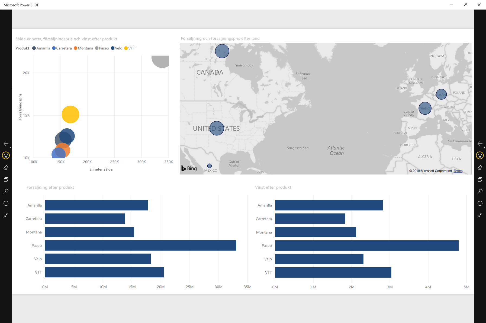
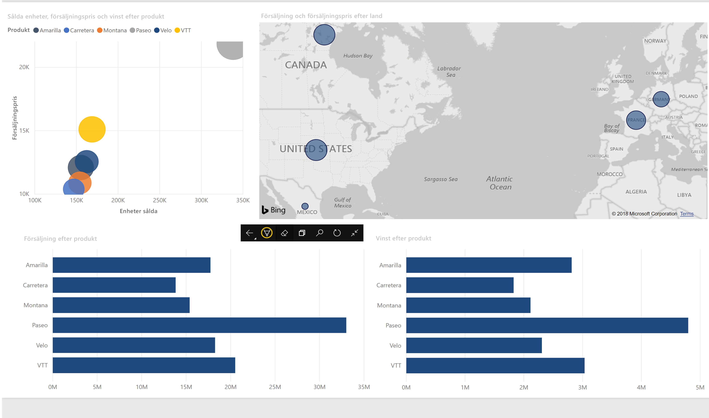

# Visa rapporter och instrumentpaneler i presentationsläge på Surface Hub och Windows 10-enheter
Du kan använda presentationsläge för att visa rapporter och instrumentpaneler i helskärmsläge på Windows 10-enheter och Surface Hub. 

Presentationsläge är användbart när du vill visa Power BI på ett möte eller en konferens eller på en dedikerad projektor i ett kontor, eller bara för att maximera utrymmet på en liten skärm. 

I presentationsläge i Power BI-mobilappen för Windows 10 tas alla ”kromelement” bort, till exempel navigerings- och menyrader, så att du och ditt team kan fokusera på rapportens data. Du får tillgång till ett verktygsfält med åtgärder som du kan använda för att interagera och samarbeta med dina data i presentationsläget.

Du kan också [visa instrumentpaneler och rapporter i helskärmsläge från Power BI-tjänsten](../end-user-focus.md) på webben.

> [!NOTE]
> Presentationsläget skiljer sig från [fokusläge för paneler](mobile-tiles-in-the-mobile-apps.md).
> 
> 

## Använda presentationsläge
Byt till helskärmsläge i Power BI-mobilappen genom att trycka på **helskärms**ikonen.
 Appkromen försvinner och ett verktygsfält visas längst ned på skärmen eller på vänster och höger sida (beroende på din skärmstorlek).

Du kan utföra följande åtgärder från verktygsfältet:

1. Trycka på ikonen tillbaka  för att gå tillbaka till den föregående sidan. Med ett långt tryck på ikonen visas fönstret med sökvägar så att du kan navigera till den mapp som innehåller din rapport eller instrumentpanel.
2. Med pennanteckningsikonen  kan du välja en färg när du använder Surface-pennan för att rita eller anteckna på rapportsidan. 
3. Använda sidikonen  för att byta rapportsidan som du för närvarande presenterar.
4. Tryck på sökikonen  för att söka efter andra artefakter i Power BI.
5. Avsluta presentationsläget genom att trycka på ikonen med två inåtriktade pilar  i verktygsfältet.

Du kan avdocka verktygsfältet och dra och placera det var som helst på skärmen. Det här är användbart för stora skärmar när du vill fokusera på ett visst område i rapporten och vill ha verktygen bredvid det. Placera bara fingret på verktygsfältet och svep det till rapportarbetsytan.

## Nästa steg
* Du kan också [visa instrumentpaneler och rapporter i helskärmsläge från Power BI-tjänsten](../end-user-focus.md)
* Har du några frågor? [Fråga Power BI Community](http://community.powerbi.com/)

