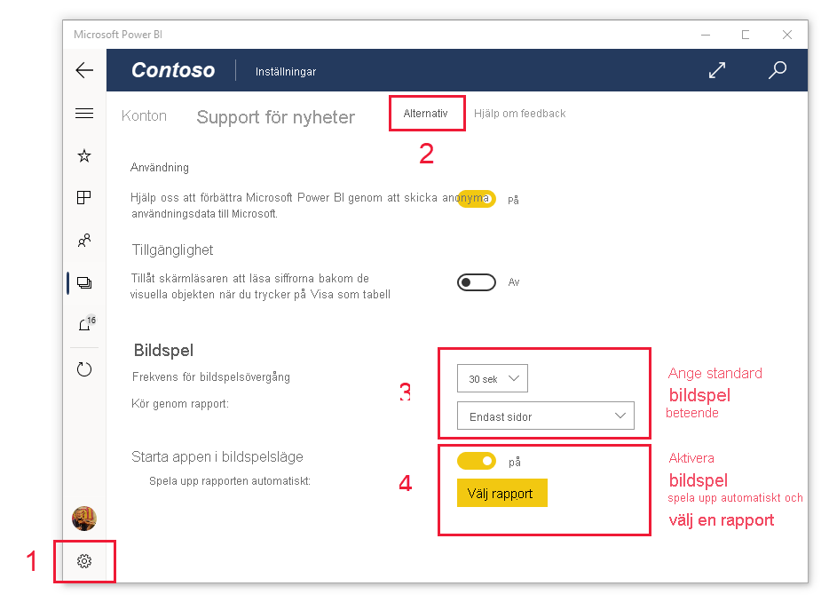

# Visa rapporter och instrumentpaneler i presentationsläge på Surface Hub och Windows 10-enheter
Du kan använda presentationsläge för att visa rapporter och instrumentpaneler i helskärmsläge på Windows 10-enheter och Surface Hub. Presentationsläget är användbart när du vill visa Power BI på ett möte eller en konferens eller på en dedikerad projektor på ett kontor, eller bara vill maximera utrymmet på en liten skärm.

I presentationsläge:
* Allt kromrelaterat (som navigering och menyrader) försvinner, vilket gör det lättare att fokusera på rapportens data.
* Ett verktygsfält för åtgärder blir tillgängligt så att du kan interagera med dina data och kontrollera presentationen.
* Du kan spela upp ett bildspel som automatiskt växlar mellan sidor, bokmärken eller både sidor och bokmärken.

>[!NOTE]
>Stöd för Power BI-mobilappen för **telefoner som använder Windows 10 Mobile** kommer att upphöra den 16 mars 2021. [Läs mer](https://go.microsoft.com/fwlink/?linkid=2121400)

## Använda presentationsläge
Byt till helskärmsläge i Power BI-mobilappen genom att trycka på **helskärms**ikonen.
 Appkromen försvinner och åtgärdsverktygsfält visas längst ned på skärmen eller på vänster och höger sida (beroende på din skärmstorlek).

Du kan utföra följande åtgärder genom att trycka på verktygsfältet:

|||
|-|-|
||**Gå tillbaka** till föregående sida. Om du trycker länge på ikonen visas fönstret med sökvägar så att du kan navigera till mappen som innehåller din rapport eller instrumentpanel.|
||**Byta sida** till en annan sida i presentationen.|
||**Använd ett bokmärke** när du ska presentera en specifik datavy som bokmärket fångar in. Du kan använda både personliga bokmärken och rapportbokmärken.|
||**Välj en pennfärg** när du använder Surface-pennan för att rita eller anteckna på rapportsidan.|
||**Ta bort pennanteckningar** som du har gjort med Surface-pennan på rapportsidan.          |
||**Återställ till standardvyn** och rensa eventuella filter, utsnitt och andra ändringar i datavyn som du har gjort under presentationen.|
||**Dela** en bild av presentationsvyn med dina kollegor. Bilden innehåller eventuella anteckningar du har gjort med Surface-pennan under presentationen.|
||**Uppdatera** rapporten.|
||**Spela upp bildspelet**, dölj åtgärdsfältet och starta bildspelet. Med en väljare kan du välja att rotera automatiskt mellan sidor, bokmärken eller både sidor och bokmärken. Som standard roteras bildspelet automatiskt mellan sidorna var 30:e sekund. Du kan dock ändra dessa inställningar i [**Inställningar > Alternativ**](#slideshow-settings). Se [mer information](#slideshows) om bildspel|
||**Avsluta** presentationsläget.|
||**Sök** efter andra artefakter i Power BI.|

Du kan avdocka verktygsfältet och dra och släppa det var som helst på skärmen. Det här är användbart för stora skärmar när du vill fokusera på ett visst område i rapporten och vill ha verktygen bredvid det. Placera bara fingret på verktygsfältet och svep det till rapportarbetsytan.

## Bildspel

Du kan spela upp ett bildspel som växlar automatiskt genom presentationen. Du kan ange att bildspelet ska växla cykliskt genom sidor, bokmärken eller både sidor och bokmärken.

När du trycker på knappen **Spela upp** i åtgärdsverktygsfältet så börjar bildspelet. En kontrollant visas med vilken du kan pausa bildspelet eller ändra vad som spelas upp: sidor, bokmärken eller både sidor och bokmärken.

 Kontrollanten visar namnet på den vy som visas (sida eller bokmärke och sida). På bilden ovan ser vi att i rapporten som kallas **Försäljning** just nu visar bokmärket **Asien och stillahavsområdet** på sidan **Försäljningsprestanda**.

Som standard växlar ett bildspel endast mellan sidorna, och med en hastighet på en sida var 30:e sekund. Du kan ändra standardbeteendet i [inställningarna för bildspel](#slideshow-settings).

### Spela upp ett bildspel automatiskt vid start

Du kan ställa in att Power BI-mobilappen ska börja spela upp ett bild spel automatiskt när du startar appen. Det här alternativet är användbart när du vill skapa en helskärmsupplevelse där en rapport körs på offentliga skärmar utan manuell åtgärd. I [Bildspelsinställningar](#slideshow-settings) kan du läsa mer om att konfigurera en rapport för automatisk uppspelning.

### Bildspelsinställningar

Som standard växlar ett bildspel endast mellan sidorna, och med en hastighet på en sida var 30:e sekund. Du kan ändra standardbeteendet genom att gå till **Inställningar > Alternativ** som i bilden nedan. Du kan också aktivera automatisk uppspelning och välja en rapport att spela upp.

1. Välj inställningsikonen.

1. Öppna fliken Alternativ.

1. Om du vill kan du ändra standardinställningarna för vad bildspelet ska stegas igenom efter (sidor, bokmärken eller båda) och hur snabbt bildspelet ska gå vidare.

1. Om du vill att rapporten ska börja spelas upp automatiskt när appen startas aktiverar du reglaget och väljer **Välj rapport**. Du kan söka efter de rapporter du har åtkomst till.

## Nästa steg
* Du kan också [visa instrumentpaneler och rapporter i helskärmsläge från Power BI-tjänsten](../end-user-focus.md)
* Har du några frågor? [Fråga Power BI Community](https://community.powerbi.com/)