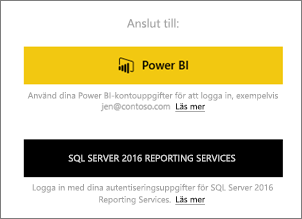
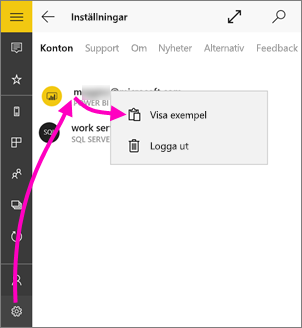
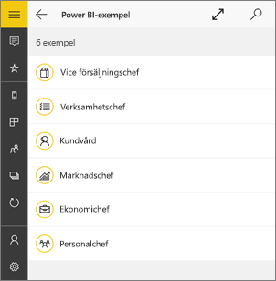
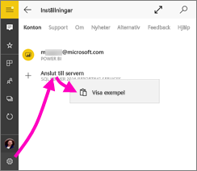
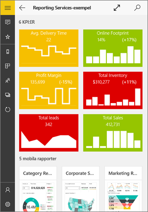
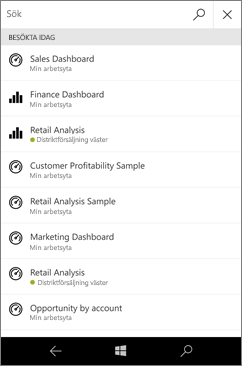
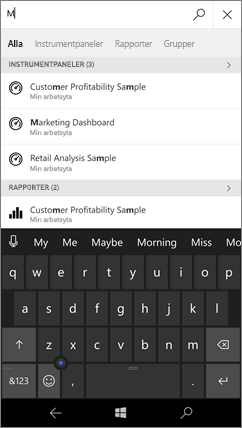
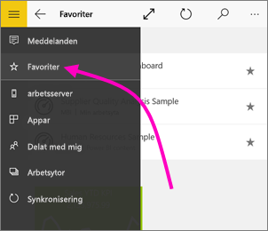
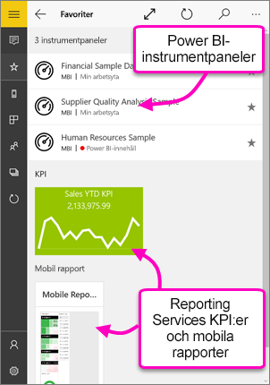

# Kom igång med Power BI-mobilappen för Windows 10
Power BI-mobilappen för Windows 10 ger dig Power BI i din surfplatta eller telefon med uppdaterad, pekaktiverad mobil åtkomst till företagets information. Visa och interagera med dina instrumentpaneler för företaget från valfri plats &#151; direkt från din [Windows-startskärm](mobile-pin-dashboard-start-screen-windows-10-phone-app.md).

Du [skapar instrumentpaneler och rapporter i Power BI-tjänsten](../../service-get-started.md) med dina data. 

Sedan interagerar du med dina instrumentpaneler och rapporter, utforskar data och delar dem, allt från Power BI-mobilappen för Windows 10.

## Vi tar det i ordning
* [**Hämta Power BI-mobilappen för Windows 10**](http://go.microsoft.com/fwlink/?LinkID=526478) från Windows Store.
  
  Din enhet måste köra Windows 10. Appen kan köras på enheter med minst 3 GB RAM-minne och 8 GB intern lagring.
   
* Ta reda på [nyheterna i Power BI-mobilapparna](mobile-whats-new-in-the-mobile-apps.md).

## Registrera dig för Power BI-tjänsten på internet
Om du inte har registrerat dig ännu, går du till [Power BI-tjänsten](http://powerbi.com/) för att registrera dig för ditt eget konto för att skapa och lagra instrumentpaneler och rapporter och föra samman dina data. Logga sedan in på Power BI från din Windows 10-enhet för att se dina egna instrumentpaneler varifrån du vill.

1. I Power BI-tjänsten, peka på [registrering](http://go.microsoft.com/fwlink/?LinkID=513879) för att skapa ett Power BI-konto.
2. Starta [skapa dina egna instrumentpaneler och rapporter](../../service-get-started.md).

## Kom igång med Power BI-appen
1. På Startskärmen för din Windows 10-enhet öppnar du Power BI-appen.
   
   
2. Om du vill visa dina Power BI-instrumentpaneler och -rapporter trycker du på **Power BI**. Logga in med samma autentiseringsuppgifter som ditt Power BI-konto på webben. 
   
   Om du vill visa dina Reporting Services-mobila rapporter och KPI:er, trycker du på **SQL Server 2016 Reporting Services**. Logga in med dina autentiseringsuppgifter för SQL Server Reporting Services.
   
   
3. Tryck på **börja utforska** för att visa dina egna instrumentpaneler.

## Testa Power BI- och Reporting Services-exemplen
Även om du inte registrerar dig, kan du prova dig fram med Power BI- och Reporting Services-exemplen. När du har hämtat appen kan du se exemplen eller sätta igång. Gå tillbaka till exemplen från instrumentpanelernas startsida när du vill.

### Power BI-exempel
Du kan visa och interagera med instrumentpanelsexemplen i Power BI, men det finns några saker som du inte kan göra med dem. Du kan inte öppna rapporterna bakom instrumentpanelerna, dela exemplen med andra eller göra dem till dina favoriter.

1. Tryck på den globala navigeringsknappen  i det övre vänstra hörnet.
2. Tryck ikonen **Inställningar** , tryck på ditt namn och tryck sedan på **Visa exempel**.
   
   
3. Välj en roll och utforska exemplet på instrumentpanel för rollen.  
   
   

### Mobila rapportexempel för Reporting Services
1. Tryck på den globala navigeringsknappen  i det övre vänstra hörnet.
2. Tryck på ikonen **Inställningar** , högerklicka eller tryck och håll in **Anslut till server**, tryck därefter**Visa exempel**.
   
   
3. Öppna mappen för detaljhandelsrapporterna eller försäljningsrapporter om du vill utforska deras KPI:er och mobila rapporter.
   
   

## Sök efter instrumentpaneler, rapporter och appar
Hitta dina instrumentpaneler, rapporter och appar snabbt genom att skriva i sökrutan som alltid finns högst upp i appen.

1. Tryck på sökikonen i det övre högra hörnet.
   
   
   
   Power BI visar dina senaste instrumentpaneler, rapporter och appar.
   
   
2. När du börjar skriva in visar Power BI alla relevanta resultat.
   
   

## Hitta ditt innehåll i Power BI-mobilapparna
Dina instrumentpaneler och rapporter lagras på olika platser i Power BI-mobilapparna beroende på var de kom från. Läs mer om [att hitta ditt innehåll i mobilapparna](mobile-apps-quickstart-view-dashboard-report.md). Dessutom kan du alltid söka efter det du har i Power BI-mobilapparna. 

## Visa dina favoritinstrumentpaneler, KPI:er och rapporter
Du kan visa alla dina Power BI-favoritinstrumentpaneler tillsammans med Reporting Services KPI:er och mobila rapporter på favoriter-sidan i mobilapparna. När du gör en instrumentpanel till en *favorit* i Power BI-mobilappen, kan du komma åt den från alla dina enheter, inklusive Power BI-tjänsten i din webbläsare. 

* Tryck på **Favoriter**.
  
   
  
   Dina Power BI-favoriter och dina favoriter från Reporting Services-webbportalen finns på den här sidan.
  
   

Läs mer om [favoriter i Power BI-mobilappar](mobile-apps-favorites.md).

## Nästa steg
Här följer några saker som du kan göra i Power BI-appen för Windows 10-enheter med instrumentpaneler och rapporter i Power BI och Reporting Services-mobila rapporter och KPI:er i Reporting Services-webbportalen

### Power BI-instrumentpaneler och -rapporter
* Visa [dina appar](../../service-create-distribute-apps.md).
* Visa dina [instrumentpaneler](mobile-apps-view-dashboard.md).
* [Fäst Power BI-paneler och instrumentpaneler](mobile-pin-dashboard-start-screen-windows-10-phone-app.md) till din enhets startskärm som live-paneler.
* [Dela paneler](mobile-windows-10-phone-app-get-started.md).
* Dela [instrumentpaneler](mobile-share-dashboard-from-the-mobile-apps.md).

### Reporting Services-mobila rapporter och KPI:er
* [Se mobila rapporter i Reporting Services och KPI:er](mobile-app-windows-10-ssrs-kpis-mobile-reports.md) på Power BI-appen för Windows 10-enheter.
* Skapa [KPI:er i Reporting Services-webbportalen](https://msdn.microsoft.com/library/mt683632.aspx).
* [Skapa dina egna mobila rapporter med SQL Server Mobile Report Publisher](https://msdn.microsoft.com/library/mt652547.aspx) och publicera dem till Reporting Services-webbportalen.

## Nästa steg
* [Ladda ned Power BI-appen](http://go.microsoft.com/fwlink/?LinkID=526478) från Windows Store  
* [Vad är Power BI?](../../power-bi-overview.md)
* Har du några frågor? [Fråga Power BI Community](http://community.powerbi.com/)

